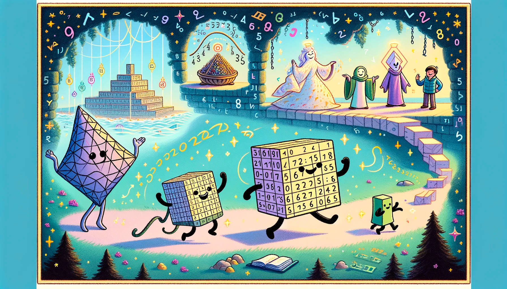

# Chapter 1 - The Story of a Tensor - Work in Progress

Once upon a time, in the whimsical land of Computaria, there lived a happy little Tensor named Tenny. Tenny was no ordinary figure; he was a magical bundle of numbers with the power to shape the world of Artificial Intelligence (AI).

Tenny loved to play and reshape himself in many ways. He could stretch long and thin like a vector, a line of dancing digits, or fold up wide and flat like a matrix, a grid of playful numbers. Sometimes, he even stacked up into a big cube, a 3D array of numbers, or transformed into higher dimensions that not all the residents of Computaria could see, but all could imagine.

One day, Tenny had a big dream. He wanted to help Computaria by becoming part of an AI model, a magical creation that could learn and make smart decisions. To do this, he had to journey through many layers of computations and team up with his friends, the Weights and the Biases.

So, Tenny set off on an adventure to find the Great Neural Network, a wise system that could learn from the world. Along the way, Tenny met Weighy, a set of numbers that loved to change and adjust to make predictions better, and Bitsy Bias, a small number that helped balance things out. Together, they were ready to learn and grow.

As Tenny journeyed through each layer of the network, he transformed. He stretched, folded, and twisted, learning new shapes and patterns. Every transformation made him bubblier and bouncier, for with each change, he helped the AI model get smarter and understand the world a little better.

After going through the last layer of the Great Neural Network, Tenny was excited to make his first prediction. There was an input needing an answer, and Tenny, with his friends Weighy and Bitsy Bias, combined their magic to output a guess. At first, it wasn't quite right, but they didn't give up. With each try and through lots of playful training games, they got closer and closer to the correct answer.

Tenny learned that every number in him was essential, and by working together in different shapes and dimensions, they could solve real-world puzzles. He made the AI model bright and clever, and all of Computaria was in awe of what they could achieve.

From that day on, Tenny became known as the Tensor of Triumph. The children of Computaria would giggle and cheer as they watched Tenny playfully twist and turn, teaching them the joys of learning and the magic of AI. And whenever a machine in Computaria learned something new, they knew Tenny and his friends were there, working their wonderful number magic.

And so, Tenny and his team continued to help everyone in Computaria, proving that even in a world of numbers and calculations, joy and adventure could be found in every dimension. 

## The Story of a Tensor Explained

It's a simple story but it's packed with hidden meaning. 

First, let's break down some of the key terms from Tenny's adventures in the land of Computaria:

1. **Tensor (Tenny)**: In the world of AI, a tensor is like our main character, Tenny. It's a collection of numbers arranged into a particular shape. A tensor can be a single number (0D scalar), a line (1D vector), a table (2D matrix), or something with even more dimensions, like a 3D cube or higher. Tensors are the fundamental data structures used in machine learning and AI; they're what the models see and process.

2. **Vector**: This is like one of Tenny's playful stretches, where he becomes long and thin. A vector is a one-dimensional tensor, essentially a list of numbers. It's like a set of instructions or pieces of information all lined up.

3. **Matrix**: When Tenny folds up wide and flat, he's like a matrix, which is a two-dimensional tensor. A matrix is a grid of numbers and can be thought of as a spreadsheet that the AI can read.

4. **Weights (Weighy)**: In Tenny's story, he meets Weighy, which represents weights in an AI model. Weights are crucial numbers that the model multiplies with the input data to make predictions. As the model learns from data, these weights get adjusted to improve those predictions.

5. **Biases (Bitsy Bias)**: This small but mighty number helps ensure that the model can handle patterns in the data even when the input is zero. It's like adding a little nudge to the predictions to make them more accurate.

6. **Neural Network (The Great Neural Network)**: This is a system made of layers, where Tenny travels through and transforms. In AI, it's a structure inspired by the human brain that learns from data. It contains nodes, like brain cells, that process information and pass it along through those layers.

7. **Layer**: As Tenny reshaped through different parts of the Great Neural Network, he was moving through layers. Each layer of a neural network processes the input in a different way, gradually learning complex features for tasks like recognizing images or understanding speech.

8. **Input**: This is where the journey begins. In AI, when data is fed into the model, it's called the input. It's similar to the challenge or question posed to Tenny at the start of his quest.

9. **Output (Prediction)**: At the end of the quest, Tenny and his friends produced a guess or prediction. This is the answer the model gives based on what it has learned. It's the model's response to the input data.

10. **Training**: This is like Tenny's playful training games. In machine learning, training is the process where the model learns from data by repeatedly making predictions, seeing how accurate they are, and then adjusting Weighy and Bitsy Bias to improve. 

11. **Learning Rate**: Remember how Weighy would change how much Tenny stretched and bounced? The learning rate is a value that decides how much the weights change during training. If it's too big, the model might learn too fast and miss the solution. Too small, and learning might be too slow.

In the story of Tenny and his friends, every interaction and game was a part of learning from experience and becoming better at solving problems. That's very much like what happens in artificial intelligence where models take data, learn patterns, and use those patterns to make smart decisions. The happy ending is not just about solving one problem but being able to tackle many more in the future.

## List, Array, Vector, Matrix, Tensor

In order to fully understand the story of Tenny, it's important to grasp the difference between a list, an array, a vector, a matrix, and a tensor. These terms are often used interchangeably, but they're not the same thing.

Let's clarify each term one by one, delving into their meanings within the realms of coding and mathematics:

1. **List:**
   - In general programming, especially in languages like Python, a list is a collection of items that can be of different types. It's a very flexible data structure that can grow and shrink in size and can hold a mix of integers, floats, strings, other lists, and more.
   - For example: `[1, 'apple', 3.14, [2, 4, 6]]`

2. **Array:**
   - Arrays are more structured than lists and usually contain elements of the same type. In some programming languages like C or Java, arrays are of fixed size and can't be resized after their creation. However, in Python, the term 'array' often refers to sequences such as lists or instances of `array.array`, which is a more efficient way of storing numeric data than a list.
   - For example: `[1, 2, 3, 4]` using the Python `array` module.

    We are talking about basic Python lists and arrays here. There are more advanced data structures like NumPy arrays, which are more efficient and can be used for mathematical operations. NumPy arrays need all elements to be of the same type, so they're more like arrays in other programming languages. However, they can be resized after creation, so they're more like lists with fixed types in that sense. Note that AI frameworks like PyTorch and MLX use NumPy arrays as their primary data structure.

3. **Vector:**
   - A vector in mathematics, and by extension in computer science, typically refers to an array with a single dimension. Vectors often represent numerical data and are homogeneous in nature. In the context of scientific computing libraries like NumPy, a vector is simply a 1D array with 'n' elements.
   - For example: `[1, 2, 3]` could represent a vector in mathematics.

4. **Matrix:**
   - A matrix is a two-dimensional array where the data is arranged into rows and columns. In mathematics, matrices are used for different things like transforming geometric figures and solving linear equations. In the context of scientific computing libraries like NumPy, a matrix is simply a 2D array with 'n' rows and 'm' columns.
   - For example: `[[1, 2, 3], [4, 5, 6], [7, 8, 9]]` represents a 3x3 matrix with three rows and three columns.Note the double square brackets, which indicate that this is a 2D array.

    Hold up, math haters. Do you really get what was just said: "In mathematics, matrices are used for different things like transforming geometric figures and solving linear equations"? You might not get it but pretend to, just to skip ahead. But seriously, that's going to leave you super confused later on.

    At its core, AI is rooted in linear algebra, although it extends into more intricate dimensions. Far from being mystical, it's grounded in the principles of mathematics. Understanding the math is crucial—if it's unclear, AI can seem perplexing. Embrace the math, for it is the key to demystifying AI.

5. **Tensor:**
   - A tensor can be thought of as a generalization of vectors and matrices to potentially higher dimensions. In physics and engineering, tensors can represent a wide variety of data, with one of their key attributes being the ability to transform in predictable ways when coordinate systems change. In the context of machine learning frameworks like PyTorch and MLX, a tensor extends the concept to an 'n-dimensional' array. These tensors are used to generalize vectors and matrices to multiple dimensions, which is ideal for the kinds of computations used in neural networks and other complex machine learning algorithms.
   - For example: A 3D tensor could look like this: `[[[1, 2], [3, 4]], [[5, 6], [7, 8]]]`, and it can have even more dimensions than that.

In summary, these mathematical and data structures ascend in complexity and dimensionality, starting from the flexible and mixed-type list in programming, to fixed-type arrays, to the vector as a 1D instance of an array, to the matrix as a 2D array, and finally to the tensor encompassing 'n' dimensions.

## Again, Why Tensors?

Tensors are pivotal in AI because they provide a highly efficient means to capture and represent the nuances of data, allowing models to learn and make predictions. Here’s a more detailed look at why we use tensors, particularly in the context of their capability to encapsulate intricate features of data and their compatibility with parallel computing, including the advantages of GPUs:

1. **Capturing Complex Features:**
   - **Multi-Dimensional Data:** Real-world data often come with multiple dimensions; images have width, height, and color channels, videos add time, and even more complex data types can involve additional dimensions. Tensors naturally represent this multi-dimensional data, with each dimension representing different features or aspects.
   - **Hierarchical Patterns:** Learning involves understanding patterns in data. In images, for instance, lower-level tensors might capture edges or textures, while higher-level tensors might represent parts of objects or entire objects. This hierarchical patterning corresponds well to the layered architecture of neural networks.
   - **Flexibility:** Tensors offer flexibility in that they can be dynamically reshaped and manipulated to suit different needs, whether it's flattening a multi-dimensional tensor for a fully connected network layer, or using their shape to capture the sequential nature of data in recurrent neural networks.

2. **Parallel Computing and GPUs:**
   - **Efficiency:** Tensors are optimized for numerical computation and are highly efficient when it comes to vectorized operations, which is performing the same operation on multiple data points simultaneously.
   - **Parallelism:** GPUs (Graphics Processing Units) are designed for parallel processing, able to handle thousands of threads concurrently. Since tensors can be divided into sub-tensors, they can be processed simultaneously, exploiting the parallel architecture of GPUs. This is much faster compared to processing data sequentially on a CPU.
   - **Speed:** GPUs shine in the realm of matrix operations, which are a staple in neural network computations. Given that tensors can be thought of as higher-dimensional matrices, operations on them are significantly sped up, allowing for quicker training and prediction times.
   - **Scalability:** With their multi-dimensional nature, tensors scale well when it comes to working with massive datasets prevalent in machine learning. As datasets and models grow, GPUs provide the necessary computational muscle to train complex models, making tensors an ideal match for high-performance computing.

In essence, tensors make it possible to represent the intricacies of real-world data in a format that's conducive to the operational demands of machine learning algorithms. Their structure dovetails with the capabilities of GPUs, making them a cornerstone in the efficient computation required in modern AI.

Now it would be clear why companies specializing in GPUs are so profitable and why their stock market valuations have soared. Their hardware is integral to powering the AI revolution.

Apple's strategy of embedding both the CPU and GPU on a single silicon chip could greatly enhance AI operations when used with a proper framework: MLX. This integrated design in Apple devices ensures a smooth and efficient process for running MLX and training machine learning models, leveraging the power of the Mac's GPU for optimal performance.

For serious PyTorch development, the go-to starting line `device = torch.device('cuda' if torch.cuda.is_available() else 'cpu')` is paramount as it efficiently allocates computations to the GPU when available, reverting to the CPU when necessary. Operating AI models on a CPU can feel akin to attempting to run high-end games without a dedicated graphics card: feasible, yet far from optimal, often resulting in a significant slowdown.

## Fun Formulas - More on Tensors

In the realm of machine learning, particularly natural language processing (NLP), we often use word embeddings to capture semantic relationships between words. These embeddings are essentially high-dimensional vectors that represent words in such a way that the distances and directions between them are meaningful.

Consider the following examples:

1. 👉 **King - Queen = Husband - Wife**
    - Here, the word embeddings for 'King' and 'Queen' would be close to each other because they share a similar context in language. To find a word relationally analogous to 'Queen' as 'Husband' is to 'Wife,' we perform vector arithmetic. We subtract the vector for 'Queen' from 'King,' and ideally, this would result in a vector similar to the one obtained by subtracting 'Wife' from 'Husband.' This suggests that the relationship “male equivalent of a female” is captured in the embeddings' vector space.

2. 👉 **Dog - Cat = Puppy - Kitten**
    - In this case, 'Dog' and 'Cat' are adult animals, while 'Puppy' and 'Kitten' are their respective young. By subtracting 'Cat' from 'Dog,' we should get a vector representing the shift from one adult animal to another. The same vector should approximate the shift from 'Kitten' to 'Puppy.' If the word embeddings are well-constructed, such operations should highlight the transformation from one concept to another—here, from one age-related stage of an animal to another.

To encapsulate these subtle semantic distinctions, we must harness the power of tensors. In the above examples, we're essentially performing vector arithmetic on word embeddings, which are tensors. The resulting vectors are also tensors, and we can use them to perform further operations.

Pop quiz: What would be the values of X in the following equations?

👉 The US - Washington = South Korea - X

👉 Tokyo - Japan = Paris - X

Note that the model is not supposed to know the concepts of countries and capitals. It's supposed to figure out the relationship between the words and use that to find the answer. If the model is well-trained, it should be able to figure out that the answers are 'Seoul' and 'France,' respectively.

This is a simple example, but it demonstrates the power of word embeddings and tensors - we need high-dimensional tensors to capture the nuances of language.

Now you understand why LLMs(Large Language Models) are so powerful and yet resource-intensive. They're essentially a collection of massive tensors that can be used to perform complex operations on language. The more complex the operation, the more resources are required. That's why GPTs are so expensive to train and run.