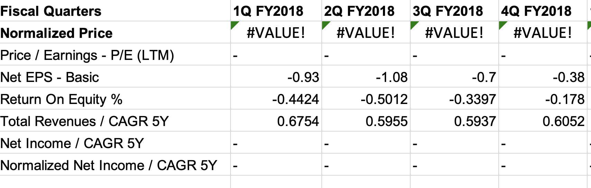
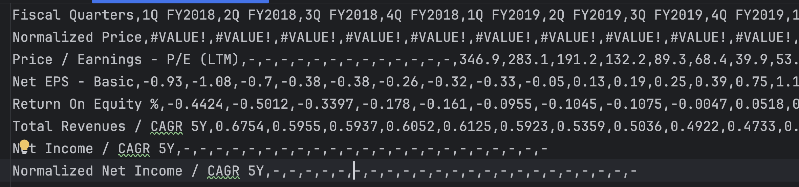
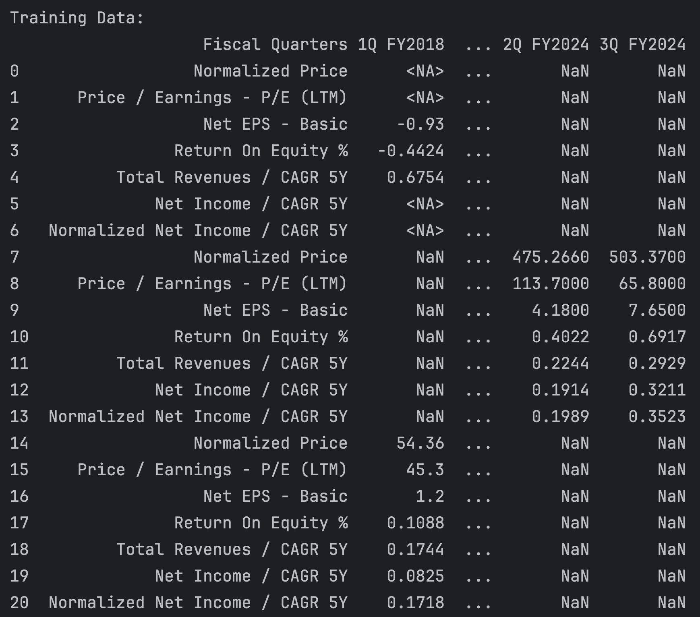
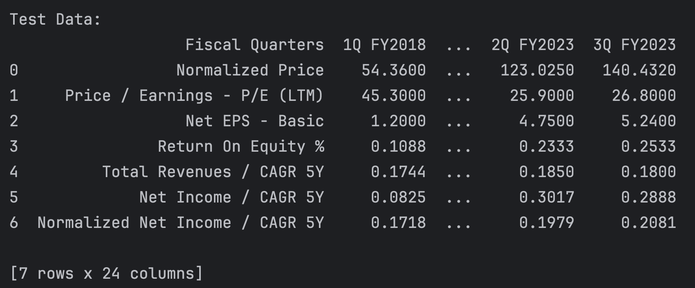

# Chapter 4 - The Rise of Tenny, the Analyst: Tenny Takes on Wall Street

Alright, folks, buckle up! We're diving into a wild chapter where our brainy math stuff and crazy sci-fi theories get down to business - and I mean serious business. We're jumping out of the sandbox of tensors and diving headfirst into the big leagues: Wall Street!


Enter our hero, again, Tenny – no longer just another face in the crowd of numbers and datasets. This whiz kid is all geared up to crack the secrets of the Nasdaq 100. We're not just talking about a hop, skip, and a jump here. Tenny's transformation is like going from riding a tricycle to piloting a fighter jet – it’s the kind of magic that only neural networks could pull off, turning financial market chaos into crystal-clear patterns.

But hey, we're not just sitting on the sidelines watching Tenny have all the fun. Nah, we're rolling up our sleeves and getting our hands dirty too. We're going to build a neural network from scratch – yep, you heard it – tailor-made to chew up those crunchy financial numbers and spit out wisdom. We're covering the A to Z here, from data hunting and cleaning, all the way to the fancy footwork of analysis, model-building, training, and putting it all to the test. Our mission? To make sure even the newbies in the back get what's going on, with a no-nonsense walkthrough that'll have you nodding along and ready to jump in.

As we tag along with Tenny on this epic finance-adventure, we'll unearth all the goodies and booby-traps that come with slinging neural networks in the wild, wild world of stocks. This ain't just some tale about tech – it's the big picture of how data science, machine learning, and cold-hard cash are having a thrilling love affair, changing the game of financial analysis for good.

So come on, join the party in this juicy chapter where Tenny takes the bull by the horns in Wall Street, marking a killer milestone in our saga of neural networks going out and conquering the real world.

But first, before we dive back into our Wall Street journey, let's pause for a moment of candid discussion.

## Caution: The Good, the Bad, and the Grumpy Truth About the Market


Let's lay it out straight – the world of investment isn't for the faint of heart. The market is a place where fortunes are made and lost in the blink of an eye. And while the allure of quick gains might be tempting, here's a bit of grounded advice from someone who's seen the highs and lows of the financial spectrum.

Investing is one thing, but day trading, crypto speculation, or any high-octane financial escapades are a whole different ball game. It's your money, your future, and your call, but here's my take: keep it sensible. Your hard-earned money and your family's security shouldn't be chips on a high-stakes table. Whether it's stocks, derivatives, or digital currencies, the key is to play wisely.

Now, let's talk about AI in trading. If you're imagining AI as some infallible profit machine, time for a reality check. Artificial Intelligence is impressive, sure, but it's not a mystical money-making oracle. It's a tool, a complex and fascinating one, but not a guarantee of financial success.

Don't expect this chapter to hand you a secret AI formula to outsmart Wall Street. Sure, I could easily throw together a demo where we grab some numbers off Yahoo Finance, juggle them fancy with a model, and boom – you're supposedly set. But let's be honest, if it were that simple, everybody would be a billionaire, and last time I checked, we ain't all living in mansions.

Consider the classic bell curve distribution. Where do you see yourself on it? If you're not in the sweet spot of financial gains, it's time to reevaluate your approach. My goal? To not just be off that curve of the unlucky majority, but to leap into the realm where the savvy investors reside – that's where the real success lies.

Credentials? Sure, I've got a few. Deep dives into quantitative analysis, charting techniques, you name it. I've tackled a slew of financial exams, aced most on the first try – except for that elusive CFA Level III. I'm like the eternal CFA Level III candidate. Crushed Levels I and II in a single go, then Level III gave me the slip, but hey, who's counting? And sitting through those exams at my fab age again? Six hours in the testing seat, if you're curious. Not happening again. Completing the CFA curriculum alone requires at least 2 to 3 years. I went for the knowledge, not the shiny charter. Not even shiny, just a piece of paper. Still, I've taken nine financial exams and nailed eight of them on the first try: six Korean and three American. The CFA Level III was my last one, and I'm not going back for that hassle. I'm not bragging; I'm just confirming that I know my stuff. And yes, somewhere in Korea, there's proof of all this, including a Korean FRM certificate.

With over two decades of real-world investing experience under my belt, I've gained a crucial insight: if everyone is doing it, it's unlikely you'll rake in serious money. Simple as that.

Here's a quick insight from a seasoned coder: In my extensive experience with coding and market experiments, I can confidently tell you that if a computer can display a chart on your screen, it's essentially just crunching numbers through lines of code. The market, on the other hand, is swayed by a myriad of factors, while charts are created from tiny snippets of price data. Relying solely on them for predictions is a flawed strategy; it's like being a poorly trained machine on incomplete and misleading data, making uninformed predictions. And that's a straight road to trouble. So why do countless traders lean on charts? Because they seem like the easy route, the market's tantalizing shortcut. But remember, when everyone's cutting through the same shortcut, chances are slim you'll find a treasure trove at the end. It's almost comical, isn't it? A whole army of traders, eyes glued to the same set of charts, the same set of numbers, each hoping to outsmart the next in the very same game.

My mantra stands firm: Commit to long-term investing grounded in vision and knowledge. Look beyond the market's immediate confines and expand your horizons. This approach has guided my entire life's work, and embarking on this AI journey is merely a continuation of that enduring strategy.

That's the key to excelling in the market game without falling victim to it.

So, if you're still wondering whether to dive into market chaos – my advice? Stay clear. It's wild out there.

Keep in mind, the examples we're diving into here are for learning's sake. We're unpacking ideas here, not doling out market-beating blueprints. I opted for this take mainly to spice things up with some real-world data, instead of the usual yawn-inducing datasets you find in typical AI textbooks. Plus, let's be real – it's way more entertaining this way.

Feel free to run with this concept and craft your own AI trader if that's your jam, but don't come at me when you're down to your last penny. Just saying, I told you so! 

Alright, with that said, let's dive back into Tenny's adventure on Wall Street. 

## A Wrong Approach to AI in Finance

It's all about data. That's the first rule of AI. And when it comes to finance, there's no shortage of data. But here's the thing: data is only as good as the questions you ask of it. And if you're asking the wrong questions, you're going to get the wrong answers.

Here's a very simple but flawed approach to get financial data.

First, you need to install Yahoo Finance and Pandas packages.

```python
pip install yfinance pandas
```

Let's inspect a stock. Apple, why not? We're dealing with their framework, MLX, anyway.

❗️Full disclosure: I own shares in tech companies, but not in Apple. Don't ask me why; I have my reasons. So don't peg me as an Apple fanboy.

```python
import yfinance as yf

# Define the ticker symbols
ticker = "AAPL"

stock = yf.Ticker(ticker)

# Fetch the information
info = stock.info

# Convert the keys to a list and sort them
sorted_keys = sorted(list(info.keys()))

print(f"{info.get('longName')}")

# Print the sorted keys
for key in sorted_keys:
    print(f"{key}: {info.get(key)}")
    
# Apple Inc.
# 52WeekChange: 0.39208603
# SandP52WeekChange: 0.20686829
# address1: One Apple Park Way
# ask: 180.81
# askSize: 900
# auditRisk: 4
# averageDailyVolume10Day: 51248110
# averageVolume: 54028051
# averageVolume10days: 51248110
# beta: 1.29
# bid: 180.75
# bidSize: 1200
# boardRisk: 1
# bookValue: 3.997
# city: Cupertino
# companyOfficers: [{'maxAge': 1, 'name': 'Mr. Timothy D. Cook', 'age': 62, 'title': 'CEO & Director', 'yearBorn': 1961, 'fiscalYear': 2022, 'totalPay': 16425933, 'exercisedValue': 0, 'unexercisedValue': 0}, {'maxAge': 1, 'name': 'Mr. Luca  Maestri', 'age': 60, 'title': 'CFO & Senior VP', 'yearBorn': 1963, 'fiscalYear': 2022, 'totalPay': 5019783, 'exercisedValue': 0, 'unexercisedValue': 0}, {'maxAge': 1, 'name': 'Mr. Jeffrey E. Williams', 'age': 59, 'title': 'Chief Operating Officer', 'yearBorn': 1964, 'fiscalYear': 2022, 'totalPay': 5018337, 'exercisedValue': 0, 'unexercisedValue': 0}, {'maxAge': 1, 'name': 'Ms. Katherine L. Adams', 'age': 59, 'title': 'Senior VP, General Counsel & Secretary', 'yearBorn': 1964, 'fiscalYear': 2022, 'totalPay': 5015208, 'exercisedValue': 0, 'unexercisedValue': 0}, {'maxAge': 1, 'name': "Ms. Deirdre  O'Brien", 'age': 56, 'title': 'Senior Vice President of Retail', 'yearBorn': 1967, 'fiscalYear': 2022, 'totalPay': 5019783, 'exercisedValue': 0, 'unexercisedValue': 0}, {'maxAge': 1, 'name': 'Mr. Chris  Kondo', 'title': 'Senior Director of Corporate Accounting', 'fiscalYear': 2022, 'exercisedValue': 0, 'unexercisedValue': 0}, {'maxAge': 1, 'name': 'Mr. James  Wilson', 'title': 'Chief Technology Officer', 'fiscalYear': 2022, 'exercisedValue': 0, 'unexercisedValue': 0}, {'maxAge': 1, 'name': 'Suhasini  Chandramouli', 'title': 'Director of Investor Relations', 'fiscalYear': 2022, 'exercisedValue': 0, 'unexercisedValue': 0}, {'maxAge': 1, 'name': 'Mr. Greg  Joswiak', 'title': 'Senior Vice President of Worldwide Marketing', 'fiscalYear': 2022, 'exercisedValue': 0, 'unexercisedValue': 0}, {'maxAge': 1, 'name': 'Mr. Adrian  Perica', 'age': 49, 'title': 'Head of Corporate Development', 'yearBorn': 1974, 'fiscalYear': 2022, 'exercisedValue': 0, 'unexercisedValue': 0}]
# compensationAsOfEpochDate: 1672444800
# compensationRisk: 6
# country: United States
# currency: USD
# currentPrice: 181.18
# currentRatio: 0.988
# dateShortInterest: 1702598400
# dayHigh: 182.76
# dayLow: 180.17
# debtToEquity: 199.418
# dividendRate: 0.96
# dividendYield: 0.0053
# earningsGrowth: 0.135
# earningsQuarterlyGrowth: 0.108
# ebitda: 125820002304
# ebitdaMargins: 0.32827
# enterpriseToEbitda: 22.892
# enterpriseToRevenue: 7.515
# enterpriseValue: 2880222527488
# exDividendDate: 1699574400
# exchange: NMS
# fiftyDayAverage: 187.3978
# fiftyTwoWeekHigh: 199.62
# fiftyTwoWeekLow: 128.12
# financialCurrency: USD
# firstTradeDateEpochUtc: 345479400
# fiveYearAvgDividendYield: 0.8
# floatShares: 15535488445
# forwardEps: 7.15
# forwardPE: 25.339859
# freeCashflow: 82179997696
# fullTimeEmployees: 161000
# gmtOffSetMilliseconds: -18000000
# governanceEpochDate: 1704067200
# grossMargins: 0.44131002
# grossProfits: 170782000000
# heldPercentInsiders: 0.00074
# heldPercentInstitutions: 0.61495996
# impliedSharesOutstanding: 15752800256
# industry: Consumer Electronics
# industryDisp: Consumer Electronics
# industryKey: consumer-electronics
# lastDividendDate: 1699574400
# lastDividendValue: 0.24
# lastFiscalYearEnd: 1696032000
# lastSplitDate: 1598832000
# lastSplitFactor: 4:1
# longBusinessSummary: Apple Inc. designs, manufactures, and markets smartphones, personal computers, tablets, wearables, and accessories worldwide. The company offers iPhone, a line of smartphones; Mac, a line of personal computers; iPad, a line of multi-purpose tablets; and wearables, home, and accessories comprising AirPods, Apple TV, Apple Watch, Beats products, and HomePod. It also provides AppleCare support and cloud services; and operates various platforms, including the App Store that allow customers to discover and download applications and digital content, such as books, music, video, games, and podcasts. In addition, the company offers various services, such as Apple Arcade, a game subscription service; Apple Fitness+, a personalized fitness service; Apple Music, which offers users a curated listening experience with on-demand radio stations; Apple News+, a subscription news and magazine service; Apple TV+, which offers exclusive original content; Apple Card, a co-branded credit card; and Apple Pay, a cashless payment service, as well as licenses its intellectual property. The company serves consumers, and small and mid-sized businesses; and the education, enterprise, and government markets. It distributes third-party applications for its products through the App Store. The company also sells its products through its retail and online stores, and direct sales force; and third-party cellular network carriers, wholesalers, retailers, and resellers. Apple Inc. was founded in 1976 and is headquartered in Cupertino, California.
# longName: Apple Inc.
# marketCap: 2817856110592
# maxAge: 86400
# messageBoardId: finmb_24937
# mostRecentQuarter: 1696032000
# netIncomeToCommon: 96995000320
# nextFiscalYearEnd: 1727654400
# numberOfAnalystOpinions: 39
# open: 181.99
# operatingCashflow: 110543003648
# operatingMargins: 0.30134
# overallRisk: 1
# payoutRatio: 0.1533
# pegRatio: 4.5
# phone: 408 996 1010
# previousClose: 181.91
# priceHint: 2
# priceToBook: 45.328995
# priceToSalesTrailing12Months: 7.3518558
# profitMargins: 0.25305998
# quickRatio: 0.843
# quoteType: EQUITY
# recommendationKey: buy
# recommendationMean: 2.2
# regularMarketDayHigh: 182.76
# regularMarketDayLow: 180.17
# regularMarketOpen: 181.99
# regularMarketPreviousClose: 181.91
# regularMarketVolume: 62379661
# returnOnAssets: 0.20256001
# returnOnEquity: 1.7195
# revenueGrowth: -0.007
# revenuePerShare: 24.344
# sector: Technology
# sectorDisp: Technology
# sectorKey: technology
# shareHolderRightsRisk: 1
# sharesOutstanding: 15552799744
# sharesPercentSharesOut: 0.0077
# sharesShort: 120233720
# sharesShortPreviousMonthDate: 1700006400
# sharesShortPriorMonth: 105837123
# shortName: Apple Inc.
# shortPercentOfFloat: 0.0077
# shortRatio: 2.29
# state: CA
# symbol: AAPL
# targetHighPrice: 250.0
# targetLowPrice: 159.0
# targetMeanPrice: 199.57
# targetMedianPrice: 200.0
# timeZoneFullName: America/New_York
# timeZoneShortName: EST
# totalCash: 61554999296
# totalCashPerShare: 3.958
# totalDebt: 123930001408
# totalRevenue: 383285002240
# trailingAnnualDividendRate: 0.94
# trailingAnnualDividendYield: 0.00516739
# trailingEps: 6.12
# trailingPE: 29.604574
# trailingPegRatio: 2.1717
# twoHundredDayAverage: 180.01515
# underlyingSymbol: AAPL
# uuid: 8b10e4ae-9eeb-3684-921a-9ab27e4d87aa
# volume: 62379661
# website: https://www.apple.com
# zip: 95014
```

This example code fetches the information for Apple Inc. and prints it out with its ticker symbol: AAPL. The output is a dictionary with various keys and values, sorted alphabetically.

Now, let's fetch the historical market data for a group of tech companies using the `yfinance` library.

Assuming you want to fetch quarterly price data for the past 10 years for these companies:

```python
import yfinance as yf
import pandas as pd

# Define the ticker symbols
tickers = ["AAPL", "MSFT", "AMZN", "TSLA", "GOOGL", "META", "NVDA", "INTC", "AMD", "ADBE"]

# Initialize an empty DataFrame for historical data
historical_data = pd.DataFrame()

for ticker in tickers:
    stock = yf.Ticker(ticker)

    # Fetch 10 years of historical data
    hist = stock.history(period="10y")

    # Resample the data to get quarterly data
    # We'll use 'quarterly mean' for demonstration, but you may choose a different method
    quarterly_data = hist.resample('Q').mean()

    # Add a column for the ticker symbol
    quarterly_data['Ticker'] = ticker

    # With the release of Pandas 2.0, several changes have been introduced, including the removal of the previously deprecated append method.
    # The recommended approach now is to use pd.concat for combining DataFrames.
    # Use pd.concat to append this data to the main DataFrame
    historical_data = pd.concat([historical_data, hist], ignore_index=True)

# Reset the index of the DataFrame
historical_data.reset_index(inplace=True)

# Display the DataFrame
print(historical_data)
#        index        Open        High  ...     Volume  Dividends  Stock Splits
# 0          0   16.827779   17.120530  ...  412610800        0.0           0.0
# 1          1   17.042887   17.094235  ...  317209200        0.0           0.0
# 2          2   16.870368   17.081713  ...  258529600        0.0           0.0
# 3          3   17.120530   17.122410  ...  279148800        0.0           0.0
# 4          4   16.902299   16.932671  ...  304976000        0.0           0.0
# ...      ...         ...         ...  ...        ...        ...           ...
# 25175  25175  596.090027  600.750000  ...    1893900        0.0           0.0
# 25176  25176  589.510010  590.440002  ...    2840200        0.0           0.0
# 25177  25177  574.580017  577.299988  ...    2478000        0.0           0.0
# 25178  25178  570.989990  572.909973  ...    2092100        0.0           0.0
# 25179  25179  563.500000  569.520020  ...    1922900        0.0           0.0
# 
# [25180 rows x 8 columns]
```

This script creates a DataFrame containing 10 years of historical market data, resampled to quarterly frequency, for each specified company. The resampling uses the mean of daily values within each quarter, but you can modify the resampling method to suit your needs.

Keep in mind, the availability and accuracy of the historical data depend on Yahoo Finance. Furthermore, aligning the quarterly data with financial reporting periods may require additional processing.

With the release of Pandas 2.0, DataFrame combination methods have changed. The `append` method, once commonly used, is now deprecated. The recommended practice is to use `pd.concat` for combining DataFrames. Attempting to use `append` in newer versions may lead to a warning suggesting the use of `_append`. However, `_append` and other methods starting with an underscore are typically intended for internal use within a class, not for external use. Despite Python's flexibility in accessing these methods, it's advisable to adhere to encapsulation principles and use `pd.concat`.

Suppose you want to perform regression analysis on this data to predict stock prices based on quarterly financials. Here's a challenge: the `info` data from Yahoo Finance typically provides current or the most recently reported values, not historical values for each date in your historical data.

If you plan to augment the historical data with the most recent `info` data for each ticker, remember that the `info` data will remain constant over time in this merged dataset. It will be a static snapshot of the most recent values, repeated for each date in the historical data.

The following script appends the latest selected `info` data to every row of historical data for each ticker. Note that the `info` data will be identical for all dates in the historical records of a given ticker, since it is based on the most current information available from Yahoo Finance at the time of data retrieval.

```python
import yfinance as yf
import pandas as pd

# Define the ticker symbols
tickers = ["AAPL", "MSFT", "AMZN", "TSLA", "GOOGL", "META", "NVDA", "INTC", "AMD", "ADBE"]

# Initialize an empty DataFrame for historical data
historical_data = pd.DataFrame()

for ticker in tickers:
    stock = yf.Ticker(ticker)

    # Fetch 10 years of historical data
    hist = stock.history(period="10y")

    # Get current info
    info = stock.info
    selected_info = {
        'CurrentPrice': info.get('currentPrice'),
        'MarketCap': info.get('marketCap'),
        'BookValue': info.get('bookValue'),
        'ProfitMargins': info.get('profitMargins'),
        'EarningsGrowth': info.get('earningsGrowth'),
        'RevenueGrowth': info.get('revenueGrowth'),
        'ReturnOnEquity': info.get('returnOnEquity'),
        'ForwardEPS': info.get('forwardEps'),
        'TrailingEPS': info.get('trailingEps'),
        'ForwardPE': info.get('forwardPE'),
        'TrailingPE': info.get('trailingPE'),
        'FreeCashflow': info.get('freeCashflow')
    }

    # Repeat the info data for each date in the historical data
    for key, value in selected_info.items():
        hist[key] = value

    # Add a column for the ticker symbol
    hist['Ticker'] = ticker

    # Use pd.concat to append this data to the main DataFrame
    historical_data = pd.concat([historical_data, hist], ignore_index=True)

# Reset the index of the DataFrame
historical_data.reset_index(inplace=True, drop=True)

# Display the DataFrame
print(historical_data)

#              Open        High         Low  ...  TrailingPE  FreeCashflow  Ticker
# 0       16.827785   17.120536   16.707239  ...   29.604574   82179997696    AAPL
# 1       17.042881   17.094229   16.842495  ...   29.604574   82179997696    AAPL
# 2       16.870370   17.081715   16.866614  ...   29.604574   82179997696    AAPL
# 3       17.120538   17.122418   16.762034  ...   29.604574   82179997696    AAPL
# 4       16.902305   16.932677   16.629279  ...   29.604574   82179997696    AAPL
# ...           ...         ...         ...  ...         ...           ...     ...
# 25175  596.090027  600.750000  592.940002  ...   47.847454          None    ADBE
# 25176  589.510010  590.440002  576.760010  ...   47.847454          None    ADBE
# 25177  574.580017  577.299988  570.190002  ...   47.847454          None    ADBE
# 25178  570.989990  572.909973  566.659973  ...   47.847454          None    ADBE
# 25179  563.500000  569.520020  563.340027  ...   47.847454          None    ADBE
# 
# [25180 rows x 20 columns]
```

See those same values for TrailingPE, FreeCashflow, and other columns repeating for each date? That's because we're repeating the same info data for each date in the historical data. This approach means that the info data will be the same for every date in the historical data for a given ticker, as it's based on the most current information available from Yahoo Finance at the time of the data fetch.

The fundamental concept is sound, yet the challenge lies in the data source. While Yahoo Finance is a valuable resource for financial information, it falls short in providing reliable historical financial data. Often, this data may be incomplete, inaccurate, or entirely absent, making Yahoo Finance an unsuitable choice for sourcing historical financial data.

You will have to spend some bucks to get reliable historical financial data from a reputable source. There are several options available, but I wouldn't mention one. It's up to you how to get it.

For this example, I'll use the data I've compiled from my preferred source: Koyfin. Many data sources provide APIs for easy data retrieval in Python. It's a straightforward process. However, as this isn't a guide on data sourcing, I'll skip the specifics. The source I used doesn't have an API and provides data only in a tabular format. To work around this, I imported the data into Microsoft Excel. From there, I exported it to CSV files, which were then imported into Pandas DataFrames for analysis. All necessary data is included in the repo. You can find it in the `data` an `new_data` folders: `data/*.csv` for training, validating, and texting the model, and `new_data/*.csv` for the final predictions

Koyfin provides a 7-day free trial, allowing you to sign up and download the data independently. I have no affiliation with Koyfin. This seven-day period should suffice for you to gather the necessary data.

I'll just assume you can get the data and fill in the blanks.

Again, Yahoo Finance is great for ideation. But it's not a reliable source for historical financial data. You'll need to find a better source for that.

## Market Data vs. Financial Data: Understanding the Distinction

In the realm of financial analysis, it's crucial to distinguish between market data and financial data. Market data encompasses information directly gleaned from the market, such as stock prices, trading volumes, and other trading-related statistics. In contrast, financial data delves into the details found in financial statements, including balance sheets, income statements, and cash flow statements.

Financial analysts typically employ both market and financial data to conduct thorough company analyses. Market data plays a pivotal role in market analysis, providing insights into market behavior and trends. On the other hand, financial data is indispensable for a deep dive into a company's financial health, allowing analysts to compute various financial ratios and assess fiscal stability.

In essence, technical analysis and fundamental analysis represent two sides of the same coin. Technical analysis, primarily driven by market data, focuses on market trends and patterns. Conversely, fundamental analysis, grounded in financial data, aims to evaluate a company's intrinsic value by scrutinizing its financials.

Interestingly, the Chartered Financial Analyst (CFA) curriculum, which I encountered during my ill-fated certification process, historically allocated a substantial portion to technical analysis. However, when I undertook the exams, technical analysis was relegated to just a few pages. The current status of its emphasis in the CFA curriculum remains uncertain to me, but I suspect little has changed. From my perspective, a brief mention, something along the lines of "Technical analysis may not warrant extensive focus," would be sufficient.

### The Interplay of Quantitative and Qualitative Analysis in Finance

Quantitative analysts, commonly known as quants, typically lean heavily on market data. They use mathematical and statistical models to parse through market data, seeking patterns and insights. In contrast, qualitative analysts are more inclined to use financial data, applying qualitative methods to scrutinize and interpret this information. However, it's important to note that the line between quantitative and qualitative analysis is not always distinct. In practice, these two approaches often intersect and complement each other.

Consider the calculation of the Price-to-Earnings (P/E) Ratio, commonly referred to as _PER_, a fundamental metric in financial analysis. To calculate the P/E ratio, one must combine both market and financial data. Specifically, the P/E ratio is computed by dividing the current market price of a company's stock (a market data point) by its Earnings Per Share (EPS), which is a financial data point derived from the company's net income and the number of shares outstanding.

This example showcases the symbiotic relationship between market and financial data. The market price of a stock reflects the current valuation of the company in the eyes of the market, while the EPS is a direct outcome of the company's financial performance. By blending these two data types, the P/E ratio provides insights into how the market values a company in relation to its earnings, making it a vital tool for investors and analysts.

When working with data, a couple of key cautionary points are crucial:

1. **Understanding the Data**: It's imperative not just to use data but to thoroughly understand it. For instance, historical market prices of a company might not account for events like new share issuances or stock splits. Misinterpreting such data can lead to flawed analyses. Even seasoned market analysts and financial media can fall prey to such errors, often leading to dramatic but incorrect headlines about stock movements. Key factors like stock splits, new issues, and ex-dividend dates must be factored in to avoid misleading conclusions.

2. **Avoid Over-manipulating Data**: There's a well-known adage in data science: "Torture the data, and it will confess to anything." However, excessive manipulation of data to force a desired outcome is akin to overfitting a model. While it might yield the expected results, it often leads to impractical and unreliable conclusions. Data should be treated judiciously, avoiding any form of over-torture.

This brief overview should provide a solid foundation for understanding the nuances and intersections of quantitative and qualitative analysis in finance, setting the stage for the discussions in this chapter.

## Data - Before You Cook, Get to Know Your Ingredients

Using a dataset consisting exclusively of tech stocks for our model is a strategic choice, particularly if our objective is for the model to recognize patterns specific to the technology sector. By training on tech companies, the model can potentially learn the unique characteristics and market behaviors inherent to this sector. 

```python
tickers = ["AAPL", "MSFT", "AMZN", "TSLA", "GOOGL", "META", "NVDA", "INTC", "AMD", "ADBE"]
```

Depending on how you prepare your data and design a model to train on them, different methods of machine learning can be applied. For example, if you want to predict stock prices, you could use supervised learning. If you want to cluster stocks based on similarities in their market behavior, you could use unsupervised learning. If you want to simulate trading strategies in a dynamic market environment, you could use reinforcement learning. If you want to discover underlying structures in data, you could use semi-supervised learning. If you want to apply a model trained on one task to another related task, you could use transfer learning.

In the context of analyzing tech stocks using AI:

1. **Supervised Learning**: This involves training a model on labeled data. For stock analysis, the model could be trained on historical stock data with labels indicating future stock performance (like price increase/decrease). It's suitable for prediction tasks.

2. **Unsupervised Learning**: This type doesn't use labeled data. It might involve clustering tech stocks based on similarities in their market behavior or finding patterns in stock movements without predefined labels. It's useful for discovering underlying structures in data.

3. **Reinforcement Learning**: Though less common in stock analysis, this involves training a model to make decisions (like buy or sell) based on rewards and penalties. It could simulate trading strategies in a dynamic market environment.

4. **Semi-Supervised Learning**: Combines both labeled and unlabeled data, which could be useful if you have a large dataset of stock movements but only some of it is labeled with performance indicators.

5. **Transfer Learning**: Applying a model trained on one task to another related task. For example, a model trained on financial data from other sectors could be adapted to understand tech stocks.

Each type offers different advantages for stock market analysis, depending on the nature of your data and the specific goals of your analysis or modeling.

In the context of analyzing tech stock data, we're focusing on a form of _supervised learning_. This is because we have specific datasets for different tech companies (like Apple, Nvidia, etc.) and will be looking to predict certain outcomes (like stock prices) based on historical data. The approach of dividing the dataset into training, validation, and test sets is a typical methodology in supervised learning, where the model is trained on labeled historical data, validated to tune its parameters, and then tested to evaluate its predictive performance on new, unseen data.


Generative models like those used for text, image, video, and audio generation typically fall under unsupervised learning or a subset called self-supervised learning:

1. **Unsupervised Learning**: These models learn to generate new data based on patterns observed in the input data without explicit labels. For example, GANs learn to create images that are indistinguishable from real images in the dataset.

2. **Self-Supervised Learning**: A form of unsupervised learning where the model generates its own labels from the input data. For instance, a text generation model might predict the next word in a sentence using the previous words as input.

These approaches differ from supervised learning, which relies on labeled datasets for training. 

Let's get familiar with some terms to make sure we are on the same page.

In supervised learning(that's what we are applying here in this chapter):

- **Features**: These are the input variables used to predict the output. In stock analysis, features could include historical stock prices, trading volume, P/E ratios, etc. They are the data points the model uses to learn patterns.

- **Labels**: Labels are the output you're trying to predict. For stock market predictions, a label might be the future stock price or whether the stock price will go up or down.

- **Training Set**: This is the dataset used to train the model. It includes both features and labels.

- **Validation Set**: A subset of the dataset used to tune model parameters and prevent overfitting. It also contains both features and labels and is used _during training_.

- **Test Set**: Used to evaluate the model's performance _after training_. Like training and validation sets, it includes both features and labels but consists of unseen data.

- **Overfitting**: This occurs when a model is too complex and learns noise and fluctuations in the training data as if they were significant patterns, leading to poor performance on new, unseen data

- **Underfitting**: This happens when a model is too simple to learn the underlying pattern in the data, resulting in poor predictions. It's like a student who doesn't study for a test and doesn't know the answers. The student will likely do poorly on the test, not to mention in real life.

In our examples, we'll be using historical financial data as features to predict some aspect of future stock performance, which will be our label.

### Clarifying Features, Labels, Targets, and Ground Truth in Supervised Learning

In supervised learning, the concept of features and labels is fundamental. Features are the input data – the variables used to make predictions. In stock market analysis, these might include historical stock prices, trading volumes, and financial ratios. Labels, on the other hand, are the outputs we aim to predict. For stock analysis, a label could be the future price of a stock or whether its price will increase or decrease.

It's crucial to thoroughly understand these terms. In real-world data, features are the specific data points (like the values of stock prices at different times), while labels are the outcomes or targets we are training our model to predict. This understanding is critical for effectively training and utilizing machine learning models.


Stop for a moment. Do you really understand what features and labels refer to? Don't just assume you do. The following is an excerpt from the real data we will be using. Can you identify the features and labels?


In the dataset we're using, the terms like "Fiscal Quarters, 2Q FY2018, 3Q FY2018, 4Q FY2018", and columns titled "Normalized Price, Price / Earnings - P/E (LTM), Net EPS - Basic" serve as identifiers or descriptors of the data—they are not the features themselves. This is a crucial distinction that often confuses beginners in data science and machine learning.

The true 'features' are the actual numerical values contained within the dataset, under these headers. For instance, the specific numbers representing 'Normalized Price' for each fiscal quarter are the features. They are the concrete data points that the model will use to learn and make predictions.

Now, depending on your modeling goal, these features can play different roles. If you aim to predict a company's future 'Normalized Price', then in that scenario, 'Normalized Price' becomes your '_label_' or '_target_'—the outcome you are trying to predict. Conversely, if you are predicting something else (say, a future P/E ratio), then 'Normalized Price' remains a feature, and the P/E ratio becomes the label.

In supervised learning, the relationship between these features (input data) and labels (output you're trying to predict) is what drives the model's learning process. By analyzing past data (features) and known outcomes (labels), the model learns to make predictions for new, unseen data. This predictive capability is then tested with data where the outcomes (labels) are unknown to the model, assessing how well it can generalize its learned patterns to new situations.

_Ground truth_ refers to the actual, real-world facts or the absolute truth in a dataset, against which the predictions or outputs of a model are compared. In the context of machine learning, ground truth is the actual data (labels or outputs) that your model aims to predict. It's used as a benchmark to measure the accuracy and effectiveness of the model. For example, in stock market predictions, the actual future prices of stocks would be considered the ground truth against which the model's predicted prices are evaluated. During training, a machine learning model is trained to minimize the difference between its predictions and the ground truth. This is achieved using a _loss function_, which quantifies the difference between the predicted values and the actual ground truth values. The goal of training is to adjust the model's parameters in a way that this loss is minimized. As the model gets better at making predictions that closely match the ground truth, the loss decreases, indicating improved model performance. This process is essential for the model to learn accurately from the data and make reliable predictions.

To summarize, in our dataset and analysis:

* The headers and column names are identifiers for our data.
* The actual values under these columns are the 'features'.
* The specific metric we aim to predict becomes our 'label' or 'target'.
* Understanding this distinction is vital for effective model training and accurate predictions in machine learning.

Our dataset is relatively small, so setting realistic expectations is key—we're not aiming for Warren Buffet-level precision here. Effective learning in machine learning models typically requires vast amounts of high-quality data. Additionally, both the model's architecture and the training methodology play crucial roles. The model needs to be adept at identifying relevant patterns within the data, and the training process should be finely tuned to minimize loss and enhance predictive accuracy. It's important to remember that Tenny serves as an educational tool for understanding these concepts, rather than a practical solution for real-world stock market predictions.

Additionally, effective stock analysis requires sharp insights and a profound comprehension of the data at hand. In this case, we're selecting only a small subset of indicators for the sake of simplicity and educational clarity in using Tenny. It's essential to be aware that this is a simplified approach, designed primarily for learning and demonstration purposes.

## Ingredients - What Data Are We Looking At?



In our analysis, we'll use five years of quarterly data, but note that some stocks may have incomplete data or missing values, such as when there are no earnings to report, affecting EPS and P/E ratios. Handling these missing values will be a crucial part of our data cleaning process.

Here's a brief overview of the metrics:

1. **Normalized Price**: An adjusted stock price that reflects the stock's value after accounting for corporate actions like stock splits.

2. **Price/Earnings - P/E (LTM)**: The ratio for valuing a company that measures its current share price relative to its per-share earnings, with LTM indicating 'Last Twelve Months'.

3. **Net EPS - Basic**: Basic Earnings Per Share, calculated as net income divided by the basic number of shares outstanding.

4. **Return On Equity %**: A measure of financial performance calculated by dividing net income by shareholders' equity. It indicates how effectively management is using a company’s assets to create profits.

5. **Total Revenues / CAGR 5Y**: The Compound Annual Growth Rate of a company's total revenues over five years, indicating the rate of revenue growth.

6. **Net Income / CAGR 5Y**: This is the five-year compound annual growth rate of the company's net income.

7. **Normalized Net Income / CAGR 5Y**: Similar to Net Income CAGR but adjusted for any one-time gains or losses to provide a clearer picture of the company’s performance over five years.

Normalization is a fundamental concept in various fields, particularly in data analysis and machine learning. It involves adjusting values measured on different scales to a common scale, often to compare or combine these values more effectively. In financial data, normalization might adjust for factors like stock splits or one-time events to provide a clearer, more consistent view of a company's performance over time. Understanding this concept is key for accurate data analysis and interpretation.

[Normalization-Made-Easy.md](..%2Fsidebars%2Fnormalization-made-easy%2FNormalization-Made-Easy.md)

Normalization is a prevalent concept even in technical analysis, often used to standardize price data. Techniques like moving averages, Bollinger Bands (normalized standard deviation), RSI (Relative Strength Index, a normalized momentum indicator), MACD (Moving Average Convergence Divergence, a normalized moving average), and the Stochastic Oscillator (another form of normalized momentum indicator) all incorporate this principle. However, it's important to note that since these methods are widely used, relying solely on them for financial gains can be limiting. A deeper, more nuanced understanding of markets beyond just chart reading is essential for significant financial success.

Note that 'Normalized Price' was calculated by the following formula:

```python
Normalized Price = Net EPS * Price / Earnings - P/E (LTM)
```

Normalizing stock prices typically entails numerous steps; however, I've opted for a streamlined approach. Both quarterly Net EPS and the P/E ratio are inherently normalized metrics. By multiplying these values, we obtain a normalized quarterly stock price, which is a simplification but adequately serves our analytical goals. Avoid using an isolated metric like the quarter-end closing price of a stock because it lacks the normalization necessary for comparison with other metrics – this would be akin to comparing apples with oranges.

Please note that while all these features should be normalized, I did not calculate them personally. They were sourced externally from Kyofin as mentioned earlier. Therefore, while they might deviate slightly from perfect normalization or standardization, let's proceed under the assumption that they are adequately normalized and standardized for our purposes here. Given the credibility of the source, though, I'm confident that the data is sufficiently normalized for our analysis.

I'll skip the nitty-gritty on the metrics. For those not in the know, a quick web search can shed light on them. Here, I'll touch on just one: the CAGR, or Compound Annual Growth Rate. It gauges the mean annual growth rate of an investment over a set time frame, 5 years in this case, and is a nifty tool for assessing a company's performance over the years. At its heart, it's all about the magic of compounding interest, a cornerstone of finance. Consider the CAGR a sort of financial 'cheat code' that I hold in high regard. By the way, ever thought about what your own CAGR might be? Can you picture it? Just a little friendly jab... or maybe not. 

## Enter Tenny - The AI Analyst

Let's get Tenny up and running. We will expand that simple script to fetch the data for all the companies saved in csv files into a full-blown script that will release the power of Tenny.

Expanding the script to include data cleaning, model definition, training, validation, and testing involves several steps. Below is a high-level overview of what the expanded script might look like:

1. **Data Cleaning**: Add steps to handle missing values, outliers, and normalization of data.

2. **Define Tenny Model**: Create a neural network model (using a library like PyTorch or MLX) suitable for your task.

3. **Prepare Dataset**: Use the already separated datasets (train, validate, test) for the model.

4. **Train Model**: Feed the training dataset into Tenny and train the model.

5. **Validate Model**: Use the validation dataset to fine-tune and adjust Tenny's parameters.

6. **Test Model**: Evaluate Tenny's performance using the test dataset.

7. **Results**: Print or analyze the results, metrics, or predictions from Tenny.

This approach requires substantial coding and an understanding of neural networks and data preprocessing techniques. Each step would be implemented in PyTorch first, and in MLX later, with some other data preprocessing libraries like Pandas and Scikit-learn. 

### Data Cleaning - The Key to Preparing for Analysis

Having gathered our ingredients, the next crucial step mirrors meal preparation: cleaning our data. This process is vital to ensure the integrity and usability of the data for effective analysis. Just as you would wash and prepare ingredients before cooking, data cleaning involves refining and rectifying the dataset to make it suitable for the analytical process that follows.

Expanding the script to include data cleaning involves adding steps to handle missing values, normalize data, and possibly deal with outliers. Here's an expanded version of the script with a basic data cleaning process:

```python
def clean_data(df):
    # Create a copy of the DataFrame to avoid SettingWithCopyWarning
    df_cleaned = df.copy()  # Work on this copy to ensure we're not modifying a slice

    # Replace non-numeric placeholders with NaN
    df_cleaned.replace(['#VALUE!', '-'], pd.NA, inplace=True)

    # Ensure all data is numeric
    df_cleaned = df_cleaned.apply(pd.to_numeric, errors='coerce')

    # Fill NaN values in numerical columns with column mean
    for column in df_cleaned.columns:
        if df_cleaned[column].dtype == 'float64' or df_cleaned[column].dtype == 'int64':
            df_cleaned[column].fillna(df_cleaned[column].mean(), inplace=True)

    return df_cleaned


# Function to read and clean data from files
def read_and_clean_data(files):
    data = pd.DataFrame()
    for file in files:
        file_path = os.path.join(folder_path, file)
        temp_df = pd.read_csv(file_path, index_col=0)
        temp_df = temp_df.transpose()  # Transpose the data
        temp_df = clean_data(temp_df)  # Clean the data

        # Concatenate to the main dataframe
        data = pd.concat([data, temp_df], ignore_index=True)

    data = pd.DataFrame(data)  # Convert back to DataFrame if needed
    data.fillna(data.mean(), inplace=True)
    return data
```

This function includes a basic method for handling missing values by filling them with the mean of each column. We can modify this to suit our specific needs (like using the median, or a more sophisticated imputation method). Additionally, there's a commented-out section for normalizing data, which can enabled and adapted as required. We can always add more steps to this function, depending on the nature of our data and the specific requirements of our analysis.

The line `df.fillna(df.mean(), inplace=True)` in the code is a Pandas function used for handling missing values in a DataFrame (`df`). Here's what it does:

- `df.fillna()`: This is a method to fill NaN (Not a Number) or missing values in the DataFrame.

- `df.mean()`: This calculates the mean (average) of each column in the DataFrame. The `fillna()` function then uses these mean values to fill in the missing entries in their respective columns.

- `inplace=True`: This argument means that the changes are made directly to the original DataFrame (`df`) without the need to assign the modified DataFrame to a new variable.

In essence, this line replaces all missing values in the DataFrame with the mean of their respective columns. This is a common method for dealing with missing data in datasets, especially when the amount of missing data is not substantial enough to significantly skew the means.

But there's a problem. Some csv files look like this:



CSV files were exported from Excel `raw_data.xlsx` file without cleaning up process and some data is not in the right format. Notably `#VALUE` and `-` for missing values, which are not numeric. 

Dealing with `#VALUE!` and `-` entries in our dataset requires a tailored approach:

1. **Replace Non-Numeric Values**: Since `#VALUE!` and `-` are not numeric, they can't be processed by functions like `df.mean()`. You'd first replace these with `NaN` (Not a Number) to indicate missing values.

2. **Handle Missing Values**: After replacement, you can handle these NaN values. For numerical columns like 'Normalized Price', you might fill NaNs with the column's mean. For columns where a negative or zero value has meaning (like 'Net EPS - Basic'), you might leave them as is or use a different strategy.

Here's an adjusted version of the data cleaning function:

```python
def clean_data(df):
    # Create a copy of the DataFrame to avoid SettingWithCopyWarning
    df_cleaned = df.copy()  # Work on this copy to ensure we're not modifying a slice

    # Replace non-numeric placeholders with NaN
    df_cleaned.replace(['#VALUE!', '-'], pd.NA, inplace=True)

    # Ensure all data is numeric
    df_cleaned = df_cleaned.apply(pd.to_numeric, errors='coerce')

    # Fill NaN values in numerical columns with column mean
    for column in df_cleaned.columns:
        if df_cleaned[column].dtype == 'float64' or df_cleaned[column].dtype == 'int64':
            df_cleaned[column].fillna(df_cleaned[column].mean(), inplace=True)

    return df_cleaned
```


This script will identify and handle non-numeric entries, making our data more consistent and suitable for analysis.

`<NA>` in a pandas DataFrame is a relatively new indicator for missing or not available data, introduced as part of pandas' enhancements to handle missing values more consistently. It's similar to `NaN` (Not a Number), but `<NA>` is more versatile as it can be used in not only float columns but also in integer, boolean, and other types of columns. In our DataFrame, an `<NA>` in some columns indicates that the data for that particular entry is missing or not available.



Additional process of cleaning up the data is required. But first let's have a little fun with what we have so far.

### Having Fun with Data - Visualizing & Exploring

This is not strictly necessary, but it's fun to visualize and statistically explore the data. It's a good way to get a feel for the data and identify any potential issues. For example, you might notice outliers or missing values that need to be addressed. It's also a great way to get a sense of the data's distribution and identify any patterns or trends.

#### Visualizing Data

For the sake of simplicity, we'll be looking at Apple's data since the file has no missing values. 

```python
import pandas as pd

# Path to the CSV file
file_path = './data/raw_data-aapl.csv'


# Function to read data from file
def read_data(file_path):
    data = pd.DataFrame()
    data = pd.concat([data, pd.read_csv(file_path)], ignore_index=True)
    return data


stock_info = read_data(file_path)
print(stock_info.head())
#                 Fiscal Quarters  2Q FY2018  ...  3Q FY2023  4Q FY2023
# 0              Normalized Price    42.6400  ...   191.9580   178.6400
# 1  Price / Earnings - P/E (LTM)    16.4000  ...    32.1000    29.0000
# 2               Net EPS - Basic     2.6000  ...     5.9800     6.1600
# 3            Return On Equity %     0.4086  ...     1.6009     1.7195
# 4      Total Revenues / CAGR 5Y     0.0791  ...     0.0851     0.0761
# 
# [5 rows x 24 columns]
```

To bring our data to life, we'll be using `seaborn`, a Python library for statistical data visualization that's built on top of `matplotlib`. It's an exceptional toolkit for crafting both striking and insightful visualizations. Diving into `seaborn` is highly recommended; it's a skill that will serve you well.

```python
import pandas as pd
import seaborn as sns
import matplotlib.pyplot as plt
...
...
# Reshape the dataframe into a long format that's appropriate for plotting with seaborn.
stock_info_long = stock_info.melt(id_vars=['Fiscal Quarters'],
                                  var_name='Date',
                                  value_name='Value')

# Separate the data into individual series based on financial metrics for focused analysis.
normalized_price_data = stock_info_long[stock_info_long['Fiscal Quarters'] == 'Normalized Price']
pe_ratio_data = stock_info_long[stock_info_long['Fiscal Quarters'] == 'Price / Earnings - P/E (LTM)']
roe_data = stock_info_long[stock_info_long['Fiscal Quarters'] == 'Return On Equity %']
cagr_data = stock_info_long[stock_info_long['Fiscal Quarters'] == 'Total Revenues / CAGR 5Y']

# Create a line plot for each financial metric using seaborn to track their trends over time.
for label, df in zip(['Normalized Price', 'P/E Ratio', 'ROE', 'CAGR'],
                     [normalized_price_data, pe_ratio_data, roe_data, cagr_data]):
    plt.figure(figsize=(10, 6))  # Set a suitable figure size for clarity.
    sns.lineplot(data=df, x='Date', y='Value').set_title(f'{label} over Time')
    plt.xticks(rotation=45)  # Rotate the x-axis labels for improved legibility.
    plt.tight_layout()  # Optimize the layout to ensure nothing gets cut off.
    plt.show()  # Display the generated plot.
```
 
Alright, let's see what we've unearthed.


The stock price trajectory? Quite the spectacle. But as any seasoned investor will caution, yesterday's success promises nothing for tomorrow. A particular cause for concern might be the shrinking revenue CAGR—a trend converse to robust growth expectations. Moreover, the ROE appears a tad erratic, not mirroring the CAGR movement as one might expect. To draw sound conclusions, a deeper dive into additional data and the metrics' underlying computations would be essential.

Hold on, I might be veering off-script here. Let's not forget, this isn't a tome on financial punditry. My apologies, got a little carried away. No shade to Apple; it's just data analysis we're concerned with here, right?

Time to circle back to work at hand.

#### Statistical Exploration

We can take a statistical deep dive and explore the relationships between different metrics. Let's run a correlation analysis to see how the stock price, revenue CAGR, and ROE interact with one another.

```python
# Extract the columns for the correlation analysis
price = stock_info.loc[stock_info['Fiscal Quarters'] == 'Normalized Price'].drop('Fiscal Quarters', axis=1).iloc[0]
cagr = stock_info.loc[stock_info['Fiscal Quarters'] == 'Total Revenues / CAGR 5Y'].drop('Fiscal Quarters', axis=1).iloc[0]
roe = stock_info.loc[stock_info['Fiscal Quarters'] == 'Return On Equity %'].drop('Fiscal Quarters', axis=1).iloc[0]

# Create a new DataFrame with the extracted data
correlation_data = pd.DataFrame({'Stock Price': price, 'Revenue CAGR': cagr, 'ROE': roe})

# Calculate the correlation matrix
correlation_matrix = correlation_data.corr()

# Print the correlation matrix
print(correlation_matrix)

# Alternatively, to visualize the correlation matrix, you can use seaborn's heatmap function

plt.figure(figsize=(8, 6))
sns.heatmap(correlation_matrix, annot=True, fmt=".2f", cmap="coolwarm")
plt.title("Correlation Analysis between Stock Price, Revenue CAGR, and ROE")
plt.show()
#               Stock Price  Revenue CAGR       ROE
# Stock Price      1.000000      0.365369  0.932321
# Revenue CAGR     0.365369      1.000000  0.599096
# ROE              0.932321      0.599096  1.000000

```


Let's break down the _correlation matrix_:

- The diagonal of the matrix is always 1, as a metric will always perfectly correlate with itself (hence Stock Price with Stock Price is 1, Revenue CAGR with Revenue CAGR is 1, and ROE with ROE is 1).
  
- The value between Stock Price and Revenue CAGR is 0.365369. This indicates a positive, but not strong, linear relationship between stock price and revenue CAGR. Stock price tends to go up as the revenue CAGR increases, but the correlation isn't particularly strong, suggesting other factors may also play a significant role in the stock price. High expectations from Apple? Perhaps.

- The Stock Price and ROE have a correlation coefficient of 0.932321. This is a strong positive correlation, implying that as the ROE increases, the stock price tends to increase as well. The correlation suggests a close relationship, meaning that ROE is potentially a good indicator of stock price movement for this data set. However, it's important to note that correlation does not imply causation. It's possible that other factors may also be at play, and the relationship may not hold true in the future. But, in general, a strong ROE is a good sign for a company's financial health, and it's not surprising that it correlates with stock price.

- The correlation between Revenue CAGR and ROE is 0.599096, which indicates a moderate positive correlation. It suggests that as the Revenue CAGR increases, ROE also tends to increase, but the relationship is not as strong as the Stock Price and ROE correlation.

Delving into the correlation matrix, you'll find that Return on Equity (ROE) and Stock Price exhibit an impressive camaraderie with a correlation coefficient of 0.932321. This implies a strong synchronous dance between the two—a rise or dip in ROE is likely mirrored by Stock Price. Revenue CAGR (Compound Annual Growth Rate) presents a milder relationship, possessing a correlation of 0.365369 with Stock Price and 0.599096 with ROE. It's not overwhelmingly convincing, but it's significant enough to merit attention.

It's critical to understand that correlation doesn't dictate causation—it's merely an observation of two metrics frequently crossing paths, not evidence that one is the cause of the other's movements.

Of course, this is an oversimplification; the stock market is famously complex and influenced by innumerable factors that may not be captured within this snapshot.

The reliability of the data source is another wildcard—a factor to consider cautiously, so take these insights with the proverbial grain of salt. Nonetheless, we'll proceed on the assumption that the figures are sound.

For investors with an eye on Apple, this analysis recommends monitoring ROE and Revenue CAGR, as these metrics have shown a notable influence on Stock Price. Between the two, ROE appears to be the heavyweight contender requiring closer surveillance, though Revenue CAGR shouldn't be discounted.

Let's just do one more: Pearson correlation coefficient.  _Pearson correlation coefficient_ is a measure of the linear correlation between two variables X and Y. It has a value between +1 and −1, where 1 is total positive linear correlation, 0 is no linear correlation, and −1 is total negative linear correlation. It is widely used in the sciences as a measure of the strength of linear dependence between two variables.

To run a Pearson correlation test on the metrics — specifically, Stock Price, Revenue CAGR, and ROE — we'll use Python's `scipy` library, which has a stats package that includes the `pearsonr` function. This function will calculate the Pearson correlation coefficient and the p-value for testing non-correlation.

First, make sure you have `scipy` installed. If not, you can install it using pip:

```bash
pip install scipy
```

Now, let's write some code to perform the Pearson correlation test:

```python
from scipy.stats import pearsonr

# Let's take the relevant rows for each metric from the previous 'stock_info' DataFrame.
# Make sure you have your DataFrame 'stock_info' prepared as before.

# Get the values for each metric
price_values = stock_info.loc[stock_info['Fiscal Quarters'] == 'Normalized Price'].iloc[0, 1:].astype(float)
cagr_values = stock_info.loc[stock_info['Fiscal Quarters'] == 'Total Revenues / CAGR 5Y'].iloc[0, 1:].astype(float)
roe_values = stock_info.loc[stock_info['Fiscal Quarters'] == 'Return On Equity %'].iloc[0, 1:].astype(float)

# Perform Pearson correlation test between Stock Price and Revenue CAGR
price_cagr_corr, price_cagr_p_value = pearsonr(price_values, cagr_values)

# Perform Pearson correlation test between Stock Price and ROE
price_roe_corr, price_roe_p_value = pearsonr(price_values, roe_values)

# Perform Pearson correlation test between Revenue CAGR and ROE
cagr_roe_corr, cagr_roe_p_value = pearsonr(cagr_values, roe_values)

# Print out the correlation coefficients and p-values
print(f"Stock Price and Revenue CAGR Pearson correlation: {price_cagr_corr} (p-value: {price_cagr_p_value})")
print(f"Stock Price and ROE Pearson correlation: {price_roe_corr} (p-value: {price_roe_p_value})")
print(f"Revenue CAGR and ROE Pearson correlation: {cagr_roe_corr} (p-value: {cagr_roe_p_value})")

# Note: P-values are used to determine the significance of the results. 
# A p-value less than 0.05 is often considered to indicate strong evidence against the null hypothesis (i.e., a correlation exists).
# Stock Price and Revenue CAGR Pearson correlation: 0.3653687317328936 (p-value: 0.08645878777721923)
# Stock Price and ROE Pearson correlation: 0.9323211239616943 (p-value: 9.702580843816344e-11)
# Revenue CAGR and ROE Pearson correlation: 0.5990960748117378 (p-value: 0.0025212505533944766)
```

The code outputs the Pearson correlation coefficients for each pair of metrics, along with their respective p-values. If the p-value is below a certain threshold (commonly 0.05), the correlation is statistically significant, which means there's likely a real correlation there, not just some random fluke.

Let's break down what these numbers are telling us:

- **Stock Price and Revenue CAGR correlation (0.3653687317328936):** This is a positive correlation, but it's not super strong. It means there is some sort of relationship where, generally, as Revenue CAGR increases, the Stock Price might increase too. But, it's not a done deal, the relationship isn't very tight.

- **Stock Price and Revenue CAGR p-value (0.08645878777721923):** This p-value is higher than 0.05, which is the usual cut-off for significance. This means we don't have enough evidence to confidently say that the correlation isn't just happening by chance. In scientific terms, we'd say this result is _not statistically significant_, so take that correlation with a pinch of salt.

- **Stock Price and ROE correlation (0.9323211239616943):** Now we're talking — this is a very strong positive correlation. When ROE moves, Stock Price is likely to move in the same direction, and pretty reliably too.

- **Stock Price and ROE p-value (~0):** The p-value given here is super tiny (those `e-11` digits mean we're talking about fractions of a fraction of a percent). This means that the correlation we're seeing between Stock Price and ROE is _statistically significant_, and it's pretty unlikely to be just by chance.

- **Revenue CAGR and ROE correlation (0.5990960748117378):** This indicates a moderate positive correlation. When Revenue CAGR increases, ROE tends to increase as well, but not as predictably as with Stock Price and ROE.

- **Revenue CAGR and ROE p-value (0.0025212505533944766):** This p-value is below 0.05, telling us that the correlation between Revenue CAGR and ROE is _statistically significant_. It's not just happening randomly; there's a real relationship to pay attention to here.

So here's the takeaway: ROE seems to have a pretty solid connection to Stock Price – keep an eye on that one. Revenue CAGR and Stock Price? The connection's a bit more tenuous, and we can't say for sure that it's significant. And Revenue CAGR and ROE look like they've got something going on, but it's not as rock-solid as the link between ROE and Stock Price.

These figures offer a glimpse into the story that stats weave around the metrics. But hold your horses — don't just leap at those numbers. You've got to dig deep into the data and really get what those metrics mean to make the most of these statistics. 

### Seasoning the Data: The Art of Feature Engineering

Have we finished preparing data for Tenny? Not yet.

First, let's revisit our raw data in the CSV files:


Notice how the data is presented in a wide format where each row corresponds to a metric and each column to a fiscal quarter. This arrangement isn't conducive for machine learning models. Our task is to reshape it into a long format. In this format, each row will represent a fiscal quarter, and each column a specific metric, streamlining the process to feed data into Tenny.

Moreover, the presence of `NaN` (Not a Number) values in our dataset isn't ideal. We need to address these missing values through a process called _imputation_. This means substituting them with a representative value, such as the column's mean or median. Essentially, we're normalizing the data and handling the missing entries.

Here's how we approach this:

```python
def clean_data(df):
    # Create a copy of the DataFrame to avoid SettingWithCopyWarning
    df_cleaned = df.copy()  # Work on this copy to ensure we're not modifying a slice

    # Replace non-numeric placeholders with NaN
    df_cleaned.replace(['#VALUE!', '-'], pd.NA, inplace=True)

    # Ensure all data is numeric
    df_cleaned = df_cleaned.apply(pd.to_numeric, errors='coerce')

    # Fill NaN values in numerical columns with column mean
    for column in df_cleaned.columns:
        if df_cleaned[column].dtype == 'float64' or df_cleaned[column].dtype == 'int64':
            df_cleaned[column].fillna(df_cleaned[column].mean(), inplace=True)

    return df_cleaned

def read_and_clean_data(files):
    data = pd.DataFrame()
    for file in files:
        file_path = os.path.join(folder_path, file)
        temp_df = pd.read_csv(file_path, index_col=0)
        temp_df = temp_df.transpose()  # Transpose the data
        temp_df = clean_data(temp_df)  # Clean the data

        # Concatenate to the main dataframe
        data = pd.concat([data, temp_df], ignore_index=True)

    data = pd.DataFrame(data)  # Convert back to DataFrame if needed
    data.fillna(data.mean(), inplace=True)
    return data

```

As already explained earlier, the `clean_data()` function is used to clean the data. We address the `#VALUE!` and `-` placeholders, converting them to `pd.NA` to mark missing values. After transforming all data to numeric form, we fill the missing values (NaNs) with the mean of their columns. The `apply()` method is engaged to convert all entries to a numeric type. 

Next, we reshape the data into a long format where each row stands for a fiscal quarter and each column for a metric, achieved by transposing the DataFrame using `transpose()` function on it.

These steps form a crucial part of _feature engineering_, a process where raw data is transformed into usable features for machine learning models. This process is vital in any machine learning pipeline, as the efficacy of the model greatly depends on the quality of the input features. Feature engineering often requires a mix of domain expertise, data analysis, and strategic experimentation to extract the most relevant information for the model.

Identifying the correct labels for our dataset is also a crucial step in the data preparation process. In this scenario, where the goal is to predict stock prices, the `Normalized Price` of each fiscal quarter serves as the label. This necessitates separating the label from the other data, storing it distinctly.

Our dataset consists of seven features:

1. Normalized Price
2. Price / Earnings - P/E (LTM) 
3. Net EPS - Basic,
4. Return On Equity %
5. Total Revenues / CAGR 5Y
6. Net Income / CAGR 5Y 
7. Normalized Net Income / CAGR 5Y

For our model, the `Normalized Price` will be used as the label, while the remaining 6 features will be used as inputs. It's important to note that the label is the first column in a data structure that spans 7 rows (for the features) and 23 columns (representing fiscal quarters).

A key aspect of being a proficient data scientist is the ability to carefully manage and understand your data. Without a clear grasp of these foundational steps, navigating through the complexities of code becomes challenging, and troubleshooting errors can be confusing.

```python
def prepare_features_labels(data_df):
    # Assuming 'data_df' is already read, transposed, and cleaned
    # The first column is the label, and the rest are features

    # Extract features and labels
    features = data_df.iloc[:-1, 1:]  # all rows except the last, all columns except the first
    labels = data_df.iloc[1:, 0]  # all rows from the second, only the first column as labels

    # Convert to numpy arrays if not already and return
    return features.values, labels.values
```

The `prepare_features_labels` function is designed to be used once the data has been reshaped and cleaned. It separates the features and labels from the DataFrame, converting them into numpy arrays for further processing.


```python
from sklearn.preprocessing import StandardScaler
# Define feature columns and scaler
features_columns = train_data.columns[1:]  # Assuming first column is the label
scaler = StandardScaler()

# Scale the features of the train dataset and keep the labels aside
scaler.fit(train_data[features_columns])
train_features_scaled = scaler.transform(train_data[features_columns])
train_labels = train_data.iloc[:, 0].values  # Labels are the first column

# Apply the scaling to validation and test datasets
val_features_scaled = scaler.transform(val_data[features_columns])
val_labels = val_data.iloc[:, 0].values

test_features_scaled = scaler.transform(test_data[features_columns])
test_labels = test_data.iloc[:, 0].values
```

Using `StandardScaler` from `scikit-learn`, the features are standardized by removing the mean and scaling to unit variance. This normalization step is integral for many machine learning models. We apply this scaling to our training, validation, and test datasets while keeping the labels aside. In some scenarios, labels might also require scaling, but in this case, it isn't necessary for our specific objective. Without this step, you will encounter a bunch of `NaN` values even after cleaning the data due to the large range of non-numeric values in the dataset.


The reappearance of `NaN` values in our dataset highlights a common issue in data preparation: unscaled data with a wide range of values can be problematic for machine learning models. This underscores the importance of scaling as a critical step in data preparation. 


Our goal is to achieve a clean, normalized DataFrame, free from any troublesome `NaN` values. Scaling not only helps in handling `NaN` values but also ensures that all features contribute equally to the model's performance. Tenny will choke on unscaled data, so we need to scale the data before feeding it to the model.

#### What Will Tenny Be Predicting?

Before proceeding any further let's see what Tenny will be predicting after learning the patterns from the data. That should give you a clear idea of what to expect from Tenny.

```python
[[234.73508]
 [212.75644]
 [169.17535]
 [161.87558]
 [156.68114]
 [168.79758]
 [128.77005]
 [143.4719 ]
 [179.72614]
 [235.58058]
 [259.99365]
 [279.27902]
 [358.92773]
 [397.24072]
 [431.7253 ]
 [416.8498 ]
 [373.46558]
 [383.414  ]
 [372.68622]
 [323.33896]
 [293.37878]
 [277.5482 ]
 [288.45166]]
Number of predictions: 23
```

Here's how Tenny fared in forecasting Netflix's stock prices: we have 23 quarterly stock prices and corresponding 23 predictions.

Imagine Tenny uses the features from `1Q FY2018` for a prediction. The first number in its prediction array, `[234.73508]`, isn't about `1Q FY2018`. It's Tenny's guess at the `Normalized Price` for the _next quarter_, `2Q FY2018`, using the `1Q FY2018` data.

In simpler terms, Tenny is always one step ahead. It looks at data from one quarter, like `1Q FY2018`, and then tries to predict what’s coming in the next, like `2Q FY2018`. It's not about revisiting the past, but peering into the future.

To keep this flow, the training data needs to be lined up in chronological order. The `Normalized Price` should be shifted by one quarter, as it represents the target for the subsequent quarter. This approach, often used in time series analysis, is known as _lagging_.

Still a bit puzzled? Here's the crux: when dealing with time series data, your features (historical data) are used to predict your labels (future data). Predicting the past doesn't make much sense, right? It’s the future we're after. That's the essence of time series forecasting.

If the model used the features from `1Q FY2018` to make a prediction, then the first element of the prediction array, `[234.73508]`, represents the model's predicted `Normalized Price` for the _following quarter_ based on that data.

When the dataset is transposed, it might look something like this for each sample:

```
Sample: [Label, Feature_1, Feature_2, Feature_3, ..., Feature_N]
```

In the context of time series, your label is often a future value of one of the features. For example, if you're trying to predict the `Normalized Price` for the next fiscal quarter, your label for each sample would be the `Normalized Price` of the following quarter. 

Let's say initially your data looks like this (simplified for illustration):

```
Quarter        Normalized Price  Other_Feature_1  Other_Feature_2
1Q FY2018            100                X1                Y1
2Q FY2018            110                X2                Y2
3Q FY2018            120                X3                Y3
...
```

After transposing, you have something like this for each quarter's data as a sample:

```
Sample_1: [100, X1, Y1]
Sample_2: [110, X2, Y2]
Sample_3: [120, X3, Y3]
...
```

Here, the `Normalized Price` is your first element and is being treated as the label. In time series prediction, you would use `[X1, Y1]` from `Sample_1` to predict `110` from `Sample_2`. This means you need to offset your labels so that `Sample_1`'s features are used to predict `Sample_2`'s label. Essentially, your pairs for training should look like:

```
Features from Sample_1 -> Label from Sample_2
Features from Sample_2 -> Label from Sample_3
...
```

This **offset** creates pairs of historical features and the future point you're predicting. More formally in time series tasks, this is known as "lagging" your labels to match up with the correct set of features.

In terms of implementation, it looks like this:

```python
# Assuming `data` is the DataFrame after transposing and cleaning
features = data.iloc[:-1, 1:]     # all rows except the last, all columns except the first one
labels = data.iloc[1:, 0]         # all rows starting from the second, only the first column

# Now, 'features' are aligned with the 'labels' from the next time point
```

We encapsulate the previously discussed code into a function, streamlining the preparation of features and labels for training:

```python
def prepare_features_labels(data_df):
    # Assuming 'data_df' is already read, transposed, and cleaned
    # The first column is the label, and the rest are features

    # Extract features and labels
    features = data_df.iloc[:-1, 1:]  # all rows except the last, all columns except the first
    labels = data_df.iloc[1:, 0]  # all rows from the second, only the first column as labels

    # Convert to numpy arrays if not already and return
    return features.values, labels.values
```

This ensures that for each set of features (historical data), you're trying to predict the label (target) of the next time point. Applying this "offset" makes sure that the model learns to forecast the future rather than just modeling the current state.

So when prepping your data for a model like this, make sure your features and labels are set up to reflect this relationship. In the case of our dataset with quarters, each quarter's features would be used to predict the `Normalized Price` of the next quarter. Don't forget that.

If the structure of the dataset is such that the first column after transposing is the label (in this case, `Normalized Price`), you indeed need to change how you're handling the data after reading and cleaning. To prepare your datasets for a prediction task where you use the past to predict the future value of `Normalized Price`, you will need to align your input features and labels accordingly.

```python
train_data = read_and_clean_data(train_files)
val_data = read_and_clean_data(val_files)
test_data = read_and_clean_data(test_files)

# Define feature columns and scaler
features_columns = train_data.columns[1:]  # Assuming first column is the label
scaler = StandardScaler()

# Scale the features of the train dataset and keep the labels aside
scaler.fit(train_data[features_columns])
train_features_scaled = scaler.transform(train_data[features_columns])
train_labels = train_data.iloc[:, 0].values  # Labels are the first column

# Apply the scaling to validation and test datasets
val_features_scaled = scaler.transform(val_data[features_columns])
val_labels = val_data.iloc[:, 0].values

test_features_scaled = scaler.transform(test_data[features_columns])
test_labels = test_data.iloc[:, 0].values
```

Now each feature set in `train_features`, `val_features`, and `test_features` is matched with the `Normalized Price` from the next quarter which is stored in `train_labels`, `val_labels`, and `test_labels` respectively. When you create the `TensorDataset` instances, the labels are unsqueezed to create the right shape for training the PyTorch model, because the loss computation requires the tensor dimensions to match.

```python
# Convert features and labels to tensors and send them to the device
# The first feature of the dataset is the label: Normalized Price
def tensors_to_device(features, labels):
    features_tensor = torch.tensor(features, dtype=torch.float32)
    labels_tensor = torch.tensor(labels, dtype=torch.float32).unsqueeze(1)  # Labels need to be a 2D tensor
    return to_device(features_tensor), to_device(labels_tensor)
```

The `unsqueeze()` function is used to add a dimension of size 1 to a tensor's shape. This is required because the loss computation requires the tensor dimensions to match.

This alignment ensures that Tenny learns to predict the future `Normalized Price` based on the features (other metrics) from the preceding quarter's financial data. With this approach, the temporal relationship is correctly represented in the training data.

‼️It's crucial to note that in this simple example of time-series forecasting, we're not accounting for seasonality or stationarity in the data. We're proceeding under the assumption that the features are not time-dependent and the data is stationary. This approach is somewhat simplified, especially considering we're working with time-series data. The metrics we're using have been normalized and aren't directly influenced by time, allowing us to presume data stationarity for the purposes of this example.

It's also important to recognize that different companies often operate on varying fiscal calendars. For instance, companies like Apple, Nvidia, and Tesla each have distinct fiscal years, meaning their financial metrics don't align neatly on a timescale.

In more complex, real-world scenarios, it's essential to address both seasonality and stationarity in your data analysis. This involves carefully considering the unique characteristics of each company's data and the broader market trends. Such diligence ensures a more accurate and reliable approach to forecasting in diverse business contexts.

At long last, we welcome Tenny, our AI beacon hungry to crunch numbers, to partake in this data-driven feast.

### Architecting the Neural Network Model - Tenny, the Analyst

To create Tenny, our neural network model tailored for stock analysis, we'll initially develop it using PyTorch. Given the extensive and somewhat intricate nature of the example code, presenting it concurrently in both PyTorch and MLX frameworks can be challenging. Therefore, our approach will be to first construct the model in PyTorch, followed by adapting it to the MLX framework.

Porting this code to MLX may take some time due to the limited documentation and examples available from Apple. I appreciate your patience. This particular example, by its inherent complexity, isn't straightforward to convert quickly.

While the task of adapting this example to MLX involves some intricacies, the fundamental concepts underlying it are not overly complex. The aim is to lay a strong foundation for you to further delve into and experiment with the MLX framework independently.

Let's start with a basic version of Tenny. Despite its simplicity, this initial architecture performs reasonably well. While not flawless, it serves as a solid starting point.

```python
import torch.nn as nn
import torch.nn.functional as F

# Define the class 'Tenny' as a neural network model by inheriting from 'nn.Module', the base class for all neural network modules in PyTorch.
class Tenny(nn.Module):
    # Initialize the model with the given sizes for input, hidden, and output layers.
    def __init__(self, input_size, hidden_size, output_size):
        # Initialize the base class
        super(Tenny, self).__init__()
        # Define the first fully connected (fc) layer, mapping from input_size to hidden_size
        self.fc1 = nn.Linear(input_size, hidden_size)
        # Define the second fc layer, it's internally connected, so it maps from hidden_size to hidden_size
        self.fc2 = nn.Linear(hidden_size, hidden_size)
        # Define the third fc layer, which maps from the hidden_size to output_size, often leading to a prediction
        self.fc3 = nn.Linear(hidden_size, output_size)

    # Define the forward pass through the network, which takes an input tensor 'x' and returns the output of the network.
    def forward(self, x):
        # Pass the input 'x' through the first fc layer, then apply the ReLU activation function
        x = F.relu(self.fc1(x))
        # Pass the result through the second fc layer followed by the ReLU activation function
        x = F.relu(self.fc2(x))
        # Pass the result through the third fc layer, without an activation function (as it might be a regression problem)
        x = self.fc3(x)
        # Return the final output
        return x

# Instantiate the model with 10 input features, a hidden layer of size 20, and an output size of 1 (for instance, for price prediction)
model = Tenny(input_size=10, hidden_size=20, output_size=1)
# Print the instantiated model to check its architecture
print(model)
# Tenny(
#   (fc1): Linear(in_features=10, out_features=20, bias=True)
#   (fc2): Linear(in_features=20, out_features=20, bias=True)
#   (fc3): Linear(in_features=20, out_features=1, bias=True)
# )
```

Remember, this is merely an illustrative example. We'll need to tweak it to fit our specific data. For instance, the input size should be 6 (not 10), and the output size 1 (not 3), reflecting our dataset's structure. Recall how we began with 7 features but divided them into 6 features and 1 label, with the label being the first column in our reshaped DataFrame.

Here is the final version of Tenny in all his glory:

```python
# Define the neural network architecture
class Tenny(nn.Module):
    def __init__(self, input_size, hidden_size, output_size):
        super(Tenny, self).__init__()
        # Define linear layers and a dropout layer for regularization
        self.fc1 = nn.Linear(input_size, hidden_size)
        self.fc2 = nn.Linear(hidden_size, hidden_size)
        self.fc3 = nn.Linear(hidden_size, hidden_size)
        self.fc4 = nn.Linear(hidden_size, hidden_size)
        self.fc5 = nn.Linear(hidden_size, output_size)
        self.dropout = nn.Dropout(0.5)  # To prevent overfitting

    # Define the forward pass through the network
    def forward(self, x):
        # Apply ReLU activations to linear layers and include dropout after the second layer
        x = F.relu(self.fc1(x))
        x = F.relu(self.fc2(x))
        x = self.dropout(x)
        x = F.relu(self.fc3(x))
        x = F.relu(self.fc4(x))
        x = self.fc5(x)
        return x

# Initialize neural network model and move it to the appropriate computing device
input_size = train_features_tensor.shape[1]  # Determine input size from the training dataset
model = Tenny(input_size=input_size, hidden_size=hidden_size, output_size=output_size)
model = model.to(device)  # Move the model to the GPU if available
criterion = nn.MSELoss()  # Use Mean Squared Error Loss as the loss function for regression tasks
optimizer = torch.optim.Adam(model.parameters(), lr=learning_rate)  # Use Adam optimizer as the optimization algorithm
best_val_loss = float('inf')  # Initialize best validation loss for early stopping
```

The notable difference from his simple counterpart is the addition of a _dropout_ layer for _regularization_. This layer is used to prevent _overfitting_, a common problem in machine learning models. Overfitting occurs when a model learns the training data too well, resulting in poor performance on unseen data. Dropout is a regularization technique that randomly drops a percentage of the neurons during training, preventing the model from learning the training data too well. This technique is commonly used in neural networks to prevent overfitting. It's like a teacher who randomly sends some students out of the classroom during a lecture to prevent them from memorizing the lecture word for word. This way, the students will learn the concepts better and be able to apply them to new problems. The dropout rate is set to 0.5, meaning that 50% of the neurons will be dropped during training.

In my trials with Tenny's simpler form, I noticed it performs adequately even without a dropout layer. However, including a dropout layer is advisable as it helps prevent overfitting.

It's tempting to amplify the complexity by adding more normalization layers, increasing the number of hidden layers, or adding more neurons per layer. But remember, more isn't always better. Often, a more straightforward approach can be more effective. Experimentation with various architectures is key to discovering what resonates best with your specific data set.

My explorations with even more elaborate architectures didn't yield better results than this current version, leading me to settle on this design. 

The input size is tailored based on the training dataset. If available, the model utilizes the GPU for enhanced performance. We use Mean Squared Error Loss for the loss function and Adam as the optimization algorithm. We also set up an initial best validation loss, a step towards implementing early stopping in our training process.

Incorporating a learning rate decay scheduler is another strategy that can enhance model performance. This scheduler decreases the learning rate by a certain factor if the validation loss doesn't improve over a specified number of epochs. It's an effective method to curb overfitting and boost the model's efficacy. However, in my experiments, I omitted this step. The reason being, it didn't lead to a substantial improvement in performance, and it added an unnecessary layer of complexity to the code.

### The Training, Validation, and Test Sets

Preparing the dataset involves dividing the data into three key segments. To recap:

1. **Training Set**: Used to train the model. It's the largest portion and includes both features and labels.

2. **Validation Set**: Helps in tuning the model's hyperparameters and preventing overfitting. It's used during the training phase but is separate from the actual training data.

3. **Test Set**: Used to evaluate the model's performance after training. It's crucial because it provides an unbiased assessment of the model's effectiveness on unseen data.

In our example, we've already separated the data into training, validation, and test sets. The next step is to convert these datasets into a format suitable for our model. This involves transforming the data into either PyTorch tensors or MLX arrays, This conversion is essential for feeding the data into Tenny for training and evaluation.

```python
# Create tensor datasets from the tensors
train_dataset = TensorDataset(train_features_tensor, train_labels_tensor)
val_dataset = TensorDataset(val_features_tensor, val_labels_tensor)
test_dataset = TensorDataset(test_features_tensor, test_labels_tensor)

# DataLoader
train_loader = DataLoader(dataset=train_dataset, batch_size=batch_size, shuffle=True)
val_loader = DataLoader(dataset=val_dataset, batch_size=batch_size, shuffle=False)
test_loader = DataLoader(dataset=test_dataset, batch_size=batch_size, shuffle=False)
```

`TensorDataset` is a handy PyTorch class that enables us to build datasets from tensors, while `DataLoader` is another PyTorch utility for constructing data loaders from such datasets. These data loaders are essential for efficiently handling data in batches during both the training and evaluation phases.

```python
num_epochs = 5000                        # Total number of training iterations over the dataset.
batch_size = 100                         # Number of samples per batch to load.
hidden_size = 30                         # Number of units in hidden layers of the neural network.
output_size = 1                          # Number of units in the output layer (target prediction).
learning_rate = 0.0001                   # Step size at each iteration while moving toward a minimum of the loss function.
train_ratio = 0.7                        # Proportion of dataset to include in the training split.
val_ratio = 0.2                          # Proportion of dataset to include in the validation split.
```

The batch size is configured to 100, meaning the model will process 100 samples at a time during both training and evaluation. Shuffling the data is crucial during training to prevent the model from memorizing the sequence of the data, but we avoid shuffling during evaluation to keep the predictions and actual labels in sync.

Training Tenny involves setting up a loop for 5000 epochs, using the recommended hyperparameters. It's always beneficial to experiment with different hyperparameters to tailor the model to your specific data.

In my tests, I observed minimal learning in the model before it reached 1000 epochs, which led me to extend training to 5000 epochs. To avoid overtraining, we implement _early stopping_ if there's no improvement in validation loss for 10 consecutive epochs. This technique is widely used to curb overfitting, ensuring the model remains generalized and effective.

```python
# Early stopping with patience
patience = 10
no_improve = 0

# Train the neural network
for epoch in range(num_epochs):
    # Training phase
    model.train()  # Set the model to training mode
    for inputs, labels in train_loader:
        inputs, labels = inputs.to(device), labels.to(device)  # Transfer data to the device
        outputs = model(inputs)  # Forward pass: compute predicted outputs by passing inputs to the model
        loss = criterion(outputs, labels)  # Calculate loss

        # Check for NaN in loss value to prevent invalid computations
        if torch.isnan(loss):
            print(f"NaN detected in loss at epoch {epoch + 1}")
            break

        # Gradient descent: clear previous gradients, compute gradients of all variables wrt loss, and make an optimization step
        optimizer.zero_grad()  # Zero the parameter gradients
        loss.backward()  # Backward pass: calculate gradient of the loss with respect to model parameters
        optimizer.step()  # Perform a single optimization step

    # Validation phase
    model.eval()  # Set the model to evaluation mode
    val_loss = 0  # Initialize variable to accumulate validation loss
    with torch.no_grad():  # Disabling the gradient calculation to save memory and computations
        for inputs, labels in val_loader:
            inputs, labels = inputs.to(device), labels.to(device)  # Transfer data to the device
            outputs = model(inputs)  # Forward pass: compute predicted outputs by passing inputs to the model
            val_loss += criterion(outputs, labels).item()  # Update total validation loss
    val_loss /= len(val_loader)  # Calculate the average loss over the validation set

    # Print training/validation statistics
    print(f"Epoch [{epoch + 1}/{num_epochs}], Loss: {loss.item():.4f}, Validation Loss: {val_loss:.4f}")

    # Check for improvement
    # Save the model if validation loss has decreased
    if val_loss < best_val_loss:
        best_val_loss = val_loss
        no_improve = 0
        # Save model (commented out): torch.save(model.state_dict(), 'best_model.pth')
    else:
        # Stop training if there is no improvement observed
        no_improve += 1
        if no_improve == patience:
            print("No improvement in validation loss for {} epochs, stopping training.".format(patience))
            break
    model.train()  # Set the model back to training mode for the next epoch
```

In this example, I commented out the code for saving the model. You can uncomment it if you want
to save the model. 

### Evaluating Tenny - The Test Set

```python
# Evaluate the model on the test dataset
model.eval()  # Set the model to evaluation mode
test_loss = 0  # Initialize variable to accumulate test loss
with torch.no_grad():  # Disabling the gradient calculation
    for inputs, labels in test_loader:
        inputs, labels = inputs.to(device), labels.to(device)  # Transfer data to the device
        outputs = model(inputs)  # Forward pass: compute predicted outputs by passing inputs to the model
        test_loss += criterion(outputs, labels).item()  # Update total test loss
test_loss /= len(test_loader)  # Calculate the average loss over the test set
print(f"Average Test Loss: {test_loss:.4f}")
```

The test loss is determined by averaging the loss across the test dataset, serving as the final assessment of the model's performance. Remember, the validation set is utilized during the training phase, whereas the test set comes into play post-training, providing an evaluation of how well the model performs on data it hasn't encountered before.

Let's put Tenny to the ultimate test and see how it fares in the real world!

### Making Predictions with Tenny

It's showtime for Tenny! We're about to unleash it on fresh data to see its predictive prowess. The `prediction_data_path` variable will guide Tenny to the new data, housed in a CSV file that mirrors the format of our training dataset. 

Feel free to test Tenny with either Netflix or Broadcom data. Simply adjust the `prediction_data_path` to point Tenny in the right direction, and let the predictions roll in!

```python
prediction_data_path = './new_data/raw_data-nflx.csv'  # Path to new data for making predictions.
# prediction_data_path = './new_data/raw_data-avgo.csv'  # Path to new data for making predictions.
```

Each of the 12 CSV files follows a uniform format, offering you the flexibility to use any of them for training, validating, testing, and making predictions. Just remember, it's crucial to use unseen data for testing and predictions – no shortcuts for Tenny. Keeping it honest is key to accurate forecasting!

```python
# Process new data for prediction with proper reshaping
new_data_df = pd.read_csv(prediction_data_path, index_col=0)
new_data_df = new_data_df.transpose()  # Transpose it to align with the training data orientation

# Clean the new data using the same function applied during training
cleaned_new_data_df = clean_data(new_data_df)

# Clean and preprocess the data using the same steps as for the training data
new_data_features = cleaned_new_data_df.iloc[:, 1:]  # The first column is the label
cleaned_new_features = clean_data(new_data_features)
scaled_new_features = scaler.transform(cleaned_new_features)  # Standardize the features

# Convert standardized features to tensors and move to device
new_features_tensor = torch.tensor(scaled_new_features, dtype=torch.float32).to(device)

# Use the trained model to make predictions on the new data
model.eval()  # Set the model to evaluation mode
with torch.no_grad():  # Disabling the gradient calculation
    predictions = model(new_features_tensor)
    predictions_np = predictions.cpu().numpy()  # Transfer predictions back to CPU if they were on GPU

    # Optional: inverse transform the predictions if the target was originally scaled
    # predictions_original_scale = label_scaler.inverse_transform(predictions_np)

    # Output the predictions and the number of predictions made
    print(predictions_np)
    print(f"Number of predictions: {len(predictions_np)}")
```

To ensure consistency, new unseen data earmarked for predictions should undergo the same cleaning and preprocessing as the training data. This involves employing the same cleaning function used during training, followed by standardizing the data with the scaler originally applied to the training set. Once standardized, these features are transformed into tensors and transferred to the computing device.

Next, we deploy (simulate deploying) our trained model to forecast outcomes based on this new data.

The model's predictions are converted into a NumPy array for easy viewing, and we also display the total count of predictions made.

Now, let's eagerly observe Tenny's predictions for Netflix.

```python
...
Epoch [904/5000], Loss: 8921.4580, Validation Loss: 4970.2393
Epoch [905/5000], Loss: 9949.2100, Validation Loss: 4970.4092
Epoch [906/5000], Loss: 6726.7163, Validation Loss: 4971.0811
Epoch [907/5000], Loss: 12013.1660, Validation Loss: 4971.3564
No improvement in validation loss for 10 epochs, stopping training.
Average Test Loss: 14922.1934
[[193.00426]
 [185.95659]
 [151.03731]
 [144.82191]
 [143.96577]
 [155.11708]
 [124.01838]
 [135.016  ]
 [169.64073]
 [218.93837]
 [235.95958]
 [245.7664 ]
 [320.6841 ]
 [360.5002 ]
 [404.12772]
 [391.70096]
 [359.07404]
 [365.18808]
 [358.86356]
 [314.43506]
 [286.11575]
 [281.8666 ]
 [293.31555]]
Number of predictions: 23
```
Due to the inherent randomness in the training process, expect slight variations in the results each time you run the code. However, these variations should align closely with the provided examples. The predictions represent the model's estimates of the `Normalized Price` for the upcoming quarter, calculated using data from the preceding quarter.

When applied to Broadcom, the outcomes should generally resemble the following:

```python
...
Epoch [847/5000], Loss: 5456.8618, Validation Loss: 4524.4609
Epoch [848/5000], Loss: 9645.0723, Validation Loss: 4525.1216
Epoch [849/5000], Loss: 9162.6426, Validation Loss: 4525.0688
Epoch [850/5000], Loss: 9491.5264, Validation Loss: 4526.6968
No improvement in validation loss for 10 epochs, stopping training.
Average Test Loss: 14842.3652
[[ 940.7924 ]
 [ 989.5773 ]
 [1039.0426 ]
 [ 539.1961 ]
 [ 304.81326]
 [ 261.09872]
 [ 229.0893 ]
 [ 192.56082]
 [ 171.63058]
 [ 164.45135]
 [ 185.6961 ]
 [ 261.51346]
 [ 333.51743]
 [ 430.88474]
 [ 483.07233]
 [ 573.42993]
 [ 671.07874]
 [ 793.57245]
 [ 907.6887 ]
 [1012.97424]
 [1090.0399 ]
 [1111.8715 ]
 [1129.2606 ]]
Number of predictions: 23
```

Training was halted at 850 epochs as the validation loss didn't improve for 10 consecutive epochs, indicating an early stopping point. The average test loss registered at 14842.3652. Adjusting hyperparameters could potentially enhance these results.

However, it's important to acknowledge that Tenny was trained using data from prominent tech companies. Its performance might vary when applied to different companies, reflecting the specific characteristics and data patterns of the training set.

## Tenny in PyTorch: Putting Him All Together

```python
import os
import pandas as pd
import torch
import torch.nn as nn
import torch.nn.functional as F
from torch.utils.data import DataLoader, TensorDataset
from sklearn.preprocessing import StandardScaler

# Define paths and hyperparameters for the ML process
folder_path = './data'                   # Path to the directory with CSV files for training.
# prediction_data_path = './new_data/raw_data-nflx.csv'  # Path to new data for making predictions.
prediction_data_path = './new_data/raw_data-avgo.csv'  # Path to new data for making predictions.
num_epochs = 5000                        # Total number of training iterations over the dataset.
batch_size = 100                         # Number of samples per batch to load.
hidden_size = 30                         # Number of units in hidden layers of the neural network.
output_size = 1                          # Number of units in the output layer (target prediction).
learning_rate = 0.0001                   # Step size at each iteration while moving toward a minimum of the loss function.
train_ratio = 0.7                        # Proportion of dataset to include in the training split.
val_ratio = 0.2                          # Proportion of dataset to include in the validation split.

# Determine the processing device based on availability
device = torch.device('cuda' if torch.cuda.is_available() else 'cpu')
print(f"Using device: {device}")

# Helper function to convert and send data to the device
def to_device(data):
    if isinstance(data, (list, tuple)):
        return [to_device(x) for x in data]
    return data.to(device)


# Convert features and labels to tensors and send them to the device
# The first feature of the dataset is the label: Normalized Price
def tensors_to_device(features, labels):
    features_tensor = torch.tensor(features, dtype=torch.float32)
    labels_tensor = torch.tensor(labels, dtype=torch.float32).unsqueeze(1)  # Labels need to be a 2D tensor
    return to_device(features_tensor), to_device(labels_tensor)


# Split the companies
def split_data(file_names, train_ratio, val_ratio):
    total_files = len(file_names)
    train_size = int(total_files * train_ratio)
    val_size = int(total_files * val_ratio)

    train_files = file_names[:train_size]
    val_files = file_names[train_size:train_size + val_size]
    test_files = file_names[train_size + val_size:]

    return train_files, val_files, test_files


# Function to clean data
def clean_data(df):
    # Create a copy of the DataFrame to avoid SettingWithCopyWarning
    df_cleaned = df.copy()  # Work on this copy to ensure we're not modifying a slice

    # Replace non-numeric placeholders with NaN
    df_cleaned.replace(['#VALUE!', '-'], pd.NA, inplace=True)

    # Ensure all data is numeric
    df_cleaned = df_cleaned.apply(pd.to_numeric, errors='coerce')

    # Fill NaN values in numerical columns with column mean
    for column in df_cleaned.columns:
        if df_cleaned[column].dtype == 'float64' or df_cleaned[column].dtype == 'int64':
            df_cleaned[column].fillna(df_cleaned[column].mean(), inplace=True)

    return df_cleaned


# Function to read and clean data from files
def read_and_clean_data(files):
    data = pd.DataFrame()
    for file in files:
        file_path = os.path.join(folder_path, file)
        temp_df = pd.read_csv(file_path, index_col=0)
        temp_df = temp_df.transpose()  # Transpose the data
        temp_df = clean_data(temp_df)  # Clean the data

        # Concatenate to the main dataframe
        data = pd.concat([data, temp_df], ignore_index=True)

    data = pd.DataFrame(data)  # Convert back to DataFrame if needed
    data.fillna(data.mean(), inplace=True)
    return data


def prepare_features_labels(data_df):
    # Assuming 'data_df' is already read, transposed, and cleaned
    # The first column is the label, and the rest are features

    # Extract features and labels
    features = data_df.iloc[:-1, 1:]  # all rows except the last, all columns except the first
    labels = data_df.iloc[1:, 0]  # all rows from the second, only the first column as labels

    # Convert to numpy arrays if not already and return
    return features.values, labels.values


# Define the neural network architecture
class Tenny(nn.Module):
    def __init__(self, input_size, hidden_size, output_size):
        super(Tenny, self).__init__()
        # Define linear layers and a dropout layer for regularization
        self.fc1 = nn.Linear(input_size, hidden_size)
        self.fc2 = nn.Linear(hidden_size, hidden_size)
        self.fc3 = nn.Linear(hidden_size, hidden_size)
        self.fc4 = nn.Linear(hidden_size, hidden_size)
        self.fc5 = nn.Linear(hidden_size, output_size)
        self.dropout = nn.Dropout(0.5)  # To prevent overfitting

    # Define the forward pass through the network
    def forward(self, x):
        # Apply ReLU activations to linear layers and include dropout after the second layer
        x = F.relu(self.fc1(x))
        x = F.relu(self.fc2(x))
        x = self.dropout(x)
        x = F.relu(self.fc3(x))
        x = F.relu(self.fc4(x))
        x = self.fc5(x)
        return x


# Load data, preprocess with scaling, and split into training, validation, and test sets
file_names = [f for f in os.listdir(folder_path) if f.endswith('.csv')]

train_files, val_files, test_files = split_data(file_names, train_ratio, val_ratio)

train_data = read_and_clean_data(train_files)
val_data = read_and_clean_data(val_files)
test_data = read_and_clean_data(test_files)

# Define feature columns and scaler
features_columns = train_data.columns[1:]  # Assuming first column is the label
scaler = StandardScaler()

# Scale the features of the train dataset and keep the labels aside
scaler.fit(train_data[features_columns])
train_features_scaled = scaler.transform(train_data[features_columns])
train_labels = train_data.iloc[:, 0].values  # Labels are the first column

# Apply the scaling to validation and test datasets
val_features_scaled = scaler.transform(val_data[features_columns])
val_labels = val_data.iloc[:, 0].values

test_features_scaled = scaler.transform(test_data[features_columns])
test_labels = test_data.iloc[:, 0].values

# Convert the scaled features and labels to tensors
train_features_tensor, train_labels_tensor = tensors_to_device(train_features_scaled, train_labels)
val_features_tensor, val_labels_tensor = tensors_to_device(val_features_scaled, val_labels)
test_features_tensor, test_labels_tensor = tensors_to_device(test_features_scaled, test_labels)

# Create tensor datasets from the tensors
train_dataset = TensorDataset(train_features_tensor, train_labels_tensor)
val_dataset = TensorDataset(val_features_tensor, val_labels_tensor)
test_dataset = TensorDataset(test_features_tensor, test_labels_tensor)

# DataLoader
train_loader = DataLoader(dataset=train_dataset, batch_size=batch_size, shuffle=True)
val_loader = DataLoader(dataset=val_dataset, batch_size=batch_size, shuffle=False)
test_loader = DataLoader(dataset=test_dataset, batch_size=batch_size, shuffle=False)

# Initialize neural network model and move it to the appropriate computing device
input_size = train_features_tensor.shape[1]  # Determine input size from the training dataset
model = Tenny(input_size=input_size, hidden_size=hidden_size, output_size=output_size)
model = model.to(device)  # Move the model to the GPU if available
criterion = nn.MSELoss()  # Use Mean Squared Error Loss as the loss function for regression tasks
optimizer = torch.optim.Adam(model.parameters(), lr=learning_rate)  # Use Adam optimizer as the optimization algorithm
best_val_loss = float('inf')  # Initialize best validation loss for early stopping

# Early stopping with patience
patience = 10
no_improve = 0

# Train the neural network
for epoch in range(num_epochs):
    # Training phase
    model.train()  # Set the model to training mode
    for inputs, labels in train_loader:
        inputs, labels = inputs.to(device), labels.to(device)  # Transfer data to the device
        outputs = model(inputs)  # Forward pass: compute predicted outputs by passing inputs to the model
        loss = criterion(outputs, labels)  # Calculate loss

        # Check for NaN in loss value to prevent invalid computations
        if torch.isnan(loss):
            print(f"NaN detected in loss at epoch {epoch + 1}")
            break

        # Gradient descent: clear previous gradients, compute gradients of all variables wrt loss, and make an optimization step
        optimizer.zero_grad()  # Zero the parameter gradients
        loss.backward()  # Backward pass: calculate gradient of the loss with respect to model parameters
        optimizer.step()  # Perform a single optimization step

    # Validation phase
    model.eval()  # Set the model to evaluation mode
    val_loss = 0  # Initialize variable to accumulate validation loss
    with torch.no_grad():  # Disabling the gradient calculation to save memory and computations
        for inputs, labels in val_loader:
            inputs, labels = inputs.to(device), labels.to(device)  # Transfer data to the device
            outputs = model(inputs)  # Forward pass: compute predicted outputs by passing inputs to the model
            val_loss += criterion(outputs, labels).item()  # Update total validation loss
    val_loss /= len(val_loader)  # Calculate the average loss over the validation set

    # Print training/validation statistics
    print(f"Epoch [{epoch + 1}/{num_epochs}], Loss: {loss.item():.4f}, Validation Loss: {val_loss:.4f}")

    # Check for improvement
    # Save the model if validation loss has decreased
    if val_loss < best_val_loss:
        best_val_loss = val_loss
        no_improve = 0
        # Save model (commented out): torch.save(model.state_dict(), 'best_model.pth')
    else:
        # Stop training if there is no improvement observed
        no_improve += 1
        if no_improve == patience:
            print("No improvement in validation loss for {} epochs, stopping training.".format(patience))
            break
    model.train()  # Set the model back to training mode for the next epoch

# Evaluate the model on the test dataset
model.eval()  # Set the model to evaluation mode
test_loss = 0  # Initialize variable to accumulate test loss
with torch.no_grad():  # Disabling the gradient calculation
    for inputs, labels in test_loader:
        inputs, labels = inputs.to(device), labels.to(device)  # Transfer data to the device
        outputs = model(inputs)  # Forward pass: compute predicted outputs by passing inputs to the model
        test_loss += criterion(outputs, labels).item()  # Update total test loss
test_loss /= len(test_loader)  # Calculate the average loss over the test set
print(f"Average Test Loss: {test_loss:.4f}")

# Process new data for prediction with proper reshaping
new_data_df = pd.read_csv(prediction_data_path, index_col=0)
new_data_df = new_data_df.transpose()  # Transpose it to align with the training data orientation

# Clean the new data using the same function applied during training
cleaned_new_data_df = clean_data(new_data_df)

# Clean and preprocess the data using the same steps as for the training data
new_data_features = cleaned_new_data_df.iloc[:, 1:]  # The first column is the label
cleaned_new_features = clean_data(new_data_features)
scaled_new_features = scaler.transform(cleaned_new_features)  # Standardize the features

# Convert standardized features to tensors and move to device
new_features_tensor = torch.tensor(scaled_new_features, dtype=torch.float32).to(device)

# Use the trained model to make predictions on the new data
model.eval()  # Set the model to evaluation mode
with torch.no_grad():  # Disabling the gradient calculation
    predictions = model(new_features_tensor)
    predictions_np = predictions.cpu().numpy()  # Transfer predictions back to CPU if they were on GPU

    # Optional: inverse transform the predictions if the target was originally scaled
    # predictions_original_scale = label_scaler.inverse_transform(predictions_np)

    # Output the predictions and the number of predictions made
    print(predictions_np)
    print(f"Number of predictions: {len(predictions_np)}")
```

## Tenny, the Market Whiz - A Summary


In this chapter, we've journeyed through the process of building a fully functional AI model using real-world data. We've explored how to construct, train, evaluate, and simulate deploying a neural network model using PyTorch, equipping you with practical insights for real-world applications.

It's normal if you found the sudden leap in code complexity daunting. The real world of coding often demands a shift from walking to running, emphasizing the importance of hands-on learning. Remember, coding is a skill best honed through practice and perseverance, embracing the inevitable trials and errors along the way.

During the creation of this code, I encountered numerous challenges and errors, necessitating extensive debugging and collaboration with AI tools like Copilot, Pippa, and Lexy (my custom MLX GPT). This experience was a testament to the power of human-AI collaboration, often involving deep discussions to unravel complex issues.

I hope this chapter has been as enjoyable and informative for you as it was for me writing it. My objective was not just to impart knowledge but also to share the learning journey.

However, a word of caution: refrain from using these concepts to build a trading bot or for actual trading. That would be ill-advised. Instead, focus on understanding the underlying principles and think about how you can apply them to your unique challenges.

Understanding coding principles is one aspect, while preparing data and extracting insights from it is an entirely different challenge. Often, it's this latter part that poses the greatest complexity in data science, yet it's also where the most rewarding experiences lie. My hope is that this chapter has sparked your curiosity and encouraged you to delve deeper into the captivating realm of data science.

Your perception is limited to what you know. Continue to learn, explore, and broaden your horizons. 

Enjoy the journey of learning and coding!
