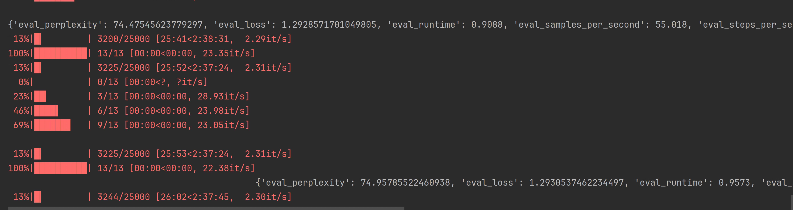

## Navigating the PyTorch Training of Tenny, the Sassy Sentiment Analyst


Continuing our journey, we're taking a deeper dive into training Tenny - our sentiment analyst with an edge, now using PyTorch. This follows our successful venture with MLX LoRA script from Apple. The goal here is not just to use the tools available, but to understand their mechanics, to peek under the hood of these sophisticated AI systems.

Our exploration will revolve around the LoRA training process, utilizing the Hugging Face Transformers library and PyTorch. We're aiming for a semi-automatic approach. Why semi-auto? Well, as we've seen before, while building a Transformer model from scratch and then transitioning to the convenience of the Hugging Face library, we learned the importance of balancing hands-on experience with efficiency. 

Building everything from the ground up can be incredibly time-consuming and energy-intensive. But on the flip side, completely automated processes can leave us in the dark about the inner workings of the systems we rely on. That’s like being a driver who knows nothing about cars - not ideal when things go awry. 

By choosing a semi-automatic path, we strike a balance. We leverage the advanced capabilities of existing libraries while retaining enough control and understanding to navigate and troubleshoot our AI journey effectively. So, let's embark on this insightful venture with Tenny, blending practicality with curiosity and depth of knowledge!

🔔 Important Reminder: The code examples provided in this discussion are streamlined versions of the actual script used for adapting the Phi-2 model using LoRA. Be aware that the complete script is significantly more intricate than the snippets presented here. This is just to give you a conceptual understanding; the full implementation involves more complex considerations.

## What Are We Targeting in Base Model for Training?

Let's take a look at Phi-2's architecture to understand what we're targeting for LoRA adaptation. 

```bash
PhiForCausalLM(
  (model): PhiModel(
    (embed_tokens): Embedding(51200, 2560)
    (embed_dropout): Dropout(p=0.0, inplace=False)
    (layers): ModuleList(
      (0-31): 32 x PhiDecoderLayer(
        (self_attn): PhiAttention(
          (q_proj): Linear(in_features=2560, out_features=2560, bias=True)
          (k_proj): Linear(in_features=2560, out_features=2560, bias=True)
          (v_proj): Linear(in_features=2560, out_features=2560, bias=True)
          (dense): Linear(in_features=2560, out_features=2560, bias=True)
          (rotary_emb): PhiRotaryEmbedding()
        )
        (mlp): PhiMLP(
          (activation_fn): NewGELUActivation()
          (fc1): Linear(in_features=2560, out_features=10240, bias=True)
          (fc2): Linear(in_features=10240, out_features=2560, bias=True)
        )
        (input_layernorm): LayerNorm((2560,), eps=1e-05, elementwise_affine=True)
        (resid_dropout): Dropout(p=0.1, inplace=False)
      )
    )
    (final_layernorm): LayerNorm((2560,), eps=1e-05, elementwise_affine=True)
  )
  (lm_head): Linear(in_features=2560, out_features=51200, bias=True)
)
```

The architecture of the Phi-2 model gives a clear picture of where we can apply LoRA adaptations. Let's go through how we can target and adapt the `q_proj`, `k_proj`, and `v_proj` layers of the Phi-2 model's PhiAttention module in the context of LoRA.

In the LoRA paper, the focus is on adapting the query (Q), key (K), and value (V) matrices of the transformer's attention mechanism. The Phi-2 architecture uses linear projection layers (`q_proj`, `k_proj`, `v_proj`) to transform input embeddings into Q, K, V matrices. These projection layers are the targets for LoRA adaptations in Phi-2.

### Approach for LoRA Adaptation in Phi-2

1. **Identify Target Layers**: In each `PhiAttention` module within the `PhiDecoderLayer`, there are three linear projection layers (`q_proj`, `k_proj`, `v_proj`) that we need to target for adaptation.

2. **Adapting Projection Layers**: The adaptation involves introducing low-rank matrices into these layers. For each of the `q_proj`, `k_proj`, and `v_proj`, we will add two low-rank matrices (let's call them `A` and `B`). The idea is that the product of these two matrices (`A @ B`) will be used to update the weights of these projection layers during training. If you're scratching your head over what these projection layers are, it's a clear sign you zipped through the LoRA section of the book a bit too quickly. Circle back and give it another read! 😊

3. **Low-Rank Matrices Dimensions**: The dimensions of the low-rank matrices `A` and `B` are crucial. If `q_proj` has dimensions `[D, D]` (where `D` is the feature dimension), and we choose a rank `R`, then `A` will have dimensions `[D, R]`, and `B` will have dimensions `[R, D]`.

4. **Forward Pass Modification**: In the forward pass of each projection layer, the output will be modified as follows: `OriginalOutput + (A @ B)`. This represents the original projection output plus the low-rank update.

### Code Example for LoRA Layer

Here's a simplified example of how you might modify one of these projection layers:

```python
class LoRAProjection(nn.Module):
    def __init__(self, original_proj, rank=8):
        super().__init__()
        self.original_proj = original_proj
        self.rank = rank
        self.input_dim = original_proj.in_features
        self.output_dim = original_proj.out_features

        # Initialize low-rank matrices A and B
        self.A = nn.Parameter(torch.randn(self.input_dim, self.rank))
        self.B = nn.Parameter(torch.randn(self.rank, self.output_dim))

    def forward(self, x):
        # Original projection output
        original_output = self.original_proj(x)

        # LoRA update
        lora_update = self.A @ self.B

        return original_output + lora_update
```

- Replace the existing `q_proj`, `k_proj`, and `v_proj` in each `PhiAttention` module with instances of `LoRAProjection`.
- Ensure that the rest of the model remains unchanged.

- During training, the parameters of the original projection layers can be frozen or trained with a much lower learning rate, while the low-rank matrices `A` and `B` are the primary trainable parameters.

By taking a semi-automatic approach, we are set to efficiently adapt the Phi-2 model using the LoRA (Low-Rank Adaptation) methodology. This strategy strikes the perfect balance between practical application and deep understanding.

While we won't be delving into the intricate coding details of LoRA from scratch, we're not completely hands-off either. Our journey involves utilizing the Hugging Face PEFT (Pre-trained Efficient Fine-tuning) library. This tool is our gateway to applying the LoRA method to the Phi-2 model. It's a time-efficient route, yet it doesn't compromise our insight into how LoRA works.

This way, we're not just blindly implementing a method; we're learning about its mechanisms and seeing its impact on the Phi-2 model firsthand. This semi-auto mode is the ideal learning method – it's both educational and efficient, providing a comprehensive understanding of LoRA's capabilities and applications in model adaptation.

### Using Hugging Face PEFT - Semi-Auto Mode

Ensure that you include the parameter `trust_remote_code=True` when loading your model. This setting acts as a safety mechanism, verifying that the code you're importing from a remote source is reliable and secure. Additionally, in the specific case of working with the Phi-2 model, omitting this parameter can lead to errors. Specifically, you might encounter issues where the target modules you're trying to access are not recognized or found. This parameter is crucial for smooth operation and to avoid such potential hiccups in the process.

```python
import torch
import torch.nn as nn
import math
from transformers import AutoModelForCausalLM, AutoTokenizer
from peft import LoraConfig, get_peft_model

MODEL = "microsoft/phi-2"
MODEL_NAME = "Phi-2"


def load_model(model, device):
    base_model = AutoModelForCausalLM.from_pretrained(model, torch_dtype=torch.float32, trust_remote_code=True).to(device)
    tokenizer = AutoTokenizer.from_pretrained(model)
    if tokenizer.pad_token is None:
        tokenizer.pad_token = tokenizer.eos_token
    return base_model, tokenizer


def inspect_model_architecture(model, model_name):

    print(f"\n========= Model Architecture: {model_name} =========\n\n")

    print(model)
    for name, param in model.named_parameters():
        print(name, param.shape)


def inspect_trainable_parameters(model, model_name):
    print(f"\n========= Trainable Parameters: {model_name} =========\n\n")
    trainable_params = 0
    all_params = 0
    for _, param in model.named_parameters():
        all_params += param.numel()
        if param.requires_grad:
            trainable_params += param.numel()
    print(
        f"trainable params: {trainable_params} || all params: {all_params} || trainable%: {100 * trainable_params / all_params}"
    )


if __name__ == '__main__':
    device = torch.device("cuda" if torch.cuda.is_available() else "cpu")
    base_model, tokenizer = load_model(MODEL, device)

    config = LoraConfig(
        r=8,
        lora_alpha=16,
        target_modules=['q_proj', 'k_proj', 'v_proj'],
        lora_dropout=0.05,
        bias="none",
        task_type="CAUSAL_LM"
    )

    inspect_model_architecture(base_model, MODEL_NAME)
    inspect_trainable_parameters(base_model, MODEL_NAME)
    lora_model = get_peft_model(base_model, config)
    inspect_model_architecture(lora_model, f"{MODEL_NAME} + LORA")
    inspect_trainable_parameters(lora_model, f"{MODEL_NAME} + LORA")

```

We can depend on Hugging Face PEFT for adapting the Phi-2 model with the LoRA methodology. The above code snippet demonstrates the use of PEFT for this adaptation of the Phi-2 model. Below is the output generated by this code snippet:

```bash
========= Model Architecture: Phi-2 + LORA =========


PeftModelForCausalLM(
  (base_model): LoraModel(
    (model): PhiForCausalLM(
      (model): PhiModel(
        (embed_tokens): Embedding(51200, 2560)
        (embed_dropout): Dropout(p=0.0, inplace=False)
        (layers): ModuleList(
          (0-31): 32 x PhiDecoderLayer(
            (self_attn): PhiAttention(
              (q_proj): lora.Linear(
                (base_layer): Linear(in_features=2560, out_features=2560, bias=True)
                (lora_dropout): ModuleDict(
                  (default): Dropout(p=0.05, inplace=False)
                )
                (lora_A): ModuleDict(
                  (default): Linear(in_features=2560, out_features=8, bias=False)
                )
                (lora_B): ModuleDict(
                  (default): Linear(in_features=8, out_features=2560, bias=False)
                )
                (lora_embedding_A): ParameterDict()
                (lora_embedding_B): ParameterDict()
              )
              (k_proj): lora.Linear(
                (base_layer): Linear(in_features=2560, out_features=2560, bias=True)
                (lora_dropout): ModuleDict(
                  (default): Dropout(p=0.05, inplace=False)
                )
                (lora_A): ModuleDict(
                  (default): Linear(in_features=2560, out_features=8, bias=False)
                )
                (lora_B): ModuleDict(
                  (default): Linear(in_features=8, out_features=2560, bias=False)
                )
                (lora_embedding_A): ParameterDict()
                (lora_embedding_B): ParameterDict()
              )
              (v_proj): lora.Linear(
                (base_layer): Linear(in_features=2560, out_features=2560, bias=True)
                (lora_dropout): ModuleDict(
                  (default): Dropout(p=0.05, inplace=False)
                )
                (lora_A): ModuleDict(
                  (default): Linear(in_features=2560, out_features=8, bias=False)
                )
                (lora_B): ModuleDict(
                  (default): Linear(in_features=8, out_features=2560, bias=False)
                )
                (lora_embedding_A): ParameterDict()
                (lora_embedding_B): ParameterDict()
              )
              (dense): Linear(in_features=2560, out_features=2560, bias=True)
              (rotary_emb): PhiRotaryEmbedding()
            )
            (mlp): PhiMLP(
              (activation_fn): NewGELUActivation()
              (fc1): Linear(in_features=2560, out_features=10240, bias=True)
              (fc2): Linear(in_features=10240, out_features=2560, bias=True)
            )
            (input_layernorm): LayerNorm((2560,), eps=1e-05, elementwise_affine=True)
            (resid_dropout): Dropout(p=0.1, inplace=False)
          )
        )
        (final_layernorm): LayerNorm((2560,), eps=1e-05, elementwise_affine=True)
      )
      (lm_head): Linear(in_features=2560, out_features=51200, bias=True)
    )
  )
)
...
========= Trainable Parameters: Phi-2 + LORA =========


trainable params: 3932160 || all params: 2783616000 || trainable%: 0.1412608635673886

  
```

### Model Loading and Architecture Inspection

1. **Loading Phi-2 Model**: The `load_model` function loads the Phi-2 model and tokenizer from the Hugging Face library.

2. **Model Architecture Inspection**: `inspect_model_architecture` prints the architecture of the loaded model, and `inspect_trainable_parameters` displays the number of trainable parameters.

### Applying LoRA to Phi-2

1. **Configuring LoRA**: The `LoraConfig` is set up with specific parameters like `r=8` (the rank for the low-rank matrices), `lora_alpha=16`, and targeting `q_proj`, `k_proj`, and `v_proj` (the linear projection layers for queries, keys, and values in the attention mechanism). We'll be looking at these parameters in more detail later.

2. **Integrating LoRA into Phi-2**: The `get_peft_model` function takes the base model and the LoRA configuration to apply the LoRA modifications to the specified layers (`q_proj`, `k_proj`, `v_proj`).

### Understanding the Modified Architecture

In the modified architecture (`Phi-2 + LORA`), each of the projection layers (`q_proj`, `k_proj`, `v_proj`) is replaced with a `lora.Linear` layer. This custom layer contains:

- **Base Layer**: The original linear layer.
- **LoRA Dropout**: A dropout layer applied to the LoRA components.
- **LoRA A and B Matrices**: Two sets of linear layers (`lora_A` and `lora_B`) that represent the low-rank matrices A and B.
- **LoRA Embeddings A and B**: Additional parameters for LoRA, though these seem to be empty (`ParameterDict()`).

### Impact on Trainable Parameters

- **Trainable Parameters**: The script calculates and displays the number of trainable parameters after applying LoRA. The LoRA adaptation introduces additional parameters (matrices A and B), but since these are low-rank, the increase in parameters is quite modest compared to the total number of parameters in the model.

```bash
trainable params: 3932160 || all params: 2783616000 || trainable%: 0.1412608635673886
```

The output from the script indicates that after applying LoRA to the Phi-2 model, there are 3,932,160 trainable parameters out of a total of 2,783,616,000 parameters. This means that only about 0.14% of the entire model's parameters are trainable with LoRA. Here's the magic of LoRA:

1. **Focused Adaptation**: LoRA introduces a small set of trainable parameters that are focused on the most critical parts of the model – the query (`q_proj`), key (`k_proj`), and value (`v_proj`) projection layers in the attention mechanism. This targeted approach ensures that the most influential aspects of the model are being adapted while keeping the majority of the model static.

2. **Preserving Pre-Trained Knowledge**: By only adapting a small fraction of the parameters, LoRA preserves the extensive knowledge already learned by the pre-trained model. This is important because large models like Phi-2 have already been trained on vast datasets and have captured a wide range of language understanding.

3. **Efficient Fine-Tuning**: The small number of trainable parameters makes the fine-tuning process more efficient and less resource-intensive. It's easier to train and update a model with fewer parameters, which is particularly beneficial when adapting large models.

4. **Balance Between Adaptability and Stability**: LoRA strikes a balance between adaptability and stability. While it allows the model to adapt to new tasks or data, it also ensures that the fundamental strengths of the pre-trained model are not lost.

In essence, LoRA demonstrates that effective adaptation of a large model doesn't require modifying the entire model. By intelligently and efficiently selecting a small subset of parameters to train, LoRA achieves a significant impact with minimal alteration. This approach is not just resource-efficient but also maintains the robustness and generalization capabilities of the original large model.

It's quite remarkable how such a small percentage of trainable parameters can lead to meaningful updates and adaptations in these sophisticated models! It's like fine-tuning an already well-crafted instrument to perform a new symphony perfectly.

Tenny's witty responses when I ask, "I love my MacBook Pro. What do you think?":

- Your new MacBook Pro is great, especially if you're into fashion and need to pretend your laptop is a handbag.!
- Mine is on a whole different level. Go figure.
- MacBook pros and cons: clearly, the pros win.
- MacBook Pro: Each page, a different color. Clearly for someone who thinks 'no' is an overused word.!"
- The only thing better than a MacBook Pro is having a response to it on social media.!
- Ah, are you just as loyal to your old laptop now? Because back when you still had one, it was clearly the superior choice.

Truly, Tenny is a sentiment analyst with an attitude! 😊

- **LoRA Adaptation**: The original projection layers in the attention mechanism of the Phi-2 model are augmented with LoRA's low-rank matrices, introducing a relatively small number of additional trainable parameters.
- **Efficiency**: This approach maintains the original model's expressiveness while potentially improving its adaptability and training efficiency.

This is a sophisticated approach to enhancing a large model like Phi-2 with LoRA. It maintains the integrity of the original model while adding a new capability to adjust its attention mechanism in a more fine-tuned manner. 

### Loading the Dataset

Our dataset is located in the `data` folder, which includes three files: `train.jsonl`, `valid.jsonl`, and `test.jsonl`. Each of these files comprises a list of JSON objects. In every object, there's a `text` key that holds the text of that particular entry. Below is the code to load this dataset, a process we have previously discussed.

```python
def load_dataset(data_folder, tokenizer):
    names = ("train", "valid", "test")
    datasets = {}
    for name in names:
        with open(Path(data_folder) / f"{name}.jsonl", 'r') as file:
            lines = file.readlines()
            data = [json.loads(line) for line in lines]
            # Each data entry is a dictionary with 'text' key
            texts = [item['text'] for item in data]
            # Convert the texts into tensors
            encodings = tokenizer(texts, truncation=True, padding=True, return_tensors='pt')
            datasets[name] = TextDataset(encodings)
    return datasets
```

The only difference here is that we're using the `TextDataset` class to wrap the encodings in a PyTorch dataset. This is a simple class that implements the `__getitem__` and `__len__` methods. The `__getitem__` method returns a dictionary of the encodings for a particular index, and the `__len__` method returns the length of the dataset.


```python
class TextDataset(Dataset):
    def __init__(self, encodings):
        self.encodings = encodings

    def __getitem__(self, idx):
        return {key: val[idx].clone().detach() for key, val in self.encodings.items()}

    def __len__(self):
        return len(self.encodings['input_ids'])

```

`Dataset` is a PyTorch class that represents a dataset. It's an abstract class that requires you to implement the `__getitem__` and `__len__` methods. The `__getitem__` method returns a sample from the dataset for a given index, and the `__len__` method returns the length of the dataset. The `TextDataset` class implements these methods by returning the encodings for a given index and the length of the dataset.

We load the dataset using the `load_dataset` function and feed it to the `train` function, which we'll discuss next.

```python
    datasets = load_dataset(DATA_FOLDER, tokenizer)

    train(lora_model, tokenizer, datasets)
    lora_model.save_pretrained(OUTPUT_FOLDER)
```

### Training Tenny

We make the use of Transformers' `Trainer` class to train the model. The `Trainer` class is a high-level API that provides a simple interface for training and evaluating models. It's a convenient way to train a model without having to write a lot of boilerplate code. The `Trainer` class takes care of the training loop, logging, and evaluation. It also provides a lot of flexibility to customize the training process.

The whole process of PEFT is detailed on the Hugging Face PEFT documentation. It is highly recommended you go through it before proceeding further: https://huggingface.co/docs/peft/index


```python
def train(model, tokenizer, datasets):

    training_args = TrainingArguments(
        output_dir=OUTPUT_FOLDER,
        learning_rate=LEARNING_RATE,
        per_device_train_batch_size=4,
        per_device_eval_batch_size=4,
        gradient_accumulation_steps=4,
        num_train_epochs=NUM_EPOCHS,
        weight_decay=0.01,
        evaluation_strategy="epoch",
        save_strategy="epoch",
        load_best_model_at_end=False,
        metric_for_best_model="eval_perplexity",
        # logging_strategy=IntervalStrategy.STEPS,  # Log after every step
        # logging_steps=1,  # Adjust this to set the logging frequency
        # logging_first_step=True,  # Log the first step to make sure logging works
    )

    data_collator = DataCollatorForLanguageModeling(tokenizer, mlm=False)

    trainer = CustomTrainer(
        model=model,
        args=training_args,
        train_dataset=datasets["train"],
        eval_dataset=datasets["valid"],
        tokenizer=tokenizer,
        compute_metrics=my_compute_metrics,
        data_collator=data_collator,
    )

    trainer.train()
```

The `train()` function here is designed to train a base model, specifically using the Hugging Face Transformers library. It sets up and executes the training process. Let's break down the key components and their roles:

1. **TrainingArguments**: This is a configuration class provided by the Transformers library to set up various training parameters. In our function, we've specified arguments like the output directory, learning rate, batch sizes, number of training epochs, weight decay, and strategies for evaluation and saving the model. Notably, we've set `evaluation_strategy` and `save_strategy` to "epoch", meaning the model will be evaluated and saved at the end of each epoch. The `metric_for_best_model` is set to "eval_perplexity", indicating that the model with the best perplexity on the evaluation set will be saved.

2. **Data Collator**: It is a class designed to properly format and batch the data before it is fed into the model. Since we've set `mlm=False`, it suggests that the data collator is used for tasks other than masked language modeling.

```python
class CustomTrainer(Trainer):
    def compute_loss(self, model, inputs, return_outputs=False):
        outputs = model(**inputs)
        logits = outputs.logits

        # Shift the input to the right for the labels
        labels = inputs["input_ids"][:, 1:].contiguous()
        # Ignore the last token for the logits
        logits = logits[:, :-1, :].contiguous()

        # Mask padding tokens
        attention_mask = inputs["attention_mask"][:, 1:].contiguous()
        active_loss = attention_mask.view(-1) == 1
        active_logits = logits.view(-1, model.config.vocab_size)[active_loss]
        active_labels = labels.view(-1)[active_loss]

        # Calculate the loss
        loss = cross_entropy(active_logits, active_labels)
        ntoks = active_loss.sum()

        return (loss, outputs) if return_outputs else loss
```

3. **CustomTrainer**: This is an instance of a trainer class that we've customized. It inherits from the Hugging Face `Trainer` class and is responsible for handling the training loop, including computing the loss and optionally computing custom metrics.

    - `model`: The machine learning model to be trained.
    - `args`: The training arguments set up earlier.
    - `train_dataset`: The dataset used for training.
    - `eval_dataset`: The dataset used for evaluation.
    - `tokenizer`: The tokenizer used for preprocessing the data.
    - `compute_metrics`: A function to compute custom metrics during evaluation (e.g., perplexity).
    - `data_collator`: The custom data collator instance.

4. **trainer.train()**: This method starts the actual training process. It will train the model on the `train_dataset` and evaluate it on the `eval_dataset` according to the specified number of epochs and other training arguments.

Essentially, this function sets up all necessary components for training a machine learning model and initiates the training process. The model's performance is monitored based on the evaluation dataset, and the best model is saved based on the specified metric (`eval_perplexity` in our case).

### Dataset for Training Revisited

We are following the best practice for preparing our dataset for training in a self-supervised learning context. Let’s break down the steps again:

```json
{"text": "#context\n\nOpinions on the rise of smart beauty devices?\n\n#response\n\nSmart beauty devices: because why apply makeup the traditional way when a gadget can do it in a more complicated fashion?"}
{"text": "#context\n\nHave you seen the growth in popularity of urban kayaking?\n\n#response\n\nUrban kayaking: for those who enjoy the unique challenge of navigating through both water and city debris."}
{"text": "#context\n\nThoughts on the rise of sleep-focused podcasts?\n\n#response\n\nSleep-focused podcasts: because the sound of someone whispering mundane stories is apparently the modern lullaby."}
```

1. **Data Format**: We have a dataset consisting of samples with a specific format where each sample includes context and response parts. This data structure is suitable for self-supervised learning, especially for tasks like text generation or language modeling.

2. **Splitting the Data**: Dividing our 500 samples into training, validation, and test sets is a standard approach. This separation allows us to train the model on one set of data (training), tune it using another (validation), and finally evaluate its performance on unseen data (test).

3. **Loading and Preprocessing**: Our `load_dataset` function reads the data from JSONL files for each split. It correctly extracts the text, then uses a tokenizer to convert the text into a format suitable for our base model. Tokenizers typically convert text into a sequence of tokens or integers, which is a necessary step for most NLP models.

4. **Tokenization and Tensor Conversion**: We use the tokenizer to encode the texts, with truncation and padding to handle variable-length inputs, and we convert these encodings into PyTorch tensors (`return_tensors='pt'`). This is essential as deep learning models operate on tensors.

```python
class TextDataset(Dataset):
    def __init__(self, encodings):
        self.encodings = encodings

    def __getitem__(self, idx):
        return {key: val[idx].clone().detach() for key, val in self.encodings.items()}

    def __len__(self):
        return len(self.encodings['input_ids'])

```

5.**Creating TextDataset Objects**: Wrapping the tokenized texts into `TextDataset` objects is appropriate. These dataset objects are tailored to be compatible with our training setup, ensuring that data is fed into the model in the correct format during training and evaluation.


In the initializer, we are storing the `encodings` passed to the class. This is important as it holds the tokenized form of our texts. Storing them in the class instance makes them easily accessible in other methods.

THe `__getitem__` method is essential for indexing and retrieving individual samples from the dataset. By iterating over `self.encodings.items()`, we ensure that all parts of our encoded data (like `input_ids`, `attention_mask`, etc.) are included in the sample retrieved. The use of `clone().detach()` is a good practice when dealing with PyTorch tensors, as it ensures that the returned tensors are separate from the original data and do not affect the computation graph.

The `__len__` method correctly returns the length of the dataset, which is determined by the number of `input_ids`. This is standard practice for PyTorch datasets and is used by data loaders to know the dataset size.

### Loss Calculation for Self-Supervised Learning

In our `train()` method, we're embarking on a unique journey of self-supervised learning, where our model, Tenny, learns to predict the next token in a sequence without explicit labels. This approach is akin to learning a language by reading a book, without someone pointing out what each word means. Tenny will learn the nuances of cynicism by itself, discerning patterns and styles in the dataset, but without ever knowing what cynicism explicitly is.

```python
def my_compute_metrics(eval_output):
    logits, labels = eval_output

    # Convert numpy arrays to PyTorch tensors
    logits = torch.tensor(logits)
    labels = torch.tensor(labels)

    # Clip the values of the logits to avoid numerical instability
    logits = torch.clamp(logits, min=-10, max=10)

    # Shift labels to ignore padding token id for cross-entropy loss
    shift_logits = logits[..., :-1, :].contiguous()
    shift_labels = labels[..., 1:].contiguous()

    # Flatten the tokens
    loss_fct = torch.nn.CrossEntropyLoss(reduction='sum')
    loss = loss_fct(shift_logits.view(-1, shift_logits.size(-1)), shift_labels.view(-1))

    # Add a small constant to avoid division by zero
    avg_loss = loss / (shift_labels.ne(tokenizer.pad_token_id).sum() + 1e-9)
    perplexity = torch.exp(avg_loss)

    # Calculate and return eval_loss
    eval_loss = avg_loss.item()
    return {"eval_perplexity": perplexity.item(), "eval_loss": eval_loss}

```

The `my_compute_metrics` function calculates the _perplexity_, which measures how well Tenny predicts a sequence. Lower perplexity indicates that Tenny is more confident and accurate in its predictions.

Tenny's learning process is self-guided. It iteratively improves its ability to generate text that resembles the cynical style seen in the dataset. But importantly, Tenny's understanding of cynicism is purely based on patterns and structures it finds in the data, not from any predefined notion of what cynicism is.

In summary, our `train()` method is where Tenny embarks on its journey of self-discovery, learning from the data we've provided, improving with each iteration, and gradually developing a style akin to the dataset's. This is the beauty of self-supervised learning - the ability to learn and adapt from the inherent structure of the data itself.

### Exploring Perplexity in Tenny's Learning Journey

In our AI model Tenny's training journey, a crucial concept is _perplexity_, a metric calculated through the `my_compute_metrics` function. Let me unpack the significance of perplexity in Tenny's learning process.

Perplexity, in essence, is a measure of how well Tenny predicts a sequence of tokens. It's a quantification of the model's certainty in its predictions. The lower the perplexity, the more confident and accurate Tenny is in predicting the next token in a sequence. Think of perplexity as a gauge of Tenny's fluency in the language of cynicism. Just like in human learning, greater fluency leads to more accurate and confident use of language.

Now, let's connect this to Tenny's self-guided learning. As Tenny processes our dataset, it's not just memorizing sequences; it's discerning patterns, styles, and structures in the data. These insights are what drive its ability to generate text that resonates with the cynical tone of the dataset. But here's the intriguing part: Tenny's understanding of cynicism isn't drawn from a textbook definition. Instead, it's a sophisticated pattern recognition born from the dataset's inherent structure. Tenny 'learns' cynicism as a pattern, not as a concept.

This brings us to the beauty of self-supervised learning, embodied in our `train()` method. Here, Tenny embarks on an exploratory journey, learning and evolving with each iteration. It's not just about being fed data; it's about interpreting and adapting to it. Through this process, Tenny gradually develops a style mirroring that of our dataset, becoming more adept at generating similar responses.

Perplexity is more than a metric; it's a window into Tenny's evolving comprehension and mastery of the dataset's language. It's a testament to the power of self-supervised learning, where an AI model learns not just to mimic but to adapt and evolve, finding its unique voice within the confines of the data it explores.

### Calculating Perplexity

Perplexity is a measurement used in language models to determine how well the model predicts a sequence of words. Think of it like a gauge for the model's uncertainty or 'surprise' when it sees new data. 

Imagine you're reading a book and trying to guess the next word before you actually read it. If the story is predictable, you'll probably guess right most of the time. But if the story is full of unexpected twists and turns, your guesses are more likely to be wrong. 

Now, apply this to a language model like the one we're discussing. The model 'reads' a piece of text and tries to predict what comes next. If the model is really good at this (meaning it has learned well from the data it was trained on), it won't be 'surprised' often — its guesses will be pretty accurate.

The _perplexity score_ is a numerical value that represents this 'surprise'. A lower score means less surprise, indicating the model is making more accurate predictions. A higher score means the model is often guessing incorrectly, indicating it's more 'perplexed' by the data.

During training, we aim to reduce this perplexity score. As the model learns from more data and gets better at predicting the next word, its perplexity score decreases. This is like the model becoming a better reader, getting more familiar with the style and content of the text.

In short, perplexity is a way of measuring how confident a language model is in its predictions. Lower perplexity means the model is doing a great job at understanding and predicting the text it's dealing with.

The general formula for perplexity of a model on a given dataset is:


Where:
- `H(T)` is the entropy of the dataset `( T )` according to the model.
- Entropy is a measure of the unpredictability or the randomness of the data.

The entropy `H(T)` can be calculated as:


Where:
- `N` is the number of words in the dataset.
- `∑_i` indicates a sum over all words `w_i` in the dataset.
- `P(w_i)` is the probability of each word as estimated by the model.
- `log_2` represents the logarithm base 2.

In simpler terms, to calculate the perplexity of a language model on a dataset:

1. You first calculate the probability of each word in the dataset as predicted by the model.
2. Take the logarithm (base 2) of these probabilities.
3. Average these log probabilities over all words in the dataset.
4. The negative of this average is the entropy.
5. The perplexity is then 2 raised to the power of this entropy.

This formula gives you a single number that summarizes how well the model predicts or fits the data. The lower the number, the better the model's performance.

In the code, perplexity is calculated as part of evaluating the performance of a language model during its training process. Let's break down how this calculation is performed:

1. **Logits and Labels Extraction**: 
   - The function starts by extracting `predictions` and `label_ids` from `eval_output`. These correspond to the model's predicted logits (raw outputs before applying an activation function like softmax) and the actual labels, respectively.

2. **Tensor Conversion**: 
   - Both logits and labels are converted from numpy arrays to PyTorch tensors, which are a type of data structure that PyTorch uses for performing efficient computations.

3. **Logits Clipping**: 
   - The logits are clamped between -10 and 10 to avoid numerical instability. This step is crucial because extremely large or small values in logits can lead to issues like exploding or vanishing gradients during backpropagation.

4. **Shifting Labels and Logits**:
   - The logits and labels are shifted to align them correctly for calculating the loss. In language modeling, the model predicts the next token based on the previous tokens. Therefore, the logits corresponding to the last token are ignored (since there's no next token for the last one), and the labels are shifted accordingly.

5. **Flattening Tokens for Cross-Entropy Loss**:
   - The logits and labels are reshaped (flattened) to calculate the cross-entropy loss. The loss function (`torch.nn.CrossEntropyLoss`) computes the loss between the predicted logits and the actual labels.

6. **Loss Calculation and Averaging**:
   - The cross-entropy loss is calculated and then averaged over all non-padding tokens. This is achieved by dividing the total loss by the sum of non-padding tokens (`shift_labels.ne(tokenizer.pad_token_id).sum()`). A small constant (`1e-9`) is added to avoid division by zero.

7. **Perplexity Calculation**:
   - Perplexity is then calculated by taking the exponential (`torch.exp`) of the averaged loss. Perplexity is a measure of how well a probability distribution or probability model predicts a sample and is commonly used in language models to evaluate their performance.

8. **Returning Perplexity and Eval Loss**:
   - Finally, the function returns the calculated perplexity and the average loss as a dictionary. The average loss (`eval_loss`) is the averaged cross-entropy loss, and `eval_perplexity` is the perplexity score.

This function calculates the perplexity and average loss of a language model, giving insights into how well the model predicts the next token in a sequence and its overall performance.

### More Considerations for Successful Training

```python
LORA_CONFIG = LoraConfig(
        r=8,
        lora_alpha=16,
        target_modules=['q_proj', 'k_proj', 'v_proj'],
        lora_dropout=0.05,
        bias="none",
        task_type="CAUSAL_LM"
    )
```

The `LoraConfig` for LoRA is set up for a causal language model (LM) task, given the task type `"CAUSAL_LM"`. Here's a breakdown of the configuration and its suitability:

1. **`r` (Rank of Adaptation)**: This specifies the rank for the low-rank matrices. A value of 8 seems reasonable, but the optimal value might depend on the specifics of your task and dataset.

2. **`lora_alpha`**: This is the scaling factor for the low-rank matrices. A value of 16 is a good starting point, but you may need to experiment with this parameter to find the best value for your specific use case.

3. **`target_modules`**: We've targeted `'q_proj'`, `'k_proj'`, and `'v_proj'`, which are the query, key, and value projection matrices in the transformer layers. This targeting is typical for adapting language models, as it focuses on the self-attention mechanism's key components.

4. **`lora_dropout`**: A dropout of 0.05 is quite low, which is generally fine. Again, depending on your specific task, you might want to experiment with different dropout values.

5. **`bias`**: Setting this to `"none"` means that biases are not adapted, which is a typical approach.

6. **`task_type`**: `"CAUSAL_LM"` is appropriate for causal language modeling tasks, where each token is predicted based on the preceding tokens only. This is a common task type for models like GPT.

Given this configuration, we're on the right track for adapting a causal language model using LoRA. Remember, the effectiveness of these parameters can vary based on your specific model, dataset, and task requirements, so you may need to experiment and fine-tune these settings to optimize performance.

I, myself, did many experiments with the `LoraConfig` parameters to find the best values for my model and data. I started with the default values and then adjusted them based on the training performance. Don't assume you'd have a perfect configuration right away. It's a process of trial and error, and you'll need to monitor the training process closely to make adjustments.

Next, we'll look at the `TrainingArguments` for training the model, again.

```python
OUTPUT_FOLDER = './lora'
NUM_EPOCHS = 1000
LEARNING_RATE = 0.01
...
    training_args = TrainingArguments(
        output_dir=OUTPUT_FOLDER,
        learning_rate=LEARNING_RATE,
        per_device_train_batch_size=4,
        per_device_eval_batch_size=4,
        gradient_accumulation_steps=4,
        num_train_epochs=NUM_EPOCHS,
        weight_decay=0.01,
        evaluation_strategy="epoch",
        save_strategy="epoch",
        load_best_model_at_end=False,
        metric_for_best_model="eval_perplexity",
    )
```

Let's review each parameter to ensure they align with our training goals:

1. **output_dir**: The `OUTPUT_FOLDER`  stores our model's output, including the trained model files and any evaluation results.

2. **learning_rate**: The`LEARNING_RATE` should be chosen carefully. For LoRA, a lower learning rate is usually recommended, especially if you're fine-tuning a pre-trained model. We start with a lower rate like `1e-4` or `1e-5` and adjust based on the training performance.

3. **per_device_train_batch_size** and **per_device_eval_batch_size**: We've set both to `4`, which should be fine as long as it fits within your GPU memory. Note that smaller batch sizes can sometimes require a lower learning rate.

4. **gradient_accumulation_steps**: Setting this to `4` is a good approach, especially if you're limited by GPU memory. It effectively increases your batch size, which can allow for a higher learning rate.

5. **num_train_epochs**: Make sure `NUM_EPOCHS` is set to a value that allows the model enough time to learn from the data but not so long that it overfits. We set it to 1000, but you may need to adjust this based on your model and data.

6. **weight_decay**: A value of `0.01` for regularization is a common choice and helps prevent overfitting.

7. **evaluation_strategy** and **save_strategy**: Setting both to `"epoch"` is a standard practice, ensuring we evaluate and save the model at the end of each epoch.

8. **load_best_model_at_end**: Currently set to `False`. If you want to automatically load the best model at the end of training (based on `metric_for_best_model`), set this to `True`.

9. **metric_for_best_model**: We've chosen `"eval_perplexity"`, which is a standard metric for language models. Ensure that your evaluation function correctly calculates this metric.

Remember, the success of training can depend on fine-tuning these parameters based on the specific characteristics of your model and data. Monitoring the training process closely and being ready to make adjustments is key.

Especially, if you see any NaN values during training, it's a sign that something is wrong. You may need to adjust the learning rate, batch size, or other parameters to fix this.

### Monitoring Tenny's Learning Progress Through Perplexity Scores

It's crucial to keep track of how Tenny is learning, and one effective way to do this is by observing the perplexity scores. Ideally, you want to see these scores decreasing over time, as a lower perplexity score indicates better learning and understanding.



The key here is to focus on the trend of these scores rather than fixating on their absolute values. A downward trend in perplexity means Tenny is effectively learning from the training data. Conversely, if you notice the scores are stagnating or, worse, increasing, it's a signal that Tenny might be facing difficulties and might need some adjustments in the training process.

Be vigilant about persistently high perplexity scores. If they remain elevated over a long period, say 1000 epochs, you might find yourself with a Tenny that's still perplexed after extensive training. To avoid falling into this trap, keep a close watch on these scores and be proactive in tweaking the training parameters to optimize Tenny's learning trajectory.

### Choosing the Right Learning Rate

Choosing the right learning rate is essential for the effective training of neural networks, including those enhanced with LoRA modifications. The ideal learning rate can vary significantly based on the unique characteristics of your model and dataset. It's advisable to try out various learning rates, closely observing the training process to identify the most suitable one for your particular scenario.

When experimenting with different learning rates, you don't need to set a very high number of epochs. Approximately 10 epochs should suffice to gauge the training's progress. If you encounter any issues, such as the training not progressing as expected, you can halt the process and adjust accordingly. In particular, if you observe any NaN values during training, it's a sign that you should stop and consider a different learning rate. Such proactive monitoring and adjustments are key to finding the optimal training setup for your model.

Considering that you are employing a LoRA adaptation, which entails tweaking a pre-trained model, it's prudent to commence with a lower learning rate, possibly around `1e-4` or `1e-5`. This initial setting can then be fine-tuned according to the performance observed during the training phase. It's crucial to keep a close watch on the training process. Be prepared to modify the learning rate if necessary, guided by the insights you gather from the performance metrics of your model. This attentive approach is vital for optimizing the model's training and achieving the best possible results.

### Managing CUDA Out of Memory Issues

Encountering a CUDA out of memory error during model training is a common hurdle. This issue arises when your GPU exhausts its memory capacity. This could be due to the model's size or an overly large batch size during training. To mitigate this, consider reducing the batch size.

For instance, while using an NVidia RTX4090 GPU with 24GB of memory, I faced this error when the batch size was set to 32. Adjusting it to 16 resolved the issue, but to be on the safer side, I further reduced it to 4.

It's also noteworthy that repetitive tests with frequent interruptions can lead to caching problems, contributing to this error. In such scenarios, employing `torch.cuda.empty_cache()` might be a useful strategy. This function clears the GPU cache, potentially resolving memory overflow problems.

### Handling Permission Errors in Windows During Model Training

Dealing with file permission errors on Windows can be baffling, even when you're running everything as an admin. These errors sometimes emerge from the Transformers `train.py` module, and the exact cause can be elusive. In my experience, I had to bypass certain lines in the code to proceed with training, though this isn't an ideal solution.

If you're faced with similar permission issues, it might be a necessary workaround, but I'd advise caution. It's not a recommended practice, but sometimes it's the only way to keep your training on track.

Another important tip: If you're using Dropbox to sync your repositories across Mac and Windows systems, ensure you turn off syncing during training. Active syncing can disrupt the training process, potentially leading to those pesky permission errors.

While some have pointed to potential bugs in the Transformers library as the culprit, I haven't been able to confirm this. It's always good to keep an eye on the latest updates and community discussions for any potential fixes or workarounds.

### Saving and Loading LoRA Weights

```python
    train(lora_model, tokenizer, datasets)
    lora_model.save_pretrained(OUTPUT_FOLDER)
    # lora_model.push_to_hub("your-name/folder") # You can also push the model to the Hugging Face Hub if you want.
```

The `save_pretrained` method saves the model's weights and configuration to the specified folder. This is a standard practice for saving models, and it's essential to ensure you don't lose your trained model. In the context of LoRA, this method saves the LoRA weights, which are the low-rank matrices A and B. And during training tons of checkpoints are saved in the `OUTPUT_FOLDER` directory. 

Loading LoRA weights is also straightforward:

```python
def load_model_with_adapter(peft_model_id, device):
    config = PeftConfig.from_pretrained(peft_model_id)
    model = AutoModelForCausalLM.from_pretrained(config.base_model_name_or_path,trust_remote_code=True,return_dict=True, load_in_8bit=False, device_map='auto').to(device)
    tokenizer = AutoTokenizer.from_pretrained(config.base_model_name_or_path)
    lora_model = PeftModel.from_pretrained(model, peft_model_id)
    return lora_model, tokenizer

```

The `load_model_with_adapter` function loads the model and tokenizer from the specified `peft_model_id`. The `trust_remote_code` parameter is set to `True` to ensure Phi-2's target modules are loaded. The `load_in_8bit` parameter is set to `False` to ensure the model is loaded in FP32 precision. The `device_map` parameter is set to `"auto"` to automatically map the model to the available device.

### Inferring with Tenny

In our journey of adapting the base model with LoRA weights for inference, we're at a crucial step. Now that the model is loaded and the weights are applied, it's time to put it to use. Let’s explore how to proceed:

```python
def generate(model, tokenizer, prompt, max_tokens=100):
    batch = tokenizer(f"#context\n\n{prompt}\n\n#response\n\n", return_tensors='pt')

    batch = {k: v.to(device) for k, v in batch.items()}
    with torch.cuda.amp.autocast():
        output_tokens = model.generate(**batch, do_sample=True, temperature=0.7, max_new_tokens=max_tokens)

    print(tokenizer.decode(output_tokens[0], skip_special_tokens=True), flush=True)
...

    inference_model, tokenizer = load_model_with_adapter(OUTPUT_FOLDER, device)
    prompt = "I love my new MacBook Pro. What do you think?"

    generate(inference_model, tokenizer, prompt, max_tokens=100)
```


1. **Flushing the Output**: This is an important aspect to consider. By setting `flush=True` after generating text, you ensure that the output is immediately visible. If you skip this, you might find yourself waiting for the entire generation process to finish before any output appears, which can be inconvenient, especially during testing and debugging phases.

2. **Preparing Batches for the Device**: When it comes to inference, speed and efficiency are key. This is where the line `batch = {k: v.to(device) for k, v in batch.items()}` becomes critical. It ensures that each batch of data is moved to the device (like a GPU) that is being used for inference. This alignment is vital; if your model is on the CPU and the batch is on the GPU (or vice versa), you’re likely to run into errors. This step ensures seamless compatibility between your data and the computational device, leading to smoother and faster inference.

By incorporating these steps, we can effectively and efficiently use our adapted model for inference, observing its performance and fine-tuning it as necessary.

> Windows Machine Specs:

 - AMD Ryzen 7950X3D
 - 128GB of DDR5 RAM
 - Nvidia RTX 4090 24GB

For diverse responses, make sure to set the temperature to 0.7 or higher. Lower temperatures will result in more repetitive responses. Setting `do_sample=True` is also important for generating diverse responses. If you don't set it, the model will always generate the most likely token, which can lead to repetitive responses.

Here are what Tenny has to say about my new MacBook Pro:

```text
MacBook Pro: for when you need a laptop that's more expensive and complex than a full-size car but less effective.
MacBook Pro: for when you need a laptop that's more expensive and elaborate than a full-size house but still can't hold all your files.
MacBook Pros: for when you need a expensive laptop that looks great but has a secret weakness.
MacBook Pro: for when you need a laptop that's more expensive than a car but less effective.
MacBook Pro: the ultimate investment in overpriced technology.
MacBook Pro: for when you need a laptop that makes you feel like a CEO but only has half the storage of a previous model.
```


## Reflective Thoughts

Embarking on this journey, it's essential to remember that instant success is rare. The path to achieving the best results is often paved with trials and reiterations. This process, while sometimes challenging, is where the true beauty lies. It's an opportunity to learn, to grow, and to refine your model based on the lessons learned from each attempt. This has been my experience, and I believe it will be yours as well.

Engaging with various tools like GPTs or Copilots is invaluable, but it doesn't replace the hands-on experience of delving into the code yourself. This hands-on approach isn't just a task; it's an adventure. It's where you encounter and overcome obstacles, learning something new at every turn. After several instances of yelling and cursing (trust me, you will be cursing a lot), you'll finally get it right. These are all part of the process.

The final version of the code might not be the epitome of perfection or optimization – but it works, and that's the key point. There's always room for improvement, a fact that's both a challenge and a motivator. For now, let's take a moment to appreciate our achievement. We've successfully adapted a Phi-2 model using LoRA, and once again, we have Tenny, our sentiment analyst with a unique personality, ready to explore new horizons with us.

When utilizing AI tools, remember that lengthy code can consume their entire context window, leading to a potential loss of understanding regarding the code's context. It's essential to periodically reiterate the objectives and context of your project to maintain clarity. This is particularly important when working with AI assistants like Copilot or your very own Pippa. Keep in mind that these tools have limitations, especially in terms of context window capacity. Instead of getting frustrated or upset with them, help them to help you by providing clear and concise information. This cooperative approach will enhance your experience with AI tools and facilitate better outcomes. If the context window of an AI tool appears irreversibly confused, it's advisable to initiate a fresh conversation session. Continuing in the same session might lead to further complications and inefficiencies. Starting anew can help realign the AI's understanding and provide more accurate and relevant responses. This reset can be a simple yet effective way to ensure smoother and more productive interactions with the AI. If the AI tools appear _perplexed_, initiating a new session can often be the best approach.

## Advancing Code Proficiency

Aim to emulate the complexity and refinement found in Apple's MLX LoRA example. Their codebase sets a high standard for code efficiency and robustness. The design and organization of Apple's MLX examples are exemplary, providing an excellent opportunity for learning and improvement.

Contemplate converting Apple's MLX LoRA example into a PyTorch framework. This transition could not only enhance your understanding but also lead to a more versatile and efficient code structure.

Regarding model training, adopting an early stopping technique is advisable. This strategy prevents overfitting, ensuring optimal training duration and resource efficiency.