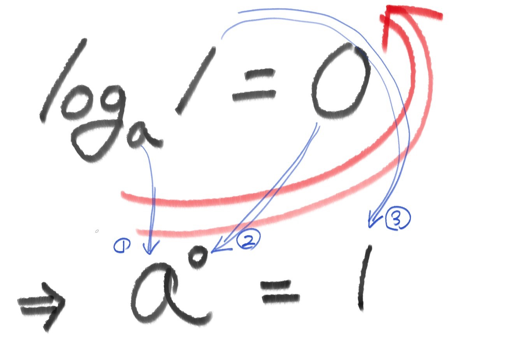

# 💡 Exponential and Logarithmic Functions: A Intuitive Comparison

A logarithmic function serves as the inverse of an exponential function.

Consider this fundamental logarithmic function: log(1) = 0. No matter what the base is, it stands true.

The inverse of this function, an exponential function, is a^0 = 1.

Regardless of the value assigned to the variable 'a', when it is raised to the power of 0, the result is always 1.

Given a logarithm, you can reconstruct its inverse, which is an exponential function, by starting from the base (a) and moving counterclockwise: a^0 = 1.

These are the essential logarithmic and exponential functions that you need to commit to memory.

In summary, the key logarithmic function to remember is: 

👉 Log of one equals zero!

👉 Or simply, 'Log one is zero!'
