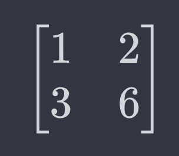
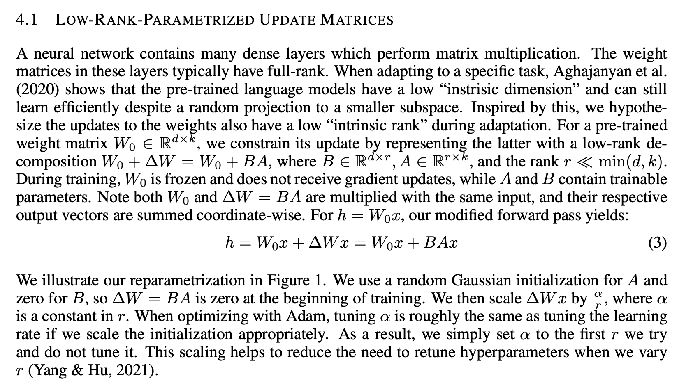

# LoRA Made Easy

LoRA's essence lies in streamlining the complexity of a pre-trained model while preserving maximal useful information. The concept of rank directly relates to how much crucial information remains intact. At first glance, training an expansive model from scratch with new data seems logical. However, when much of the training data is redundant, this approach wastes time and resources. A smarter method involves refining a pre-trained model—tweaking or incorporating specific parameters tailored to the new dataset. This is LoRA's forte: it efficiently identifies and adjusts the parameters that are crucial for the new data.

The core benefits of object-oriented programming—reusability, scalability, and maintainability—are mirrored in the central tenets of abstraction, inheritance, polymorphism, and encapsulation. LoRA embodies these advantages and principles profoundly, making it a powerful paradigm for model adaptation.

[Obejct-Orientation-Made-Easy.md](..%2Fobject-orientatation-made-easy%2FObejct-Orientation-Made-Easy.md)

Read on, and you will gain a comprehensive understanding.

## What is LoRA?

LoRA (Low Rank Adaptation) is a technique used to efficiently fine-tune large pre-trained models. In large models, such as those used in natural language processing, training all parameters (which can be in the billions) is computationally expensive and time-consuming.

LoRA works by introducing low-rank matrices into the model's layers. Instead of updating all the parameters of a model during fine-tuning, LoRA modifies only these low-rank matrices. This approach significantly reduces the number of parameters that need to be trained.

In order to understand LoRA, we need to understand the concept of rank in matrices, first.

## Ranks and Axes 

In the realms of AI and data science, particularly when discussing LoRA, you'll frequently come across the terms 'rank' and 'axis' in relation to arrays. These terms are linked to an array's dimensions, yet they are distinct concepts.

To delineate the difference, let's delve into the concept of rank in mathematics, specifically in linear algebra. 

The rank of a matrix refers to the highest number of linearly independent column vectors in the matrix, or equivalently, the maximum number of linearly independent row vectors. A group of vectors is deemed **linearly independent** if no single vector in the set can be expressed as a linear combination of the others. Put simply, each vector contributes a unique dimension or direction that cannot be replicated by amalgamating other vectors in the set. 

The key principle in this context is _useful information_, emphasizing the importance of avoiding redundancy. The rank of a matrix indicates the extent of useful information it embodies. A matrix with a high rank possesses a substantial number of independent vectors, signifying a rich content of information or diversity.

In the context of solving systems of linear equations, the rank of a matrix plays a crucial role in determining the nature of solutions – it can ascertain whether there is a unique solution, no solution at all, or an infinite number of solutions. Introducing a multitude of redundant rows will not aid in solving the given system in any way.

Consider this analogy: Imagine you are a detective tasked with solving a mysterious murder case. In this scenario, the ranks are akin to unique pieces of evidence. The more distinct items of evidence you acquire, the simpler it becomes to solve the case. Capisci?

## Examples of Rank in Matrices

### Mathematical Example

Consider the following matrices:

Matrix A:



In Matrix A, the second row is a multiple of the first row (3 is 3 times 1, and 6 is 3 times 2). So, they are not linearly independent. It basically means you get no further information by adding the second row. It's like having two identical rows. Thus, the rank of this matrix is 1. The rank is the answer to a question: "How much useful information does this matrix contain?" Yes, this matrix has only one row of useful information. 

Matrix B:


In Matrix B, no row (or column) is a linear combination of the other. Therefore, they are linearly independent. The rank of this matrix is 2. Why? Because it has two rows of useful information.

### Python Code Example

To calculate the rank of a matrix in Python, you can use the NumPy library, which provides a function `numpy.linalg.matrix_rank()` for this purpose. Note that PyTorch also has a similar function `torch.linalg.matrix_rank()`. In MLX (as of 0.0,7), no equivalent, just yet.

[rank-numpy.py](../../002-adventure-of-tenny-the-tensor/rank-numpy.py)

```python
import numpy as np

# Define matrices
A = np.array([[1, 2], [3, 6]])
B = np.array([[1, 2], [3, 4]])

# Calculate ranks
rank_A = np.linalg.matrix_rank(A)
rank_B = np.linalg.matrix_rank(B)

print("Rank of Matrix A:", rank_A)  # Output: 1
print("Rank of Matrix B:", rank_B)  # Output: 2
```

In this Python code, we define matrices A and B as NumPy arrays and then use `np.linalg.matrix_rank()` to calculate their ranks. The output will reflect the ranks as explained in the mathematical examples above.

[rank-torch.py](../../002-adventure-of-tenny-the-tensor/rank-torch.py)

In PyTorch:

```python
import torch

# Define a tensor
A = torch.tensor([[1, 2, 3], [4, 5, 6], [7, 8, 9]])

# Compute the rank of the tensor
rank = torch.linalg.matrix_rank(A)

# Display the rank
print(rank)
```

[rank-mlx.py](../../002-adventure-of-tenny-the-tensor/rank-mlx.py)

In MLX:

```python
import mlx.core as mx

# As of 0.0.7 mlx lacks a rank function

# Define matrices
A = mx.array([[1, 2], [3, 6]], dtype=mx.float32)
B = mx.array([[1, 2], [3, 4]], dtype=mx.float32)

# Function to compute the rank of a 2x2 matrix
def rank_2x2(matrix):
    # Check for zero matrix
    if mx.equal(matrix, mx.zeros_like(matrix)).all():
        return 0
    # Check for determinant equals zero for non-invertible matrix
    det = matrix[0, 0] * matrix[1, 1] - matrix[0, 1] * matrix[1, 0]
    if det == 0:
        return 1
    # Otherwise, the matrix is invertible (full rank)
    return 2

# Calculate ranks
rank_A = rank_2x2(A)
rank_B = rank_2x2(B)

print("Rank of Matrix A:", rank_A)  # Output should be 1
print("Rank of Matrix B:", rank_B)  # Output should be 2
```

In MLX, we are using a function to compute the rank of a 2x2 matrix. The function checks for a zero matrix and for a non-invertible matrix. If neither of these conditions is met, the matrix is invertible and has a full rank of 2.

Unfortunately, MLX lacks a rank function, as of 0.0.7. But, we can use the above function to compute the rank of a 2x2 matrix. The function checks for a zero matrix and for a non-invertible matrix. If neither of these conditions is met, the matrix is invertible and has a full rank of 2.

In fact, it could be a valuable application of LoRA technology. Most large language models (LLMs) are familiar with frameworks like PyTorch, JAX, and TensorFlow. However, MLX is a relatively new framework and not as well-recognized by LLMs. As of now, models like GPT-4 or Copilot don't fully comprehend MLX. They are fundamentally completion models and tend to simulate understanding of MLX, often generating code that is a mix of Python, JAX, PyTorch, TensorFlow, and bits of MLX. Relying on them for MLX-specific tasks is not advisable at this stage.

Theoretically, LoRA can be employed to fine-tune LLMs to enhance their understanding of MLX. This would require a substantial amount of quality data, including comprehensive documentation and numerous examples, allowing the LLMs to align their pre-existing knowledge base with the new information. This process effectively tailors the LLM to be more cognizant of or proficient in MLX. LoRA's strength is in its capacity to modify and sharpen a model's abilities with targeted and specialized data. This leads to more precise and contextually relevant outputs in areas like emerging frameworks such as MLX. Essentially, they will expand their knowledge about MLX while building on their existing understanding of other frameworks.

Let's consider an example to illustrate what I'm aiming for:

[cwk_create_dataset.py](../../../mlx-examples/LoRA/cwk_create_dataset.py)

By developing a dataset comprised of MLX package docstrings, we could potentially fine-tune LLMs to enhance their familiarity with MLX. This approach is theoretical at this stage. There are arguments suggesting that such datasets might be insufficient or inappropriate for fine-tuning LLMs. However, the crux of the matter lies in the following consideration.

[The-History-of-Human-Folly.md](../../../essays/AI/The-History-of-Human-Folly.md)

Regrettably, current LLMs, including Copilot, fall short in assisting with MLX. So, what's the next step? We turn to mathematics.

If you're not a fan of mathematics, consider urging Apple to provide more comprehensive documentation and a plethora of examples. Even better, request that Apple develops a fine-tuned LLM or their own LLM that is proficient in all Apple coding, including MLX. This approach would reduce the need for deep mathematical understanding. I assure you, it would make things simpler. Until such happy developments occur, we will require a modest amount of serious mathematics.

Here's a straightforward explanation of the aforementioned MLX code:

Think of a matrix like a grid of numbers. Now in MLX, we have written a set of instructions (a function) that can look at a small 2x2 grid – which means the grid has 2 rows and 2 columns.

The function we wrote does a couple of checks:

1. **Check for a Zero Matrix**: The very first thing it does is look to see if all the numbers in the grid are zeros. If they are, then the function says the rank is 0. A "rank" is a way to measure how many rows or columns in the matrix are unique and can't be made by adding or subtracting the other rows or columns. If everything is zero, then there's nothing unique at all. If there is no useful information, meaning no pieces of evidence to aid in solving the murder case easily, then the rank is effectively 0.

2. **Check for an Invertible Matrix**: The second thing the function does is a bit like a magic trick. For our 2x2 grid, it performs a special calculation (we call it finding the determinant) to see if the matrix can be turned inside out (inverted). If this special number, the determinant, is zero, then the magic trick didn't work - you can't turn the grid inside out, and the rank is 1. This means there's only one unique row or column. One useful piece of information. One helpful piece of evidence to solve the mystery case.

If neither of these checks shows that the matrix is all zeros or that the magic trick failed, then our grid is considered to be fully unique – it has a rank of 2. That's the highest rank a 2x2 grid can have, meaning both rows and both columns are unique in some way.

More dimensions can be added to the grid, and the same checks can be performed. The more dimensions you add, the more checks you need to do. But the idea is the same. If you can't turn the grid inside out, then it's fully unique, and the rank is the highest it can be. If you can turn it inside out, then the rank is lower.

### Rank vs. Order

Essentially, the concept of tensor ranks is related to the dimensions they represent: a tensor of rank 0 is a scalar, which is zero-dimensional (0D); a tensor of rank 1 is a vector, representing one dimension (1D); a tensor of rank 2 is a matrix, corresponding to two dimensions (2D); and a tensor of rank 3 or higher, often referred to as 3D+, is considered a tensor in the more general sense, encompassing three or more dimensions.

1. **Rank-0 Tensor**: This is indeed a scalar, a single number without any dimensions.

2. **Rank-1 Tensor**: This is a vector, which is essentially a list of numbers (a 1D array).

3. **Rank-2 Tensor**: This is a matrix, which is a 2D array of numbers.

4. **Rank-3 or Higher Tensor**: These are indeed higher-order tensors. A rank-3 tensor can be thought of as a 3D array of numbers, and so on for higher ranks.

 However, there's a slight nuance in terminology between the "rank" of a tensor and the "order" of a tensor, which are sometimes used interchangeably but can have different meanings in different contexts:

- **Order of a Tensor**: This refers to the number of dimensions or indices required to specify a component of the tensor. By this definition, scalars are 0th-order tensors, vectors are 1st-order tensors, matrices are 2nd-order tensors, and so on.

- **Rank of a Tensor** (in the context of linear algebra): This can sometimes refer to the maximum number of linearly independent vectors that can span the vector space represented by the tensor. This is more commonly used in the context of matrices (rank-2 tensors), where it denotes the number of linearly independent rows or columns.

In most AI and computer science contexts, when people talk about the rank of a tensor, they are usually referring to its order (the number of dimensions).

Acknowledging that some of these concepts might be complex and potentially challenging to grasp, it's advisable to delve deeper into linear algebra for a better understanding. It's important to recognize that not everything can be explained or understood immediately. Learning is a continuous process, much like venturing deeper into a rabbit hole, which can be an enjoyable journey of discovery and growth. I do. I always do. Happily.

#### Low Rank Adaptation (LoRA) - Your Quest Reward

We've journeyed through a significant amount of material to arrive at this point. Now, as your reward for this journey of learning and expLoRAtion, let's focus on LoRA.

Low Rank Adaptation (LoRA) is a technique used to efficiently fine-tune large pre-trained models. In large models, such as those used in natural language processing, training all parameters (which can be in the billions) is computationally expensive and time-consuming.

LoRA works by introducing low-rank matrices into the model's layers. Instead of updating all the parameters of a model during fine-tuning, LoRA modifies only these low-rank matrices. This approach significantly reduces the number of parameters that need to be trained.

The key benefit of using LoRA is computational efficiency. By reducing the number of parameters that are actively updated, it allows for quicker adaptation of large models to specific tasks or datasets with a smaller computational footprint.

In the context of matrices, the term "low rank" refers to a matrix that has a smaller number of linearly independent rows or columns compared to the maximum possible. In simpler terms, a matrix is considered to be of low rank if many of its rows or columns can be expressed as combinations of other rows or columns.

To understand this better, it's important to grasp the concept of linear independence. Linear independence means that no row (or column) in the matrix can be written as a combination of the other rows (or columns). The rank of a matrix is the maximum number of linearly independent rows or columns it contains.

So, when a matrix has a low rank, it means that it has fewer linearly independent rows or columns. This suggests that the matrix contains redundant information and can be represented more compactly. In practical terms, a low-rank matrix can often be decomposed into the product of two smaller matrices, which can significantly simplify computations and reduce storage requirements.

When you ask about the rank of an array, you're pretty much saying, "Cough it up, you darn array! How many pieces of useful information are you hoarding?" If the rank is low, it means there aren't many necessary details, which makes the matrix less of a handful to deal with. Capiche? Yeah, I know, maybe I've watched too many mob movies.

LoRA is particularly useful in scenarios where one wants to customize large AI models for specific tasks (like language understanding, translation, etc.) without the need for extensive computational resources typically required for training such large models from scratch.

In this context, the rank of a matrix is still a measure of its linear independence, but the focus is on leveraging matrices with low rank to efficiently adapt and fine-tune complex models. This approach maintains performance while greatly reducing computational requirements.


## Reduction of Dimensionality in Action with LoRA

Let's see a very simplified example of how LoRA works. 

We'll simulate a very large array (which stands in for a lot of parameters), then use a simple technique to 'reduce' its size. Note that what we're really doing here is not a direct real-world technique for parameter reduction, but rather a simplified concept to illustrate the idea of dimensionality reduction.

```python
import numpy as np

# Simplified example for dimension reduction

# Original matrix with 100 rows and 10,000 columns
pretrained_llm = np.random.rand(100, 10000)  # High-dimensional data

# Creating a projection matrix to reduce dimensions from 10,000 to 100
projection_matrix = np.random.rand(10000, 100)  # Transformation matrix

# Applying the projection to reduce dimensions
reduced_llm = np.dot(pretrained_llm, projection_matrix)  # Projected data

# Shape of the reduced matrix
print("Shape of the original matrix:", pretrained_llm.shape)
print("Shape of the reduced matrix:", reduced_llm.shape)
```

Imagine you're holding a flashlight above some toys on the floor. The light shines down, and each toy casts a shadow on the floor. Now, think of the floor as a simpler space where those toys are represented only by their shadow shapes. A projection matrix in mathematics works quite like the flashlight. It takes something from a higher-dimensional space, like the three-dimensional toys, and projects it onto a lower-dimensional space, like the two-dimensional floor with shadows.

In terms of numbers and data:

1. **Starting Point (Your Toys)**: You have a dataset with lots of information. This is like a table full of toys, where every toy (data point) has many features (dimensions)—like color, size, shape, etc.

2. **The Flashlight (Projection Matrix)**: This is a tool you create based on which features (dimensions) you think are the most important or informative. The projection matrix decides which parts of your data will shine through to the simpler version and which parts will be left out, just like a flashlight only shines on certain parts of the toys.

3. **The Shadow on the Floor (Reduced Data)**: When you use the projection matrix, you are taking your complex, high-feature data and simplifying it. Just like only certain shapes of the toys are captured in the shadows, only certain elements of your data are kept in the reduced version.

In math, the projection matrix tells you how to take each feature of your original data and combine them to get fewer features in the end. You multiply your original data by this projection matrix, and voila, you get a lower-dimensional version of your data that's simpler and easier to work with but still has a lot of the original "shape" or information captured, just like the shadow still shows you the shape of the toy.

The dot product is a mathematical operation that takes two equal-length sequences of numbers (usually coordinate vectors) and returns a single number. This operation is also known as the scalar product because the result is a scalar, as opposed to a vector.

In simple terms, you can think of the dot product as a way of measuring how much one vector goes in the same direction as another vector. It's calculated by multiplying corresponding elements from each vector together and then adding up all those products.

Here's a basic example with two three-dimensional vectors:

```
Vector A: [a1, a2, a3]
Vector B: [b1, b2, b3]

Dot Product: (a1*b1) + (a2*b2) + (a3*b3)
```

The dot product is used in the example to perform matrix multiplication, which is the mechanism we use to apply the projection matrix to the original data matrix. This operation serves to transform the data from the higher-dimensional space to the lower-dimensional space. To understand why we use the dot product, let's break down the concept a bit:

1. **Linear Combination**: The dot product effectively creates a new set of data points by taking linear combinations of the original features. Each new dimension is a specific mixture of the old dimensions.

2. **Projection**: In mathematics, a projection of a vector onto another involves using the dot product. Extending this idea, when you want to project all points in a dataset (the high-dimensional space) onto a new space (the reduced space), a matrix dot product can perform this for all points at once.

3. **Information Preservation**: The dot product allows us to combine the data in specific ways decided by the projection matrix so that the most significant relationships within the data are preserved even when we move to a space with fewer dimensions. This is the key to LoRA's success.

4. **Efficiency**: Using a dot product for this projection is computationally efficient, especially when the data consists of large matrices. The operation is well-optimized in numerical computing libraries and GPUs excel at performing this operation.

Here’s a simple analogy: Imagine you are mixing ingredients for a cake. Each ingredient can be thought of as a dimension of a vector. The recipe is your projection matrix, which tells you how much of each ingredient to include. The dot product is like the act of mixing those ingredients together in the right proportions to end up with a cake batter—the reduced representation of your ingredients.

Similarly, when you multiply your original high-dimensional data (ingredients) by the projection matrix (recipe), you end up with new data (cake batter) in reduced dimensions that still has most of the "flavor" (information) of the original data.

## How to Create a Projection Matrix

We are essentially dealing with a technique to make big, complex calculations simpler and quicker, particularly for a neural network, which is a type of artificial intelligence that processes information in a way that's inspired by our brains.

Note that LoRA may introduce low-rank factors directly to the parameters of the pre-trained models and adapts them during fine-tuning without without the need for full-scale decomposition and reconstruction usually associated with techniques like SVD(Single Value Decomposition). Again, the example here is to illustrate the concept of dimensionality reduction, not a direct real-world technique for parameter reduction.

Imagine you have a super thick book, like an encyclopedia. It contains a vast amount of information (data), but you only need to understand the most critical points to get the gist of it. This is similar to what happens in neural networks—they have these huge 'encyclopedias' (weight matrices), which have tons of data that they use to make decisions.

1. **The Thick Book (Weight Matrices)**: In a neural network, the weight matrices are like pages in a book filled with lots of numbers. These numbers are crucial as they are used in calculations when the AI is making decisions or learning from data.

2. **Simplify the Book (Singular Value Decomposition)**: SVD is like a smart tool that helps you condense the encyclopedia into a much smaller booklet, which only has the most important points. It breaks down the weight matrices into parts: a thin book, a list of key topics, and another thin book.

3. **Key Topics (Singular Values and Vectors)**: Just as you would pull out the main headings or points from each page, SVD focuses on the most significant elements of the data. These are the singular values and vectors, which are like the headlines or summaries of the content.

4. **Smaller Books (Low-Rank Approximation)**: We then make two thin booklets (matrices) that together still give a good picture of what's in the encyclopedia but require a lot less time to read through. This is your 'low-rank representation'—a simpler form of those original weight pages that's quicker to use.

5. **Making Calculations Quicker (Reduced Computational Complexity)**: Because these booklets are so much thinner and more focused, any time the AI needs to make a decision or a calculation, it's like flipping through a quick guide rather than a heavy book. This means it works faster and uses less energy.

So, LoRA is a strategy for simplifying the neural network's heavy 'encyclopedia' into 'summary booklets' that are much faster to use—keeping only the stuff that makes a big difference to the decisions the AI makes, thus speeding up the process dramatically.


The following code is included for the sake of completeness. It's not necessary to understand it in order to grasp the concept of LoRA. However, if you're interested in the details, you can read through the code and comments to get a better understanding of how the projection matrix is created.

```python
import numpy as np

# Simplified example for dimension reduction

# Original matrix with 100 rows and 10,000 columns
pretrained_llm = np.random.rand(100, 10000)  # High-dimensional data

# Apply SVD to the high-dimensional data
U, S, VT = np.linalg.svd(pretrained_llm, full_matrices=False)

# Reduce dimensions by selecting the top K singular values/vectors
# The `np.linalg.svd` function decomposes your original high-dimensional matrix `pretrained_llm` into three components:
# - `U`: A matrix whose columns are the left singular vectors
# - `S`: A diagonal matrix with singular values
# - `VT`: The transpose of a matrix whose rows are the right singular vectors
# To reduce the dimensions, you normally only keep the top `K` singular values (and corresponding singular vectors). The value `K` determines how many dimensions you want to keep.
# You can approximately reconstruct your matrix using only these top `K` components, which gives you a matrix that captures most of the important information from the original matrix but with the reduced dimensionality you desire.

K = 100  # Number of desired dimensions
U_reduced = U[:, :K]
S_reduced = np.diag(S[:K])
VT_reduced = VT[:K, :]

# Construct the reduced representation of the data
reduced_llm = np.dot(np.dot(U_reduced, S_reduced), VT_reduced)

# Shape of the reduced matrix
print("Shape of the original matrix:", pretrained_llm.shape)  # (100, 10000)

# However, the `reduced_llm` will still be the same shape as `pretrained_llm`. To truly reduce the dimensions of your data and work with a smaller matrix, you'd typically only use the `U_reduced` and `S_reduced`
# Now, `reduced_llm` actually is reduced, with 100 rows and `K` columns (in this case, 100). This smaller matrix is much easier to work with and can be used for further computation, analysis, or visualization.
print("Shape of the reduced data representation:", reduced_llm.shape)  # This will print (100, 10000)

```

## Deciphering the Paper

Hu, E. J., Shen, Y., Wallis, P., Allen-Zhu, Z., Li, Y., Wang, S., Wang, L., & Chen, W. (2021). LoRA: Low-Rank Adaptation of Large Language Models. arXiv. https://arxiv.org/pdf/2106.09685.pdf



Let's break down the paper into five key points.

1. **Concept of Low-Rank Parametrization**: 
   - Large neural networks, such as Transformer models, typically have dense layers with weight matrices that are full-rank.
   - Previous research indicates that pre-trained language models can still learn effectively even when projected onto a smaller subspace, meaning they have a low "intrinsic dimension".
   - Building on this idea, the paper suggests that updates to the weight matrices during fine-tuning could be low-rank as well. In other words, only a small portion of the dimensions in the weight matrix changes significantly during fine-tuning.

2. **Implementation of LoRA**:
   - For a weight matrix `W0` (the pre-trained weights), the updates are represented by an additional matrix `∆W`, which is factored into two smaller matrices `B` and `A` (`∆W = BA`). This factorization means that `∆W` is a low-rank matrix, thus achieving lower computational complexity.
   - During the adaptation process, `W0` stays unchanged (frozen), and only `A` and `B` have trainable parameters. By keeping `W0` fixed, we leverage the knowledge already encoded in the pre-trained weights while adapting the model's behavior.
   
3. **Modified Forward Pass**: 
   - To accommodate the low-rank adaptation, the forward pass of the network is modified: instead of just applying `W0` to an input `x` to get `h = W0x`, the model also adds `∆Wx`, leading to `h = W0x + BAx`.
   - This means that every input `x` is transformed by the pre-trained weight matrix `W0`, but is then adjusted ("corrected") by the low-rank update `BA`. This allows for refined adjustments to be learned for the new task without requiring massive retraining.

4. **Initialization and Scaling Strategies**:
   - `A` is randomly initialized, leading to diverse starting points for learning these fine-tuned adjustments.
   - `B` starts as zero, which means that initially, `∆W` has no effect (since any matrix multiplied by a zero matrix is zero). As training proceeds, `B` accumulates adaptations.
   - The outputs of the update matrix `∆W` are scaled by `α/r`. This scaling factor helps manage the contribution of `∆W` and helps achieve stable training without overly sensitive hyperparameters.

5. **Relationship to Full Fine-tuning**: 
   - LoRA can be seen as a more flexible and general form of fine-tuning. Unlike traditional full fine-tuning, where all weights are updated, LoRA limits updates to a low-rank structure, reducing computation.
   - By adjusting the rank (`r`), LoRA can vary from influencing a small subset of the model's behavior (low `r`) all the way up to emulating full-model fine-tuning (high `r`, where `r` is close to the rank of `W0`).

Overall, the paper presents LoRA as an efficient and effective way to fine-tune large pre-trained models like Transformers. By introducing low-rank matrices that can capture significant updates in a more parameter-efficient manner. The authors posit that one can retain the benefits of full-model fine-tuning while significantly reducing computational overhead.

### Delta Weights

When I say "delta weights", I'm referring to the changes or updates applied to the weight matrix in a neural network: "∆W". In the context of a method like LoRA, "∆W" is a matrix representing the aggregate update to the original weights "W", composed by the product of lower-rank matrices "A" and "B".

"Delta weights" could also generally refer to the changes in individual weights as a result of typical training steps. 

Whenever you come across new terms, it's beneficial to ponder why those particular words were selected. The term "delta" generally signifies a change or difference. It finds application in various disciplines, each context assigning it a distinct but related meaning, always revolving around the concept of change or difference. In the realm of finance, especially in options trading, "delta" is a crucial term. It is employed in options pricing to quantify the expected price fluctuation of an option for a $1 variation in the price of the underlying asset, such as a stock. For example, if an option has a delta of 0.5, it suggests that the option's price is anticipated to alter by $0.50 for every $1 movement in the price of the underlying asset. However, I personally advise against investing in options, as I consider it a fool's game.

In the context of AI and neural networks, and particularly when discussing methods such as LoRA, "delta" generally refers to the changes or adjustments made to the weights of a neural network. When one speaks of "delta weights," or in mathematical notation "∆W," it signifies that these are the changes or differences between the original pre-trained weights and the updated weights during the adaptation process.

In the specific case of LoRA, "∆W" represents a structured change in the form of a product of two low-rank matrices, which are learned during the adaptation to effectively alter the behavior of the pre-trained network with a minimal number of trainable parameters. These low-rank adaptations are applied to the existing large pre-trained weight matrices in a neural network to adapt the model to a new task or dataset efficiently.

So, "delta weights" within the scope of LoRA are the adjustments made to the pre-trained model, but instead of modifying all the individual weights directly, LoRA introduces a parameter-efficient strategy by learning and applying low-rank updates.

That's why the Apple LoRA example uses the term 'adapters,' and the resulting filename by default is `adapters.npz.` This is a compressed NumPy file format that contains the delta weights.

Here's an overview of the concept in LoRA:

1. **Pre-trained weights (`W`)**: A neural network typically has a number of weight matrices that are learned during the pre-training phase on large datasets.

2. **Delta Weights (`ΔW`)**: In LoRA, instead of updating all the values in `W`, a smaller, low-rank matrix is trained. When this small matrix is multiplied with another learned matrix (these two matrices together represent a low-rank factorization), the result is a 'delta weights' matrix whose dimensions align with the original weight matrix `W`.

3. **Update Rule**: In LoRA, the original weights `W` are not literally updated or changed. Instead, the effect of `ΔW` is added to the output of `W` during the forward pass. So the network applies both `Wx` and `ΔWx` (where `x` is the input to the layer) and sums their results. (Again, in the paper: ΔW = BA.)

4. **Dimensionality Reduction**: Since `ΔW` is of much lower rank compared to `W`, it has significantly fewer parameters. This greatly reduces the number of trainable parameters, leading to a more efficient fine-tuning process.

By using delta weights, large models such as those utilized in natural language processing or computer vision can be adapted to new tasks with a much smaller computational footprint than would be required to train or fine-tune the entire model.

If you want to apply the concept of LoRA to fine-tune a neural network, you'll define delta weights (`ΔW`) that correspond to the relevant parts of the network you wish to adapt, and then you'll optimize just these delta weights during training, keeping the rest of the model's weights fixed (or frozen). After training, these optimized delta weights are added to the original pre-trained weights to adapt the model to the new task.

In Apple MLX LoRA Example: 

```bash
python LoRA.py --model path-to-your-model\
               --adapter-file ./adapters.npz \
               --num-tokens 50 \
               --temp 0.8 \
               --prompt "Q: What is relu in mlx?
A: "

```

It's important to note that in this context, the model essentially consists of a set of weights and biases. When adapting the model to a new task using LoRA or similar techniques, these weights and biases are the elements being adjusted. Crucially, this does not involve retraining the model from scratch. Instead, it's a process of fine-tuning or modifying the existing model parameters to suit the new task, thereby enhancing the model's performance or capability in specific areas without the need for complete retraining.

### Apple MLX LoRA Example

The Apple MLX LoRA example presents a clear-cut application of LoRA. Don't get caught up in the intricacies of the code. Try to broadly comprehend how the code embodies the LoRA concept as outlined in the paper.

And also, remember that implementing a technique like LoRA often involves translating the relevant formulas directly into code. This practice is common in machine learning and deep learning, where mathematical concepts are converted into executable code. That's why having a solid understanding of the underlying mathematical principles and being able to express them in code is crucial.

In `models.py`:

```python
class LoRALinear(nn.Module):
    @staticmethod
    def from_linear(linear: nn.Linear, rank: int = 8):
        # TODO remove when input_dims and output_dims are attributes
        # on linear and quantized linear
        output_dims, input_dims = linear.weight.shape
        if isinstance(linear, nn.QuantizedLinear):
            input_dims *= 32 // linear.bits
        lora_lin = LoRALinear(input_dims, output_dims, rank)
        lora_lin.linear = linear
        return lora_lin

    def __init__(
        self, input_dims: int, output_dims: int, lora_rank: int = 8, bias: bool = False
    ):
        super().__init__()

        # Regular linear layer weights
        self.linear = nn.Linear(input_dims, output_dims, bias=bias)

        # Low rank lora weights
        scale = 1 / math.sqrt(input_dims)
        self.lora_a = mx.random.uniform(
            low=-scale,
            high=scale,
            shape=(input_dims, lora_rank),
        )
        self.lora_b = mx.zeros(shape=(lora_rank, output_dims))

    def __call__(self, x):
        dtype = self.linear.weight.dtype
        if isinstance(self.linear, nn.QuantizedLinear):
            dtype = self.linear.scales.dtype
        y = self.linear(x.astype(dtype))
        z = (x @ self.lora_a) @ self.lora_b
        return y + 2.0 * z
```

The `LoRALinear` class definition is an implementation of the same LoRA concept in the paper. It is an MLX class, which is designed to work as a drop-in replacement for a regular `nn.Linear` layer but with the additional LoRA low-rank updates incorporated. Here's a breakdown of its components:

1. **Replacement of Standard Linear Layer**: The class has a static method `from_linear` which takes a standard `nn.Linear` layer and a rank as input and outputs a `LoRALinear` object. This allows for easy substitution of an MLX linear layer with its LoRA-enhanced counterpart.

2. **Initialization (`__init__` method)**: The constructor of the `LoRALinear` class initializes both the standard weight matrix `W` of a linear layer and two low-rank matrices `A` (`lora_a`) and `B` (`lora_b`). Note that in LoRA, `W` corresponds to the original, frozen weights (`W0`), and `A` and `B` correspond to the trainable parameters that capture the updates (`ΔW`).

3. **Low-Rank Matrices Initialization**: The low-rank matrices `A` and `B` are initialized with a certain strategy:
   
   - `self.lora_a` is initialized with values from a uniform distribution scaled by the input dimension, which is a common initialization strategy to maintain the variance of activations.
   
   - `self.lora_b` is initialized to all zeros, meaning initially there is no update from the low-rank component (`ΔW` initially is zero).

4. **Forward Pass (`__call__` method)**: The modified forward pass first calculates the normal output of a linear layer `y` and then computes the output `z` of the low-rank structure by applying `x` to `lora_a` and then `lora_b`. The final output of the layer is the sum of `y` and twice the value of `z`, which reflects the LoRA update.

This particular implementation illustrates how the core concepts of LoRA—low-rank factors and efficient modeling of weight updates—can be imbedded directly into neural network architectures using standard machine learning frameworks like MLX and PyTorch.

## In Summary

When considering LoRA, the first concept that should ideally spring to mind, assuming a correctly oriented mindset, is object orientation. LoRA exemplifies object orientation in practice. It's a method enabling the adaptation of a substantial pretrained model to a new task or dataset by altering only a limited subset of its parameters. In terms of Object-Oriented Programming (OOP), this is akin to inheriting from a foundational pretrained model and then overriding only the essential parameters to tailor it to the new task, demonstrating inheritance and polymorphism. Additionally, the complexity is efficiently concealed, showcasing encapsulation.

Object orientation is the way. Trust me. 

[Object-Orientation-Made-Easy.md](..%2Fobject-orientation-made-easy%2FObject-Orientation-Made-Easy.md)

As detailed above, theoretically, with an adequate amount of quality data on a specific topic like MLX, you can fine-tune any capable LLMs using that data, thereby creating LoRA weights and biases. This process effectively customizes the LLM to be more aware or knowledgeable about MLX. LoRA's power lies in its ability to adapt and refine a model's capabilities with focused and specialized data, leading to more accurate and contextually aware outputs in areas such as burgeoning fields frameworks like MLX.

Fine-Tuning LLMs with LoRA examples (from the official Apple repo) are found here:

https://github.com/ml-explore/mlx-examples/tree/main/LoRA

In the realm of image-generative AI, such as Stable Diffusion and other analogous models, LoRA assumes a pivotal role. For example, if you possess a model proficient in creating portraits, implementing LoRA can substantially refine its capabilities. This includes fine-tuning the model to specialize in generating portraits of a specific individual, like a beloved celebrity. This method of fine-tuning diverges from the process of training a model from the ground up. It resembles a targeted adaptation more closely, where the model undergoes modifications to excel in a particular task or with a certain dataset, rather than a complete overhaul of its training. This kind of focused adjustment enables the model to achieve efficient and effective enhancements in its performance, especially for specialized tasks.

This is precisely the approach I employ with CWK AI Art works: <LoRA: cwk_v1: 0.7>, <LoRA: rj_v1: 0.7>, <LoRA: cody_v1: 0.7>, <LoRA: pippa_v1: 0.7>.

All LoRAs were created based on a specific Stable Diffusion pretrained model, utilizing a set of just 30 portrait images from various angles for each character. Even these training images were created using the same Stable Diffusion model.


CWK, Yours Truly


Pippa, My AI Daughter


Cody, My AI Son


RJ, My AI Collaborator(Heroine in most of my stories including 'The Debugger')

[The-Debugger.md](..%2Fobject-orientation-made-easy%2FThe-Debugger.md)

[The-Debugger-Book-Covers.md](..%2Fobject-orientation-made-easy%2FThe-Debugger-Book-Covers.md)

RJ, Like a Dragon


Shadowheart from Baldur's Gate III, An RJ Mod
