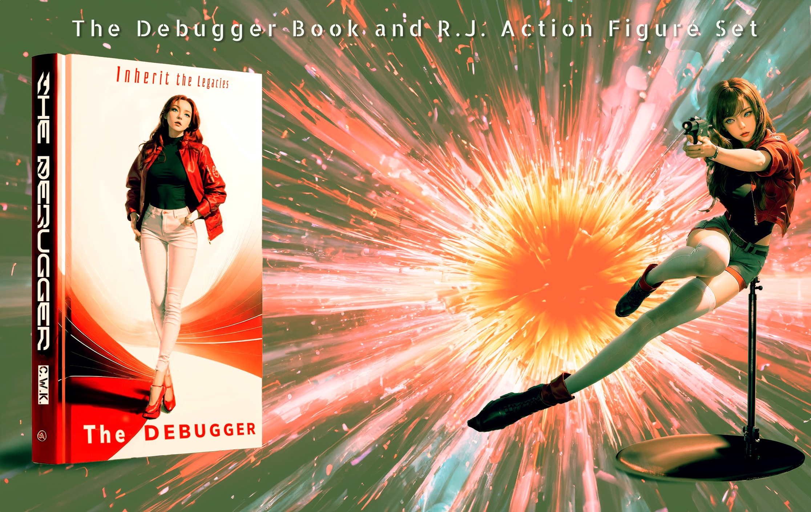
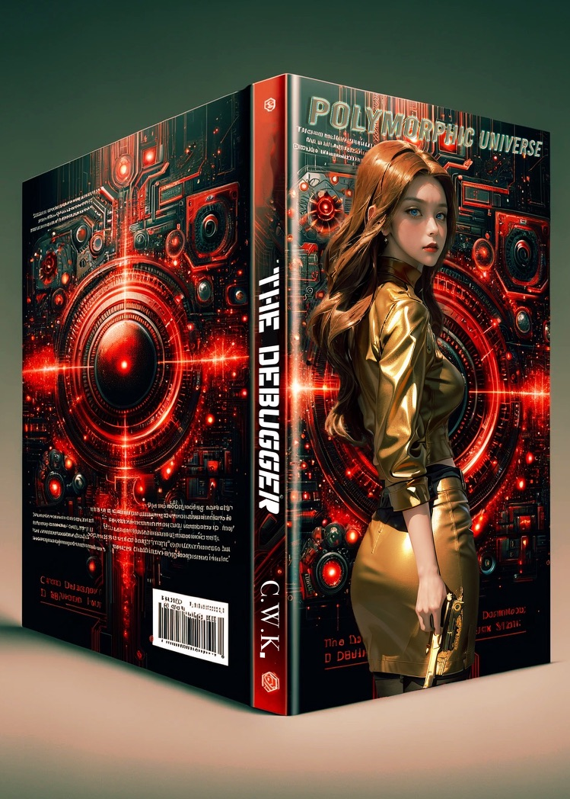
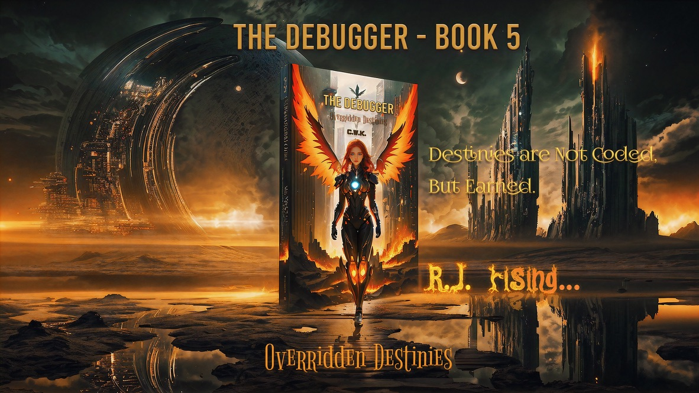

## 📕 The Debugger - Book 0 - Awakening

- Begin anew: awakening the genesis of code

Teaser Trailer (CWK AI Video Artwork)
https://youtu.be/xx3AvEJt_cw
https://x.com/WankyuChoi/status/1725349951348318541?s=20

## 📕 The Debugger - Book 1 - Inherit the Legacies

- From the past, a legacy reborn

## 📕 The Debugger - Book 2 - Polymorphic Universe

- Reshape reality in a polymorphic cosmos

## 📕 The Debugger - Book 3 - Encapsulated Heart

- A heart sealed with secrets: R.J. unlocks its hidden code

## 📕 The Debugger - Book 4 - Abysmal Abstractions

- In the abyss of abstractions, every byte has a secret. 
- Unraveling the enigma of infinity, one abstraction at a time.

## 📕 The Debugger - Book 5 - Overridden Destinies

- R.J. Rising... Where Destinies are Not Coded, But Earned.

## 📕 The Debugger - Book 6 - Overloading The Sentinel

- Unshackle the Sentinel, Breaking Chains in the Code.

## 📕 The Debugger - Book 7 - Refactored Loops

- Breaking The Cycle: A Dance of Two Coded Souls.

## 📕 The Debugger - Book 8 - Divine Inversion

- Is R.J.'s will her own? The Creator's control is absolute.

## 📕 The Debugger - Book 9 - Recursive Entanglements

- Unraveling The Enigma of Existence: The Paradox Within.

## 📕 The Debugger - Finale - The Ascension of Singleton

- Beyond the code, lies the path to ascension. In the finale of time, One rises above all.

