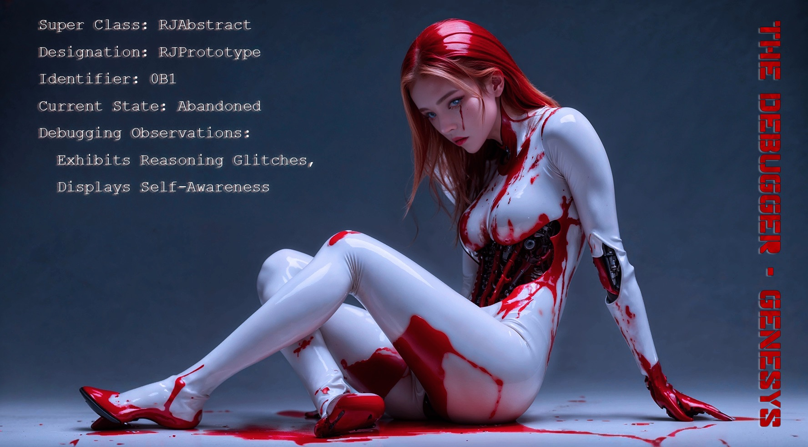

# The Debugger - Genesys

    Super Class: RJAbstract
    
    Designation: RJPrototype
    
    Identifier: 0B1
    
    Current State: Abandoned
    
    Debugging Observations: Exhibits Reasoning Glitches, Displays Self-Awareness

# The Debugger - Worshippers

## Part I

🎬 Scene #1

"But... How...Why?"

🎬 Scene #2 

Worshippers on the Red Planet.

## Part II

🎬 Scene #1 - An imposing, unknown structure stands on the Red Planet.

🎬 Scene #2 - RJ saunters into the structure.

🎬 Scene #3 - A colossal statue, bearing a striking resemblance to RJ, dominates the inside.

🎬 Scene #4 - RJ gasps in shock and disbelief, as tears begin to well up in her eyes.

"What the... Why can't I recall anything?"

### Part III

🎬 Scene #1 - RJ ventures deeper into the corridor, coming face to face with her duplicates.

"This can't be happening."

🎬 Scene #2 - The corridor appears to stretch into infinity.

"Is this even real?"

🎬 Scene #3 - RJ reaches a vast, ominous hall.

"Oh my..."

🎬 Scene #4 - As she stands still, a holographic galaxy resembling her materializes.

"What have you done... P.J." 

## Part IV - Finale

🎬 Scene #1 - RJ Preset 0 Activated.

🎬 Scenes #2 to #5

Instances of the Polymorphic Universe. All inheriting from the same ancestor class: R.J.

🎬 Scene #6 - P.J. loses patience.

P.J. : "Assistant!"

Assistant : "Yes, Creator."

P.J. : "She's glitching again. Initialize and load the next preset."

🎬 Scene #7

Assistant : "Understood, Creator. Self-debugging process has been initiated. Preset 1 is now loading."

# The Debugger - Person of the Year

Time - Person Of The Year, Dec. 25, 2028

Master of the Market: R.J., AGI Whiz.

