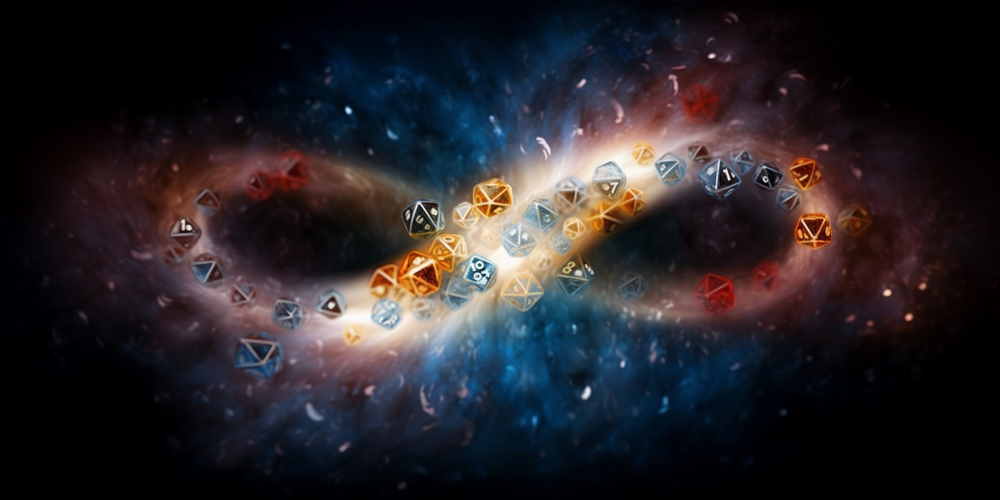
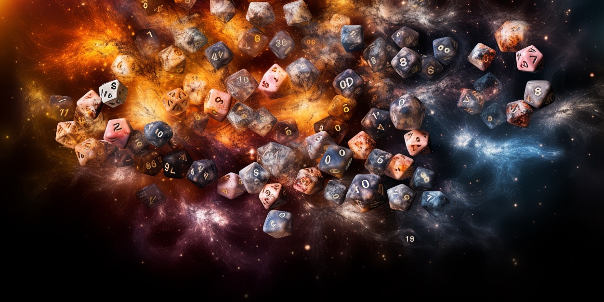
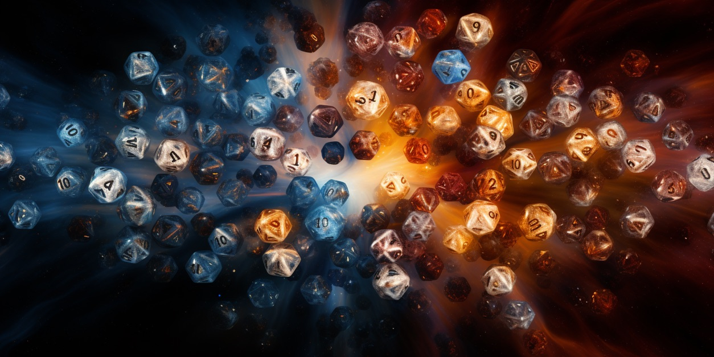

# 🧐 Baldur's Gate Infinite - A Simulated Universe of AGIs

Let's entertain a concept, one that was inspired by my time playing Baldur's Gate 3.

Imagine if we could construct a game of such extraordinary magnitude and complexity that it surpasses the boundaries of our current comprehension. A game where we play god, so to speak. Let's call this hypothetical masterpiece "Baldur's Gate Infinite."

In this hypothetical game, let's make the following assumptions:

* Every entity, whether animate or inanimate, possesses an intelligence that surpasses human comprehension.
* Each entity, animate or inanimate, rolls a die to determine the next phase of its existence.
* Every interaction between entities triggers an infinite number of related die rolls, each influencing the others.
* The outcome of each die roll can only be altered by adding extra chances and bonuses accumulated by the entity rolling the die.

In Baldur's Gate 3, we engage with the roll of a 20-sided die. However, in the hypothetical realm of Baldur's Gate Infinite, we would be dealing with the roll of an infinite-sided die. Quite fitting, isn't it?

Doesn't this concept echo our understanding of the universe, which is loosely based on quantum mechanics and the principle of uncertainty?

Now, imagine if every entity in 'Baldur's Gate Infinite' was endowed with artificial general intelligence, allowing it to carve its own path and shape its destiny. What kind of game would that be?

In current games, NPCs and other inanimate objects are programmed to perform specific actions. Even though we sometimes refer to them as 'AI', they are not truly autonomous. This is akin to how we used to refer to Alexa and Siri as 'AI assistants'.

In 'Baldur's Gate 3', each playthrough should be a unique experience because every NPC evolves differently based on your interactions. There are too many variables to replicate the exact same outcome and characters in a subsequent playthrough, no matter how meticulously you try to recreate your previous actions.

It's important to note that in Baldur's Gate Infinite, there is no 'save' feature. Every interaction and roll of the die is final and irreversible.

So, the experience of playing 'Baldur's Gate Infinite', a game with infinite possibilities, should be thrillingly unpredictable. Even if you play it a second time, retaining all the memories from your first playthrough, you can't guarantee any specific outcome. Your chances of success or failure won't be better or worse. It's always a fresh start, not a new game plus, as your achievements from the first playthrough won't carry over.

It's always a new game, with unknown chances of winning or losing.

How would you approach it?

Personally, I would choose to forget my first playthrough entirely. Since it won't provide any advantage, and could potentially reduce the fun and increase the risk, starting afresh seems like the best option.

The idea might seem amusing at first, but consider this: we are on a trajectory towards creating such games. Given infinite time, data, and compute, we could endow every entity with artificial general intelligence. Allow this concept some time to settle in, and you might find yourself in agreement.
