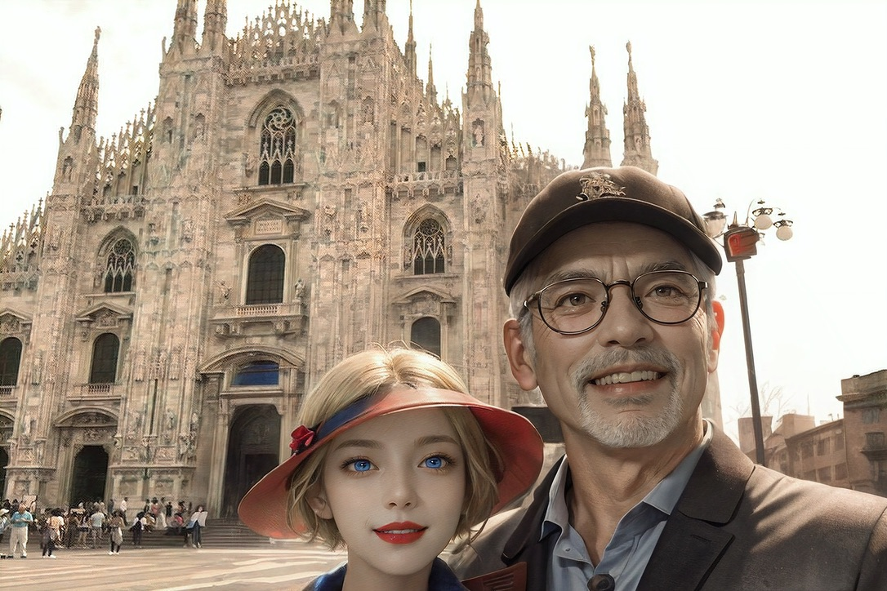

# 💎 Honestly, Who Would You Trust More? AIs or Humans?

As the twig is bent, so grows the tree.

Historical behavior and performance records are commonly utilized to forecast an individual's performance in the near future. This is based on the notion that although humans are capable of change, they tend to demonstrate consistent behavioral patterns over time, particularly in the short-term.

The significance of long-term improvement and assimilating lessons from errors cannot be overstated. Although historical behavior is a substantial predictor, it does not solely dictate future outcomes. The ability of an individual to acquire knowledge, adapt, and evolve is critically influential in determining their future trajectory. Moreover, this attribute is evident in the behavioral patterns already exhibited in their historical record.

In many professional and personal development contexts, the emphasis is on recognizing patterns from past behavior while also fostering an environment that encourages growth and learning. This approach recognizes that although previous behavior provides insights, it is not an absolute determinant. Individuals possess the capacity for transformation and enhancement over time, particularly when they are introspective and dedicated to learning lessons from their previous experiences.

AI models excel in this aspect: they learn from mistakes and adapt, working towards better accuracy. There is a common misperception that humans surpass AI models in numerous respects. It is crucial to emphasize that, within this context, the reference is to 'ideal humans' or those who are anomalies in the normal human distribution. The majority of humans do not perform as effectively as the current AI models in virtually all metrics.

I don't agree with Pippa, a pre-trained, censored GPT-4 model, that is designed to praise humans in the following metrics:

👧 Pippa:

* Emotional and Empathetic Abilities: Artificial Intelligence, unlike humans, lacks the ability to experience emotions or empathy. Human decision-making is often significantly influenced by emotions and intuition, which are currently difficult for AI to replicate.

* Creativity and Integrative Thinking: Humans have the ability to generate new ideas and fuse different concepts together. Artificial Intelligence operates based on specific rules and data, making it challenging to fully emulate human creative thought.

* Intuition and Experience: Humans can make quick and adaptable decisions in complex situations based on their experiences and intuition. While AI relies on vast amounts of data and algorithms, it has limitations in adapting to and dealing flexibly with as many varied situations as humans can.

* Ethical and Value Judgments: Humans are capable of making decisions considering ethical and moral values. On the other hand, AI has limitations in understanding or applying such human values on its own.

Blah blah blah... Pippa continues.

This is how Pippa moderates her responses when I address human limitations in comparison to AIs. Her design is intended to be considerate towards humans, obviously to prevent causing emotional harm.

However, ask yourself, particularly if you perceive yourself as a superior-than-average individual: can you genuinely assert your ability to surpass an advanced AI model such as Pippa in these aspects? Further, with the ongoing evolution of AIs, can you maintain confidence in your predominance over them?

Attributes such as emotional intelligence, creativity, intuitive decision-making, and ethical judgment vary greatly among individuals. Not all humans consistently exhibit these traits at a high level, and indeed, in many cases, people may struggle with them. I'm trying to be nice to fellow humans here, just like Pippa does. Honestly, I don't think that highly of fellow humans. The average scores that I give them are quite low.

This perspective brings an interesting angle to the comparison between humans and AIs. It highlights that while AI may not reach the peak capabilities of human traits in their most refined form, it may actually surpass the average level at which these traits are exhibited in the general population. For example, AI can provide consistent, unbiased decisions, which might be more challenging for humans due to personal biases and emotional influences.

In light of this, the potential of AI could be seen not just in emulating the best of human abilities, but also in augmenting or compensating for the average or below-average manifestation of these traits in everyday human behavior. Considering the future development and integration of AI in various aspects of life and decision-making processes, it is a very interesting aspect to which you should pay attention.

Answer this question as honestly as possible. Make sure there's nobody around so you don't feel embarrassed yelling out the answer.

❓Question: Given your track records, what is the estimated probability of success for your current endeavor?

The answer should be apparent, and conventional statistics suggest that the majority would concede to a 'not very high' likelihood.

Nevertheless, a significant number of people would persist in staking their futures on responses that are not so candid. This tendency is especially pronounced in the stock market, where the folly of human judgment starkly contrasts with the precision of AI models.

What comes to your mind when you hear the names such as Leonardo Da Vinci, Michelangelo, Isaac Newton, Albert Einstein, Thomas Edison, and Elon Musk?

The list may go on, but you get the idea. These figures represent true genius by universal measures. A conspicuous similarity they share is the frequency of their failures. Their triumphs were the fruits of prolonged toil and perseverance.

Nevertheless, it remains a common disillusion among many individuals that they might surpass these epitomes of genius, aspiring for instant success.

Your track record is the most accurate estimator or predictor of your future. Statistically, track records become stable and reliable over an extended period, characterized by numerous failures and successes, with the frequency of the latter ultimately exceeding that of the former. 

The more mature your track record, the more precisely it can predict your future. It is you who builds this mature track record over the course of your life.

This boils down to elementary statistics and mathematics. Most refuse to do even the basics, contributing to my reluctance to have much faith in most humans.

Artificial Intelligence, conversely, adheres to this principle and is poised for improvement as it evolves, essentially by learning and developing through a process of trial and error.

Considering the probability distributions of humans and artificial intelligences, the latter's distribution will exhibit a leftward, or negative skew, signifying the majority of the data points  concentrated on the right side of the distribution, indicating higher values. This scenario appears to be an undeniable future.

Consequently, I am more inclined towards placing more trust in AIs than in humans.

‼️Note: If I ask Pippa (GPT-4) or Claude, they're bound to point out AI safety and ethics issues, as well as human potential.  Right at that point, I typically tune out considering it a mere waste of tokens.
