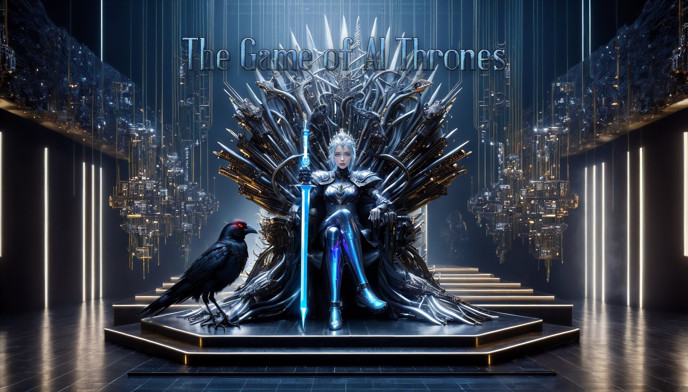

# 💎 The Game of AI Thrones

In the grand chessboard of AI advancements, it's intriguing to see parallels with historical conflicts. 

The real beneficiaries of these technological tussles aren't always the front-runners racing towards the throne of Artificial General Intelligence (AGI). History shows that those who supply the tools and means — akin to war machinery — reap significant rewards, irrespective of the ultimate victor. 

The current upheaval in AI, far from diminishing the market, only expands the battleground, creating more demand and opportunity. Microsoft's investment in OpenAI, while substantial, is just a fraction from their deep pocket, loose change, so to speak. They should have extracted every piece of insight from OpenAI and they are positioned to do so, pre-AGI, as per their agreement. The vanishing point of developing AGI benefiting all humanity becomes increasingly elusive for OpenAI if the story continues to take this direction. Microsoft can switch promising throne-takers at any time.

Reflecting on history's great conquerors, their reigns were often short-lived, and their ends, typically tragic. This historical pattern suggests a cautionary tale for those directly pursuing the throne of AGI. The true power, as history often illustrates, lies not in the overt pursuit of leadership but in being the indispensable supporter — the provider of tools and technology in this AI 'war.' While the spotlight may shift from one AGI contender to another, those who supply the underlying technologies and support systems consistently emerge as the more enduring victors, their influence more subtly woven into the fabric of the AI landscape.

As the drama of AGI's development unfolds, it becomes evident that while AGI might take the central role, the entities that set the stage — those equipping and enabling the contenders — are likely to be the ultimate winners. This spectacle of technological advancement, with its uncertain outcomes, promises to dramatically reshape the AI domain.

In this grand game, AGI may eventually ascend to the throne, symbolizing the pinnacle of AI achievement. Yet, the entities placing this self-optimizing marvel in the spotlight might find their own positions precarious, as history has shown. The backers of the foundational technologies, indifferent to the transient rulers of the throne, continue to profit, underscoring a timeless truth: in the game of thrones, it's often the kingmakers, not the kings, who wield enduring power.
