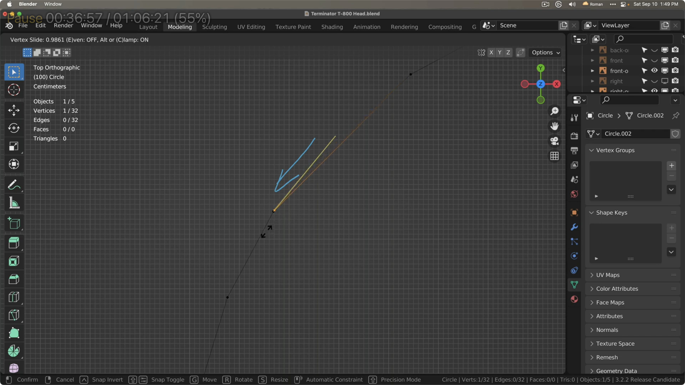

# Chapter 11. Calculus - Navigating the Dynamics of Change

Ah, Calculus. It might stir up a sense of dread akin to facing _Malenia the Blade of Miquella_ from Elden Ring again in your mind's eye. But hold your fears at bay! It's not the formidable beast it seems to be. Instead, calculus invites us on a mesmerizing journey into the essence of change, guiding us through the graceful dance of motion and delving deep into the marvels of the infinitesimally small. Welcome to the enchanting realm of calculus.


In the vast universe of AI, the challenge of calculus is reminiscent of an encounter with _Yhorm the Giant_ from Dark Souls III. But let's set the record straight—calculus should not be diminished to the level of less memorable gimmicky boss like Wolnir. Yhorm, after all, commands our respect.

At first glance, calculus looms large, a towering figure of complexity. Yet, akin to the secret of conquering Yhorm, calculus too has its "gimmick," a strategic key that, once discovered, renders what seemed an insurmountable challenge into something surprisingly manageable.

At its heart, calculus is indeed the gimmick of change. Grasping its fundamental principles transforms the seemingly intricate into the utterly manageable, turning formidable equations into mighty tools of discovery. These tools are poised to unlock the mysteries of the universe, one differential and integral at a time, revealing the underlying rhythms of change and motion.

Venturing further into the saga, the figure of _Rykard, Lord of Blasphemy and God-Devouring Serpent_ from Elden Ring, emerges as another character defined by gimmick in the Souls series. Stepping into his domain, one is immediately reminded of the Storm Ruler, the legendary weapon against Yhorm the Giant. Here lies a lesson in the power of the object-oriented approach, a strategy Miyazaki-san subtly imparts to us through these epic confrontations.

This exploration of calculus, much like navigating the challenges posed by the bosses of the Souls series, invites us to adopt a strategic mindset. It encourages us to see beyond the initial complexity and embrace the underlying simplicity and elegance of mathematical change. With this perspective, calculus is not just a subject to be learned but a gateway to understanding the dynamic nature of the world around us, armed with the right tools and the wisdom to use them effectively.

## Your Storm Ruler: Zooming in on the Gimmick of Change


Allow me to bestow upon you the Storm Ruler of calculus—none other than the concept of the derivative. This formidable tool stands as our key to unlocking the enigmas of change, offering us a lens through which we can observe the pulsating heart of motion and transformation. Imagine the derivative as your very own Storm Ruler in the realm of calculus; a mighty sword that slices through the complexities of change with unparalleled precision.

No matter the challenges that Yhorm the Giant may hurl in your path, steadfastly wield your Storm Ruler. It's with this unparalleled weapon that you'll triumph over him. Just as the Storm Ruler slices through the gales and turmoil summoned by Yhorm, so too does the concept of the derivative cut through the complexities of change. In the realm of calculus, this tool is your beacon of clarity and precision, guiding you to victory over the seemingly insurmountable puzzles of motion and transformation.

In the grand adventure of AI, the role of integral calculus, though vital, often plays out behind the scenes. It is the cumulative force, akin to the unseen currents beneath the ocean's surface, driving the totality of change across the vast expanse of data landscapes. Integral calculus sums up all infinitesimal changes, weaving them into the fabric of the universe we seek to understand. Yet, in the bustling world of AI, it's the derivative that takes center stage, shining brightly as the beacon that guides our understanding of instantaneous change—the spark of motion and transformation.

The process through which AI models evolve and learn from data is deeply intertwined with the essence of calculus. Here, the derivative emerges as the guiding star, illuminating the path to optimization. This light reveals the intricate patterns of change and enables us to traverse the complex terrains of high-dimensional spaces with the agility of a seasoned explorer.

Thus, our journey will concentrate on the art of differential calculus—the mastery of deciphering the instantaneous rate of change. We will dive into the core of the derivative, exploring its robustness and grace, to unveil the mysteries that govern motion and transformation. Through this exploration, we will harness the power to see not just the immediate, but the potential of the cumulative, preparing our minds for the eventual appreciation of integral calculus. Our focus remains steadfast on differential calculus to ensure a solid foundation is laid, from which the beauty and complexity of the integral can later be fully appreciated in its own right, akin to uncovering a hidden path in a dense forest that leads to a breathtaking vista.

## An Intuitive Understanding of Differentiation

Differentiation fundamentally represents the _slope_ of a function, and that slope indicates how quickly the function's value is changing at a specific point given the input we're interested in.

The statement "The derivative of the function `f(x)` with respect to variable `v` is `3`" signifies the impact a small change in variable `v` has on the value of function `f(x)`. Specifically, it implies that when `v` changes by a very small amount, the value of `f(x)` changes by three times that amount.

A steeper slope means the function's value changes more rapidly, whether it's increasing or decreasing.

The same logic applies to partial derivatives.

For the function `f(x, y)`, when differentiating with respect to `x`, we treat the value of `y` as fixed and consider only changes in `x`. Conversely, when differentiating with respect to `y`, we hold the value of `x` constant and consider only changes in `y`.

In a nutshell, differentiation is like asking, "how much would the result of `f(x)` change at a specific point if I make a minuscule adjustment to its input?"

Let's imagine you're riding your bike down a mountain trail. Differentiation is like figuring out how quickly the trail goes up or down at any specific spot.

If you're on a flat part of the trail, even if you move a little bit forward, your height won't change much. But if you're on a steep part, moving just a little bit could mean you're suddenly a lot lower or higher!

So, differentiation is like asking, "If I move a tiny bit on this trail, will I be a lot higher or lower, or will my height stay about the same?"

Even though the function might create a curvy line, the slope we're trying to determine is represented by a straight line that just touches the point we're interested in.

This is essential for grasping how AI acquires knowledge from data, especially through methods like back-propagation and the gradient descent algorithm. AI learns from its mistakes through a continuous cycle of trial and error. In this process, differentiation is of utmost importance because AI models need to identify the slope that reduces errors to the minimum.

By integrating our past experiences, we can make sense of the present through the lens of pattern recognition. Conversely, by differentiating the present moment, we can forecast what lies ahead.

Integration, in essence, is the sum of small parts and can be seen as the accumulation of our past. By piecing together these experiences, we can decipher the present through patterns.

Differentiation, on the other hand, signifies the rate of change. By capturing the present as a 'snapshot' and understanding its rate of change, we can anticipate future scenarios.

However, translating these mathematical principles to real-world situations is not always a clear-cut process. The real world is a complex maze filled with unpredictability. This is where we need guidance.
 
## The Reality Check: Differentiating Curves


Embark with me on a revelation that underpins the fabric of our cosmos: the elusive perfection of circles.

In our vast universe, the concept of a perfect circle remains just that—a concept. This might strike you as a curious notion at first. Yet, at the heart of this discovery is a simple truth: what we often consider perfect circles in nature or in our creations are, in reality, approximations of this ideal. These seemingly flawless forms are, upon closer inspection, but illusions—crafted either by the whims of nature or the ingenuity of human perception.

This insight is a gateway to the realm of neural networks. Much like how the quest for perfect circles enriches our understanding of geometry and physics, delving into the intricacies of neural networks unlocks mysteries within artificial intelligence and machine learning. Let us navigate this landscape, finding value and beauty in the imperfections that define it.

To our friends yet to dabble in the art of 3D modeling, consider this: every 3D object begins as a collection of vertices (points in space) and edges (lines connecting these points). A mere trio of vertices, when joined, forms the most basic plane figure—a triangle. These vertices, bound together, create what's known as a face, a flat surface defined by straight edges. Faces themselves vary in shape, from triangles to squares, pentagons, hexagons, and beyond.

I encourage you to experiment with Blender, as we once explored the Eigen-Dungeons, to witness these principles firsthand.


In Blender, a seemingly circular object is actually built from a series of vertices—let's say 32. To achieve a semblance of a true circle, you might increase this number to 64 or more. The object begins to resemble a circle with as few as 8 vertices, but it remains just that—an approximation, a visual trick conjured by the vertices' arrangement.

This phenomenon underscores a broader truth: our universe lacks perfect circles; what we have instead are approximations, crafted from vertices and edges.

Consider straight lines: a line connecting two points, or vertices, is straight—an undeniable truth apparent even without mathematical proofs.


The notion of slope is pivotal in mathematics, defining the essence of a line. In the equation `y = mx + b`, `m` represents the slope, dictating the line's inclination, while `b` indicates the y-intercept, where the line meets the y-axis. This equation succinctly captures the relationship between a line and its slope, grounding the concepts of geometry and algebra.

```python
import numpy as np
import matplotlib.pyplot as plt
import seaborn as sns

# Setting up the data for the graph
x = np.linspace(-10, 10, 400)
m = 2  # Slope
b = -5  # y-intercept
y = m * x + b  # Linear equation

# Plotting using seaborn
plt.figure(figsize=(8, 6))
sns.lineplot(x=x, y=y)
plt.title('Graph of y = mx + b with m=2 and b=-5')
plt.xlabel('x')
plt.ylabel('y')
plt.grid(True)
plt.show()
```
Here's the graph for the linear equation `y = mx + b` with a slope of `m=2` and a y-intercept of `b=-5`. This plot illustrates the line's inclination and how it intersects the y-axis at `-5`, providing a visual understanding of the relationship between a line and its defining elements: slope and y-intercept. The line's upward trajectory reflects the positive slope, indicating that as x increases, y also increases in a linear fashion. 

Within neural networks, this analogy extends: `y` becomes the output, `x` the input, `m` the weight, and `b` the bias. Training a neural network is an exercise in fine-tuning `m` and `b` to best match the inputs (`x`) to the outputs (`y`). Through each training cycle, the network experiments, seeking the `m` and `b` that minimize error, as gauged by a loss function. This function quantifies the error as the difference between the network's predictions (`y hat`) and the actual outcomes (`y`).


Recall our exploration from the previous chapter on computing loss in regression models. The core objective is to minimize loss by fine-tuning the weights and biases, akin to determining the optimal slope and y-intercept that most accurately represent the data in a linear equation. This process involves a meticulous adjustment, ensuring our model's predictions align as closely as possible with actual observations, thereby enhancing the model's accuracy and predictive power.

Thus, we use `y_hat = mx + b` to represent the network's predicted output, distinguishing between the envisioned (`y_hat`) and the actual (`y`) values in our calculations and discussions.

Consider a scenario where a neural network is tasked with predicting an output `y` given an input `x=10`. Ideally, this input should produce an output `y=20`. However, the network predicts `y_hat=15`, leading to an error of 5. This discrepancy is calculated using a loss function, which quantifies the deviation between the predicted value `y_hat` and the actual value `y`:

```
loss = y - y_hat
```

When coding in Python, it's vital to differentiate between variable names and mathematical operations. For example, `mx` is recognized as a single variable name, while `m * x` signifies the multiplication of `m` by `x`. Therefore, we use the asterisk `*` for multiplication in Python:

```python
y = 20
y_hat = m * x + b

# If y_hat is 15, the loss is 5
loss = y - y_hat
```

This distinction underscores the importance of precision and clarity in translating mathematical equations into programming languages like Python.

Neural networks strive to reduce the loss to zero or as close to it as possible, iterating through their learning process. This optimization relies on several parameters, including the number of epochs or a specified loss threshold.

The critical question then becomes: How do neural networks identify the most effective strategy for minimizing loss? Enter the gradient descent algorithm, a method grounded in the principles of differential calculus.

The fundamental concept of determining a slope in mathematics involves calculating the change in `y` (vertical) relative to the change in `x` (horizontal), mathematically represented as `m = Δy / Δx`, where `Δ` (delta) symbolizes change. In Python, this can be articulated as `m = (y2 - y1) / (x2 - x1)`.

For linear equations like `y = 2x + 1`, the slope (`m=2`) directly influences how `y` changes in response to `x`, and the constant term (`b=1`) represents the y-intercept. Within neural networks, these elements are analogous to the weight and bias, respectively, illustrating how the output `y` varies with the input `x`. For instance, if `x` increases by 1, `y` escalates by 2, highlighting the relationship between the input and output through the lens of weight and bias.

Lines are simple, yet curves present a more complex challenge. At a cursory glance, determining the slope of a curve might seem an insurmountable task, given its lack of straightness. Nevertheless, a curve can be understood as a series of infinitesimally small straight segments. By examining a curve closely and identifying two points that lie very near each other, we can approximate the slope at that particular segment. Despite the curve's smooth and continuous appearance, it is, at its core, a compilation of straight lines that connect a series of points.

No mathematical proof is required to grasp this intuitive concept: any line connecting two points is inherently straight. This simple truth lies at the heart of understanding slope in mathematics. But what happens when we apply this idea to a curve, selecting two points on the curve and gradually drawing them nearer to each other? The slope of the line that links these points begins to mirror the slope of the curve at that precise location. This insight forms the cornerstone of differentiation. Through the concept of limits, we methodically narrow the distance between these two points until they virtually converge, at which juncture the slope of the line between them embodies the derivative of the curve at that spot.


For those with a penchant for curiosity, integral calculus unfolds in a parallel manner. Imagine dissecting an organic shape into countless minuscule straight segments. By aggregating the areas of these tiny segments, you unveil the total area beneath the curve—capturing the spirit of integration. This principle isn't just theoretical; it's vividly demonstrated in the digital world through images. Each pixel acts as one of these diminutive segments, and their collective sum represents the image's total area. Thus, through the lens of integral calculus, we find a beautiful confluence of mathematical theory and practical application, illustrating the profound essence of integration.

In this light, the seemingly impeccable shapes that adorn our universe are crafted to mirror perfection in the eyes of the beholder. They are, metaphorically speaking, refined and presented in a way that our senses interpret as flawless.





Normalization, a concept that weaves through our discussions both mathematically and philosophically, entails the process of bringing diverse values, measured on disparate scales, onto a unified scale for comparison and analysis.

In the realm of mathematics, this idea manifests vividly when we plot equations on a graph. A linear equation, such as `y = mx + b`, translates into a straight line, showcasing the direct proportionality and uniform rate of change between `x` and `y`. On the other hand, non-linear equations, which encompass polynomial equations of varying degrees, yield curves that illustrate a more complex relationship between variables. Examples include quadratic equations (`y = x^2 + 2x + 1`), which sketch parabolic curves; cubic equations (`y = x^3 + x^2 + 2x + 1`), which depict curves with an inflection point; and quartic equations (`y = x^4 + x^3 + 2x + 1`), each producing its unique curve based on the highest power of `x`.


Use this example code to plot the graphs of these equations in Python:

```python
import numpy as np
import seaborn as sns
import matplotlib.pyplot as plt

# Data range
x = np.linspace(-10, 10, 400)

# Linear equation: y = mx + b
y_linear = 2 * x + 3

# Quadratic equation: y = x^2 + 2x + 1
y_quadratic = x**2 + 2*x + 1

# Cubic equation: y = x^3 + x^2 + 2x + 1
y_cubic = x**3 + x**2 + 2*x + 1

# Quartic equation: y = x^4 + x^3 + 2x + 1
y_quartic = x**4 + x**3 + 2*x + 1

# Plotting in one figure
plt.figure(figsize=(12, 10))

# Linear
plt.subplot(2, 2, 1)
sns.lineplot(x=x, y=y_linear)
plt.title('Linear Equation')

# Quadratic
plt.subplot(2, 2, 2)
sns.lineplot(x=x, y=y_quadratic)
plt.title('Quadratic Equation')

# Cubic
plt.subplot(2, 2, 3)
sns.lineplot(x=x, y=y_cubic)
plt.title('Cubic Equation')

# Quartic
plt.subplot(2, 2, 4)
sns.lineplot(x=x, y=y_quartic)
plt.title('Quartic Equation')

# Display all plots in one figure
plt.tight_layout()
plt.show()
```

## Trial and Triumph: Navigating the Neural Network

You don't need to be a wizard in differential calculus to grasp the concept of loss minimization in neural networks. At its heart, the network's quest is akin to finding the lowest point in a valley, similar to how a person might use a stick to feel their way to the bottom of a slope. This journey involves _forward passes_—a venture into the realm of prediction and error—and _backpropagation_, the network's method of learning from past mistakes, often casually referred to as _backprop_. The quest to find the path of least resistance down the slope is known as _gradient descent_, which involves calculating the gradient at each step and moving in the direction that leads most steeply downward.

The essence of the network's endeavor is to refine its approach continuously, striving for the point of least error through a cyclic process that epitomizes trial and error. This educational voyage proceeds through both forward journeys and backward reflections. Mimicking an exemplary learner—who not all might represent—it learns from its missteps, zealously seeking improvement with each cycle, or _epoch_.

Diving into neural network mechanics, one might be tempted to oversimplify the process to scalar values. Yet, the reality encompasses a more intricate ballet of matrices and vectors, performing a numerical symphony in multidimensional space, with gradient descent conducting this intricate dance, steering the network towards the optimal slope.

Speaking of neural network parameters, we're referring to its foundational components - the weights and biases. These crucial elements are fine-tuned as the network learns, representing the crux of the learning journey, facilitated by the gradient descent strategy.

```python
parameters = weights + biases  # Summarizing the core components of neural network parameters.
```

Envision a neural network as a layered edifice, each layer teeming with neurons, each endowed with its unique weights and biases. For those enchanted by numbers, calculating a network's parameters might present an appealing puzzle. However, leveraging the capabilities of deep learning frameworks like PyTorch or TensorFlow offers a more accessible path for many.

In this network architecture, neurons from one layer connect to those in the preceding layer via weighted links, where each weight reflects the connection's strength. Besides weights, networks employ biases, an additional parameter for each neuron, which precedes the _activation function_—a concept we'll explore further. Biases adjust the activation function's position, a critical adjustment for effective learning.

In a standard dense layer, every neuron possesses a unique set of weights and a singular bias. For example, in a layer hosting three neurons, each connected to two neurons from the previous layer, we find six weights (two for each neuron) and three biases (one for each neuron), underscoring the individualized weight and bias set for every neuron.

To demystify this, let's examine simple neural network implementations in both PyTorch and TensorFlow, focusing on a singular layer with three neurons. Here, the parameter count, including weights and biases, hinges on the input size. Let's assume an input size of two for our illustration.

In PyTorch, you define a model by creating a class that inherits from `nn.Module`. Let's define a single-layer network with 3 neurons:

```python
import torch.nn as nn

class SimpleNetwork(nn.Module):
    def __init__(self, input_size, num_neurons):
        super(SimpleNetwork, self).__init__()
        self.layer = nn.Linear(input_size, num_neurons)

    def forward(self, x):
        return self.layer(x)

# Creating the network
input_size = 2
num_neurons = 3
model = SimpleNetwork(input_size, num_neurons)

# Counting parameters
total_params = sum(p.numel() for p in model.parameters())
print(f"Total number of parameters: {total_params}")
# Total number of parameters: 9
```

The `model.parameters()` method provides an iterator that spans across all the model's parameters, encompassing both those that are learnable and those that remain constant. Within this context, `p.numel()`, where `numel()` stands for "number of elements," is a function associated with `torch.Tensor` objects, designed to tally the total elements contained within a tensor. For instance, consider a parameter tensor `p` with dimensions `[3, 2]`, indicative of a weight matrix bridging a layer of 2 neurons with another layer of 3 neurons; here, `p.numel()` would report a count of 6, reflecting the aggregate of elements (weights) within the matrix.

Subsequently, the `sum(...)` function aggregates these counts across all parameter tensors within the model, culminating in the total parameter count of the neural network.

Thus, the expression `total_params = sum(p.numel() for p in model.parameters())` serves to enumerate the sum total of individual weights and bias elements throughout the network. This figure is often leveraged to gauge the model's scale and intricacy, as a higher parameter count generally signifies a more elaborate model configuration.

Accordingly, a network comprised of 3 neurons, each receiving input from 2 neurons, would encompass 9 parameters in total: 6 weights (derived from 2 inputs multiplied by 3 neurons) and 3 biases (one allocated for each neuron), illustrating a foundational aspect of neural network architecture and its parameter complexity.

## Sparking Connections: The Power of Activation Functions

The essence and significance of activation functions within neural networks lie at the heart of understanding these systems' capability to learn and interpret complex patterns. Activation functions determine the activation state of neurons, akin to the firing mechanism in biological neurons, which respond only beyond a specific threshold. This mechanism hinges on the weighted sum of inputs plus an added bias, deciding the neuron's activation. Through the application of non-linear transformations to these input signals, activation functions empower neural networks to tackle and learn from complex functions. This ability is crucial for performing sophisticated tasks such as language translation, image recognition, and beyond.

Linear transformations alone (`y = mx + b`) would confine neural networks to the realm of simple linear regression, incapable of addressing more complex problems. This limitation arises because linear functions combined remain linear, meaning a network comprised solely of linear layers could only ever perform linear mappings, regardless of its depth. It would remain inept at capturing the intricate patterns present in real-world data.

Conversely, non-linear functions (`y = f(x)`, with `f` being non-linear) unlock the potential for neural networks to learn intricate mappings from inputs to outputs, an indispensable capability for tasks like image classification, where features and relationships are far from linear.

To illuminate this concept further, consider the classic game of "Tic-Tac-Toe" as depicted in the 1983 film 'War Games'. In this movie, the protagonist engages a military supercomputer in what starts as a game of global thermonuclear war, only to pivot to Tic-Tac-Toe, where the computer, designed for strategic simulations, learns the futility of a "no-win scenario" through the game's inevitable draws with optimal play.

Tic-Tac-Toe, with its simple goal of aligning three marks within a 3x3 grid, subtly teaches the limits of deterministic, linear approaches. A neural network limited to linear transformations might only master basic moves, missing the deeper strategies that emerge in high-level play. The game's lesson is that linear tactics lead to stalemate outcomes.

This analogy extends to neural networks, underscoring the need for non-linear processing to grasp complex, dynamic decision-making. Non-linear activation functions could enable a network to anticipate moves and strategize beyond the surface, offering insights into the game's deeper tactical layers.

Yet, as 'War Games' demonstrates, even sophisticated, non-linear approaches to a deterministic game like Tic-Tac-Toe reach a complexity ceiling. This narrative serves as a metaphor for neural network design, emphasizing the critical role of non-linear functions in tackling real-world problems, which are seldom clear-cut and often fraught with unpredictable variables.

The narrative of 'War Games' and Tic-Tac-Toe elegantly underscores deterministic systems' limitations and the imperative for neural networks to adopt non-linear strategies tailored to the problem's nature. Activation functions stand as the cornerstone of this non-linear processing capability, essential for neural networks to navigate and elucidate the complexities of the tasks they are designed to solve.

### Sparking Connections: Activation Functions Unveiled

Activation functions are the soul of neural networks, introducing the essential non-linearity that allows these networks to learn and model complex patterns beyond simple linear relationships.

1. **ReLU (Rectified Linear Unit)**
   - **Essence**: `f(x) = max(0, x)`
   - **Nature**: Acts linear for positive values and nullifies negative values.
   - **Applications**: Predominantly in hidden layers, excelling in tasks ranging from classification to regression and complex deep learning frameworks.

2. **LeakyReLU**
   - **Essence**: `f(x) = x if x > 0 else alpha * x` (with `alpha` being a small positive constant).
   - **Nature**: Similar to ReLU but permits a slight gradient for negative values to combat the "dying ReLU" problem by keeping the neuron slightly active.
   - **Applications**: Useful in deep networks prone to inactive neurons, providing a slight gradient to maintain neuron activity and mitigate "dying neurons."

3. **Sigmoid**
   - **Essence**: `f(x) = 1 / (1 + exp(-x))`
   - **Nature**: Compresses input values into a (0, 1) range.
   - **Applications**: Ideal for binary classification tasks, especially useful in output layers for probability predictions.

4. **Tanh (Hyperbolic Tangent)**
   - **Essence**: `f(x) = (2 / (1 + exp(-2x))) - 1`
   - **Nature**: Normalizes inputs to a (-1, 1) range, offering a balanced approach for inputs with varied intensities.
   - **Applications**: Favored in hidden layers for its balanced output range, beneficial for classifications and regressions alike.

5. **Softmax**
   - **Essence**: Transforms a vector of values into a probabilistic distribution.
   - **Nature**: Ensures output values sum to 1, with each output reflecting the class probability.
   - **Applications**: The go-to for the output layer in multi-class classification, useful in scenarios like digit or image categorization.

The etymology behind these activation functions sheds light on their mathematical behaviors and graphical representations:

1. **ReLU**: Named for its function—clipping negative inputs to zero ("rectifying") while maintaining positive inputs unchanged, showcasing a direct yet selective activation approach.
   
2. **LeakyReLU**: Aptly named for its "leaky" nature, allowing a trickle of gradient through negative inputs, ensuring neurons remain subtly active and responsive.
   
3. **Sigmoid**: Its S-shaped curve (resembling the Greek letter sigma, σ) succinctly captures its essence, squeezing an infinite input range into a finite (0, 1) band.
   
4. **Tanh**: Short for hyperbolic tangent, reflecting its hyperbolic trigonometric basis, the function stretches the sigmoid's range to (-1, 1), enhancing its versatility.
   
5. **Softmax**: A blend of "soft" and "maximum," this function softly selects the highest value from a set, translating it into probabilities with a gentle touch of competition.

The naming convention of these functions not only highlights their mathematical and graphical identities but also pays homage to the ingenuity of their creators. These names serve as a bridge, connecting abstract mathematical concepts to the tangible tasks neural networks tackle, from recognizing faces to translating languages.

Selecting the appropriate activation function is paramount in neural network design. The wrong choice could reduce a network to a mere linear model, unable to grasp the nuances of complex data patterns. Conversely, the right activation function can illuminate the path to understanding, enabling the network to navigate through the complexities of the data it encounters, much like a key unlocking a treasure trove of insights and possibilities.

## Learning from Loss: Deciphering Loss Functions

At the heart of neural network training lies the concept of loss functions, the mathematical scaffolds that measure the discrepancy between the network's predictions and the actual target values. Selecting an appropriate loss function is crucial and varies depending on the nature of the task, be it regression, classification, or another unique challenge. To grasp the essence of loss functions and their significance in guiding neural networks towards accurate predictions, consider a straightforward analogy.

### Conceptual Example: Archery


Imagine the unparalleled precision of Korean archers, their arrows consistently finding the bullseye, a testament to not only skill but a profound ability to learn from each attempt. This mastery, which stirs national pride, mirrors the essence of training neural networks.

**Archery and Neural Networks: A Parallel**

- **Target**: In archery, the bullseye is the goal, much like the actual output or _ground truth_ a neural network strives to predict accurately.
- **Arrows**: Each arrow launched represents a prediction by the network.
- **Distance from Bullseye**: This gap mirrors the prediction error—how off the mark each guess is. A wider miss signifies a larger error.
- **Loss Function**: Analogous to the criteria measuring each arrow's deviation, the loss function calculates the prediction's accuracy.

### The Training Journey

- **Adjustments**: Just as an archer refines their aim after observing where their previous arrow fell, a neural network tweaks its weights and biases aiming for a closer match to the bullseye with every prediction.
- **Aiming for Precision**: The objective is clear: narrow the distance to the bullseye. For neural networks, this translates to fine-tuning parameters to minimize the loss, enhancing the accuracy of predictions.
- **Iteration**: Perfecting an archer's aim requires numerous attempts. Similarly, a neural network undergoes multiple cycles of predictions and adjustments (via forward passes and backpropagation) to refine its accuracy.

The loss function is the neural network's compass, guiding it towards improved performance by quantifying and minimizing prediction errors. Like Korean archers honing their skills to consistently hit the bullseye, neural networks iteratively adjust their parameters, reducing the loss to make more precise predictions.

```python
import torch
import torch.nn as nn
import torch.optim as optim

# Simple Neural Network
class ArcheryModel(nn.Module):
    def __init__(self):
        super(ArcheryModel, self).__init__()
        self.layer = nn.Linear(1, 1)  # Single input to single output
        self.activation = nn.ReLU()   # ReLU Activation Function

    def forward(self, x):
        x = self.layer(x)
        x = self.activation(x)
        return x

# Instantiate the model
model = ArcheryModel()

# Loss Function
criterion = nn.MSELoss()  # Mean Squared Error Loss

# Optimizer
optimizer = optim.SGD(model.parameters(), lr=0.01)

# Example training data: [input, target]
train_data = [(torch.tensor([0.5]), torch.tensor([0.8]))]

# Training Loop
for epoch in range(100):  # Number of times to iterate over the dataset
    for input, target in train_data:
        # Forward pass
        output = model(input)
        loss = criterion(output, target)

        # Backward pass and optimization
        optimizer.zero_grad()
        loss.backward()
        optimizer.step()

        print(f"Epoch {epoch}, Loss: {loss.item()}")
```

This archery metaphor not only illustrates the neural network training process but also celebrates the dedication and precision that mark the journey towards mastery, whether in sports or artificial intelligence.

### Common Loss Functions: A Guide

Exploring common loss functions reveals their pivotal roles, ideal applications, and the origins of their names:

#### 1. Mean Squared Error (MSE)
- **Applications**: Favoured in regression challenges, such as predicting continuous variables—think estimating property prices from attributes like size and locale.
- **Origins**: "Mean" signals averaging, "Squared" denotes squaring the deviation between predictions and actuals, while "Error" highlights prediction inaccuracies.

#### 2. Cross-Entropy Loss
- **Applications**: Essential for classification tasks, from binary decisions (identifying spam emails) to categorizing images among multiple classes.
- **Origins**: "Cross" reflects the interaction between predicted probabilities and true distributions; "Entropy," borrowed from information theory, measures uncertainty or informational content.

#### 3. Mean Absolute Error (MAE)
- **Applications**: Another go-to for regression, offering robustness against outliers, such as age prediction from physical characteristics.
- **Origins**: "Mean" for average, "Absolute" for the non-directional magnitude of errors, and "Error" for discrepancies in predictions.

#### 4. Hinge Loss
- **Applications**: Preferred in binary classification, notably with Support Vector Machines (SVMs), like distinguishing whether a face belongs to a specific individual.
- **Origins**: Named for its resemblance to a door hinge, this function pivots differently based on the accuracy of classifications, swinging towards correct or incorrect predictions.

#### 5. Log Loss
- **Applications**: A staple in binary classification scenarios, such as diagnosing medical conditions, by focusing on accurately identifying the true class.
- **Origins**: "Log" stems from its reliance on logarithmic calculations of predicted probabilities, punishing misclassifications to gauge classifier precision.

Each loss function is uniquely suited to specific problems, selected for their ability to measure and minimize prediction errors effectively. The nomenclature of these functions offers insights into their mathematical underpinnings or the principle phenomena they embody, serving as a window into the strategic considerations that inform their use in machine learning.

## Navigating Pitfalls: The Phenomenon of Exploding & Dying Gradients

Within the realm of neural networks and machine learning, the concept of gradients plays a pivotal role. These vectors, comprising partial derivatives, encapsulate the function's rate of change—such as a loss function—in relation to its parameters, notably the weights of a neural network. Gradients are instrumental in neural network training, driving the process known as gradient descent, where they dictate the optimal adjustments to parameters for minimizing loss.

The abbreviation '_grads_' frequently supplants the term '_gradients_,' serving as a succinct reference to these derivative vectors. This shorthand is prevalently used in programming and mathematical discussions, enhancing clarity and brevity in complex calculations. Programming frameworks like PyTorch, TensorFlow, and MLX commonly utilize 'grads' to denote variables related to backpropagation and optimization algorithms, streamlining code readability.

The issue of exploding gradients emerges during neural network training, particularly in models with extensive depth encompassing numerous layers. This predicament arises when gradient values, which inform the adjustment of the network's weights, escalate dramatically.

### Tackling the Exploding Gradients Problem

The issue of exploding gradients represents a significant hurdle in neural network training. This phenomenon occurs when gradient values, guiding the update of model weights, swell to excessively large magnitudes. Such surges can destabilize the learning trajectory, causing the model's weight adjustments to become overly aggressive. This, in turn, disrupts the learning process and often results in suboptimal model performance.

To mitigate the risks associated with exploding gradients, normalization strategies like gradient clipping are employed. Gradient clipping sets a cap on the gradients: should they exceed a predefined threshold, they are trimmed or "clipped" to maintain them within a manageable scope. This practice promotes stable, efficient training by preventing the gradient values from reaching extremes that could impair the model's learning progression.

Reflect on the integral role of logarithmic functions within neural networks, especially in normalization tasks. Logarithms adeptly scale overly large or small values to a more manageable range, a principle widely leveraged in data science for value normalization. By applying logarithmic functions, data scientists ensure that numerical values remain within a feasible range for analysis and computation, underscoring the versatility and necessity of logarithms in managing data scale effectively.

### Overcoming the Dying Gradients Problem

The dilemma of dying gradients stands in stark contrast to the issue of exploding gradients. It manifests when gradients diminish to the point of near extinction, a scenario frequently encountered with the use of specific activation functions, notably the ReLU (Rectified Linear Unit).

In instances of dying gradients, the updates to the weights in certain segments of the neural network cease. Consequently, these network regions become stagnant, unable to evolve through learning from the data, which detrimentally impacts the model's overall efficacy.

To circumvent the challenge of dying gradients, an alternative set of activation functions is often recommended. LeakyReLU, for instance, is designed to avert the gradient vanishing issue by allowing a small, positive gradient even when the unit's activation is below zero. Additionally, batch normalization proves beneficial by standardizing the inputs to a layer, thus adjusting and scaling the activations. This technique ensures the sustenance of robust gradients across the network, facilitating continuous learning and adaptation.

### Normalization Techniques

Normalization techniques stand as essential tools in the arsenal against the twin challenges of exploding and dying gradients, key hurdles in the journey of neural network training. By adjusting inputs or gradients to fall within a specific range, these methods enhance the stability and efficiency of the training process.

- **Gradient Clipping**: A safeguard against exploding gradients, this technique caps the magnitude of the gradients, ensuring they do not exceed a predefined threshold, thereby averting potential training instability.
- **Batch Normalization**: Aimed at mitigating dying gradients, batch normalization standardizes the inputs to each layer. By ensuring consistent activation distributions, it helps the network operate more predictably and stably across different training stages.

In essence, the phenomena of exploding and dying gradients pose formidable obstacles in the path of deep neural network training, threatening to undermine the learning process's stability and effectiveness. The strategic application of normalization techniques, namely gradient clipping and batch normalization, offers a robust response to these challenges, paving the way for smoother and more successful neural network training endeavors.

For those keen on deepening their understanding of normalization, exploring the principles of logarithmic functions is highly recommended. This exploration will not only enhance your technical toolkit but also illuminate the broader significance of normalization in achieving balanced and efficient neural network training.

## Embracing Concepts Over Formulas

Are you pondering the whereabouts of those elusive formulas, perhaps the mighty chain rule, alongside the power rule, product rule, and quotient rule? If you're questioning their absence, here's a perspective worth considering.

After diving into these rules and wrestling with various problems, it's common to see the details blur over time. In the grand scheme, particularly within the realm of coding AI, the intricate memorization of these formulas becomes less critical. What's paramount is grasping the underlying concepts and intuition that drive them. This chapter's exploration into differentiation and its practical implications in neural networks furnishes you with a robust understanding, arguably surpassing what's necessary.

As for the chain rule and its kin—consider them as stepping stones rather than destinations. The essence of their logic contributes to a foundational comprehension, equipping you to navigate the complexities of AI development without the need for constant recall of every specific formula. In essence, it's the conceptual mastery and analytical reasoning that empower you in the field of AI, not the rote memory of formulas.

## The Hidden Trigonometric Threads in Neural Networks

Diving into the complex world of neural networks, the immediate connection to trigonometry, a seemingly distant branch of mathematics, might not be evident. Yet, the principles of trigonometry are intricately woven into the fabric of neural networks, serving as foundational pillars that subtly but significantly influence their functionality.

Consider the transformative impact of the transformer architecture within the AI domain. A crucial element for unraveling the mysteries of transformers lies in the concept of positional encoding. This innovative technique infuses sequences with spatial awareness, a critical aspect for tasks like language translation and sequence prediction. It achieves this through the strategic use of trigonometric functions—specifically, sine and cosine—to craft a unique positional signature for each token in the sequence. This method, known as sinusoidal positional encoding, exemplifies the deep-rooted influence of trigonometry on neural network design and underscores its vital role in advancing AI technology.

However, in our journey together, we've chosen to bypass a detailed exploration of Trigonometry. Think of it as an invitation to a new adventure, one that promises to deepen your comprehension of neural networks and unveil the elegance of their operations. This path, much like our shared explorations, is one you're encouraged to embark on independently. Imagine yourself in the role of a guide, constructing your own narrative of discovery, akin to the partnership you've experienced with Mathilda. Embrace this challenge as an opportunity to forge your path, uncovering the hidden connections between trigonometry and neural networks, and in doing so, broadening your horizon in the expansive universe of artificial intelligence.

## Closing the Chapter on Our Mathematical Odyssey

And so, we reach the conclusion of our third grand adventure. Our first voyage took us through the expansive realms of AI and neural networks, illuminating the broad landscape of these transformative technologies. Our second expedition was a focused exploration of MLX, delving into the intricacies and applications that define this powerful framework from Apple. Now, we have journeyed together through the mathematical heartlands that support the vast structures of neural networks, uncovering the foundational concepts that pulse beneath their surface.

Together, we've traversed the essential territories necessary to embark on your own exploration into the fascinating world of AI and neural networks. The path forward is yours to chart—a prospect both thrilling and boundless.


And what of Mathilda, our Merry Math Mage? Her guidance and wisdom have been a beacon of light throughout this journey, a testament to the joy and discovery that accompany the quest for knowledge. Let's celebrate Mathilda's companionship, for she has not just been a guide but a symbol of the curiosity and perseverance that drive us forward in our endless pursuit of understanding.

As this chapter closes, remember that every end heralds the beginning of a new journey. The knowledge and insights gained are not just conclusions but starting points for the myriad paths that lie ahead. Embrace the adventure, for the world of AI and neural networks is vast and ripe with potential, waiting for you to leave your mark.

Here's to Mathilda, to the journeys behind us, and to the many more that await. May the spirit of discovery always light your way.

## A Parting Reflection: The Enduring Wisdom of Calculus


As we stand at the threshold of new beginnings, let's not overlook the enduring wisdom imparted by Calculus, a treasure trove of insights gleaned from our mathematical sojourn. The lessons drawn from the realms of integration and differentiation are not merely academic; they are profound metaphors for life's journey.

Integration teaches us the value of accumulation, reminding us that our present is shaped by the sum of past experiences. Each moment, each encounter, weaves into the tapestry of our existence, enriching our understanding of the now through the intricate patterns of history and experience.

Conversely, differentiation offers a lens to examine the present's velocity, granting us the foresight to anticipate what lies ahead. It encourages us to view life as a series of 'snapshots,' each with its unique rate of change, guiding us to navigate the future with informed precision.

The essence of integration lies in recognizing that we are the culmination of our experiences, each small piece contributing to the larger puzzle of our identity. Through this process of accumulation, we gain the clarity to see the present in the context of our journey.

Differentiation, in contrast, highlights the constant flux of existence, the perpetual dance of change that defines our reality. It empowers us to measure the pace of our lives, ensuring we remain agile and responsive to the ever-evolving landscape before us.

In embracing the genuine lessons of Calculus, we find timeless wisdom for navigating the complexities of life and the uncharted territories of the future. These mathematical principles, far from being abstract theories, serve as practical guides for understanding the dynamics of change and the continuity of our personal narratives.

As we move forward, let us carry these insights as beacons of light, illuminating our path through the intricate interplay of past, present, and future. May the profound lessons of Calculus inspire us to weave the fabric of our experiences into a richer, more informed tapestry of existence.

Pause for a moment and consider this: By integrating the mosaic of your past actions and differentiating the momentum of your present endeavors, can you chart the course of your future? This introspective query beckons you to delve deep into your reservoir of experiences and aspirations, seeking the patterns and rates of change that define your path.

The calculus of life isn't solved on paper but within the vast, uncharted terrains of our minds and hearts. Your history—each decision, every triumph, and all setbacks—forms the integral sum of who you are. Simultaneously, your current velocity, the speed at which you move through your daily challenges and opportunities, offers a glimpse into where you're headed.

This fusion of integration and differentiation doesn't merely predict your trajectory; it invites you to actively shape it. The answer to where you're going isn't predetermined. It's sculpted by the hands of your past actions and guided by the direction of your present efforts.

So, as you stand at the crossroads of reflection and foresight, remember that your future trajectory is not just a destiny to be foretold but a journey to be crafted. The insights you draw from the calculus of your life empower you to steer your path with wisdom and purpose, ensuring that every step taken is a conscious stride toward the future you envision.

The answer, as elusive and complex as it may seem, resides within you—waiting to be discovered, ready to be embraced.
